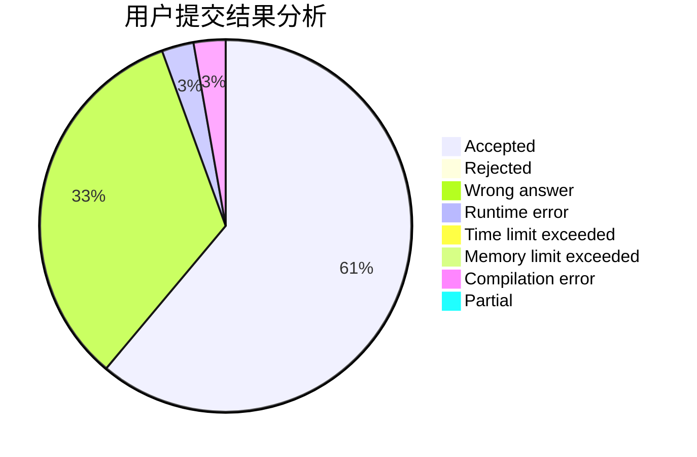
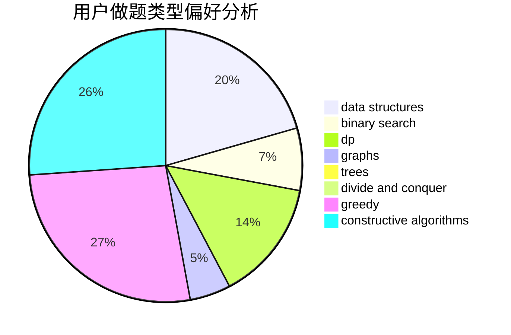

# Mybuger_OVO

<!-- tabs:start -->

#### **用户提交结果分析**

#### **用户做题类型偏好分析**

#### **用户错题知识点分析**

<!-- tabs:end -->
# 推荐题目
[1436E](https://codeforces.com/contest/1436/problem/E)		binary search,
                        data structures,
                        two pointers		  
[1399E2](https://codeforces.com/contest/1399E/problem/2)		binary search,
                        dfs and similar,
                        greedy,
                        sortings,
                        trees,
                        two pointers		  
[610C](https://codeforces.com/contest/610/problem/C)		constructive algorithms		  
[412E](https://codeforces.com/contest/412/problem/E)		implementation		  
[1179D](https://codeforces.com/contest/1179/problem/D)		data structures,
                        dp,
                        trees		  
[560A](https://codeforces.com/contest/560/problem/A)		implementation,
                        sortings		  
[516C](https://codeforces.com/contest/516/problem/C)		dsu,graphs,sortings,trees		  
[1510K](https://codeforces.com/contest/1510/problem/K)		brute force,
                        graphs,
                        implementation		  
[439D](https://codeforces.com/contest/439/problem/D)		binary search,
                        sortings,
                        ternary search,
                        two pointers		  
[1207F](https://codeforces.com/contest/1207/problem/F)		brute force,
                        data structures,
                        implementation		  
