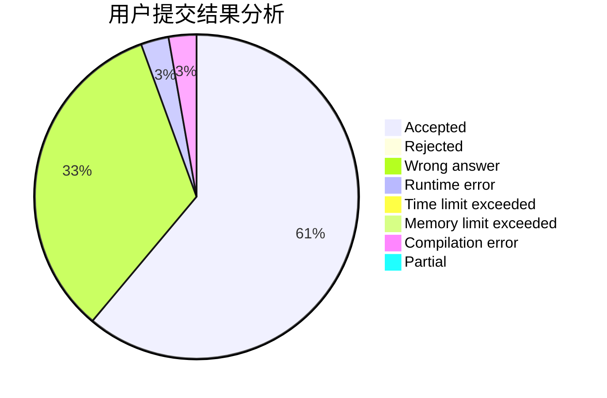
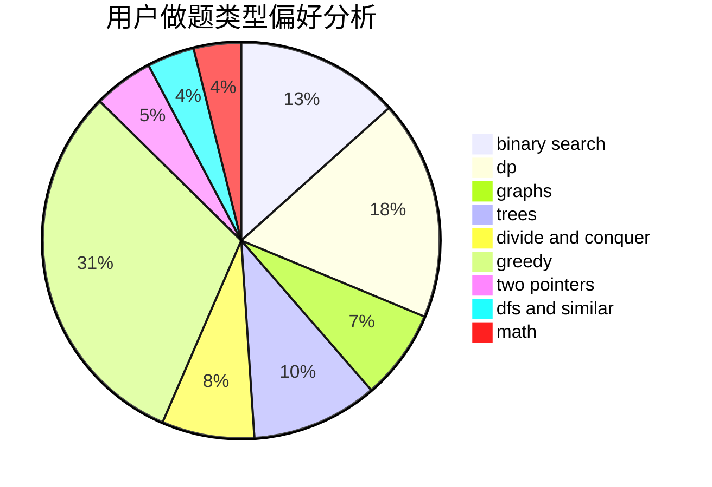

# Mybuger_OVO

<!-- tabs:start -->

#### **用户提交结果分析**

#### **用户做题类型偏好分析**

<!-- tabs:end -->
# 推荐题目
[1446C](https://codeforces.com/contest/1446/problem/C)
[1408G](https://codeforces.com/contest/1408/problem/G)
[629E](https://codeforces.com/contest/629/problem/E)
[438D](https://codeforces.com/contest/438/problem/D)
[1182C](https://codeforces.com/contest/1182/problem/C)
[584C](https://codeforces.com/contest/584/problem/C)
[543C](https://codeforces.com/contest/543/problem/C)
[166E](https://codeforces.com/contest/166/problem/E)
[460E](https://codeforces.com/contest/460/problem/E)
[1213B](https://codeforces.com/contest/1213/problem/B)
