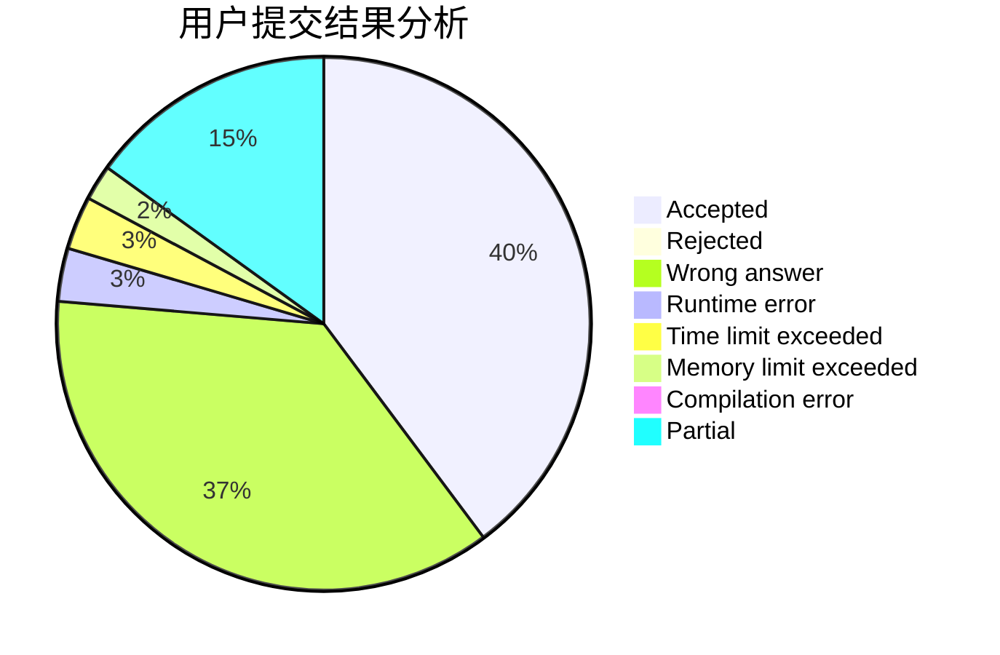
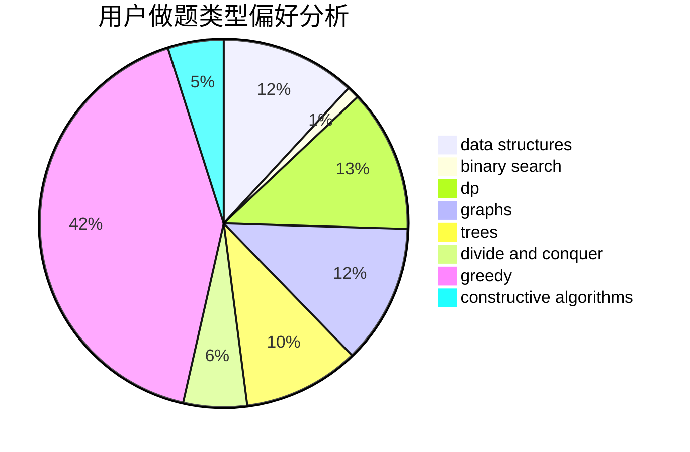
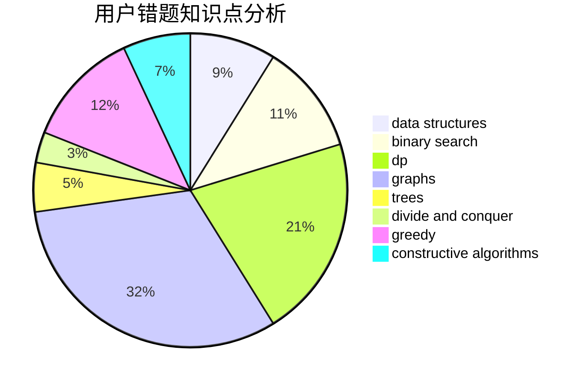

# Myrcella

<!-- tabs:start -->

#### **用户提交结果分析**

#### **用户做题类型偏好分析**

#### **用户错题知识点分析**

<!-- tabs:end -->
# 推荐题目
[720D](https://codeforces.com/contest/720/problem/D)		data structures,
                        dp,
                        sortings		  
[936D](https://codeforces.com/contest/936/problem/D)		dp,
                        greedy		  
[928B](https://codeforces.com/contest/928/problem/B)		*special problem,
                        dp		  
[1413D](https://codeforces.com/contest/1413/problem/D)		data structures,
                        greedy,
                        implementation		  
[1060F](https://codeforces.com/contest/1060/problem/F)		combinatorics,
                        dp		  
[631B](https://codeforces.com/contest/631/problem/B)		constructive algorithms,
                        implementation		  
[935B](https://codeforces.com/contest/935/problem/B)		implementation		  
[962F](https://codeforces.com/contest/962/problem/F)		dfs and similar,
                        graphs,
                        trees		  
[863B](https://codeforces.com/contest/863/problem/B)		brute force,
                        greedy,
                        sortings		  
[634B](https://codeforces.com/contest/634/problem/B)		dsu,graphs,sortings,trees		  
