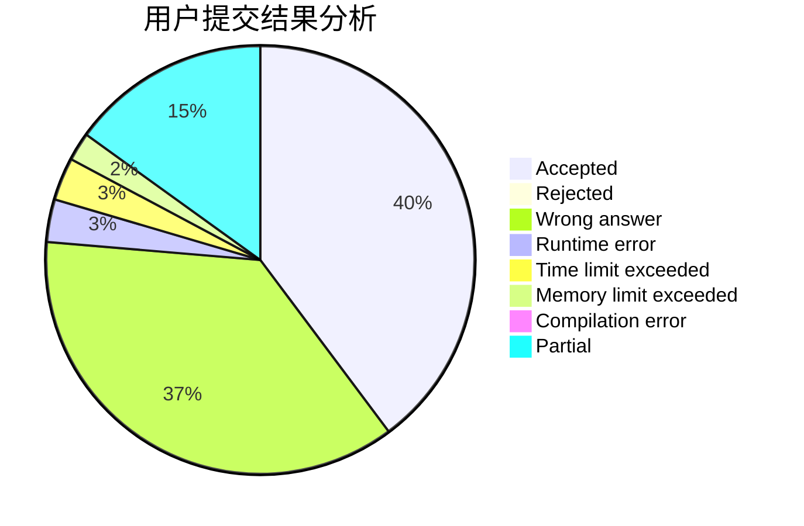
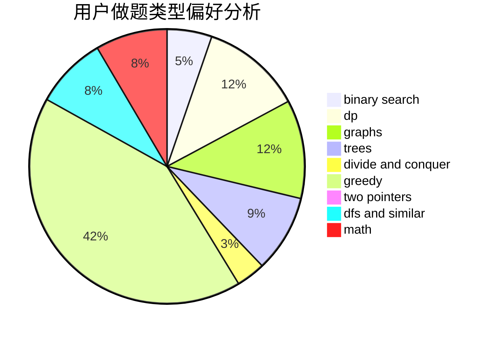

# Myrcella

<!-- tabs:start -->

#### **用户提交结果分析**

#### **用户做题类型偏好分析**

<!-- tabs:end -->
# 推荐题目
[720D](https://codeforces.com/contest/720/problem/D)
[936D](https://codeforces.com/contest/936/problem/D)
[928B](https://codeforces.com/contest/928/problem/B)
[1413D](https://codeforces.com/contest/1413/problem/D)
[1060F](https://codeforces.com/contest/1060/problem/F)
[631B](https://codeforces.com/contest/631/problem/B)
[935B](https://codeforces.com/contest/935/problem/B)
[962F](https://codeforces.com/contest/962/problem/F)
[863B](https://codeforces.com/contest/863/problem/B)
[634B](https://codeforces.com/contest/634/problem/B)
