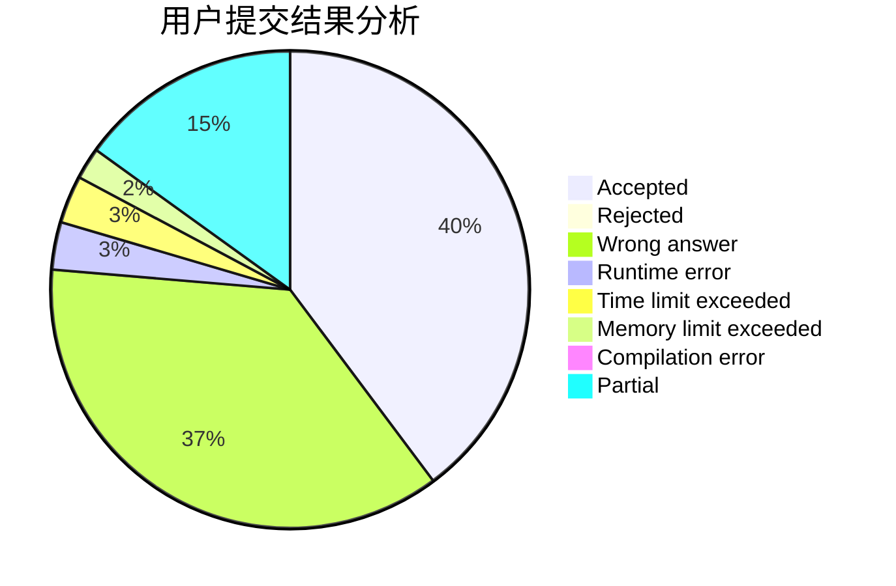
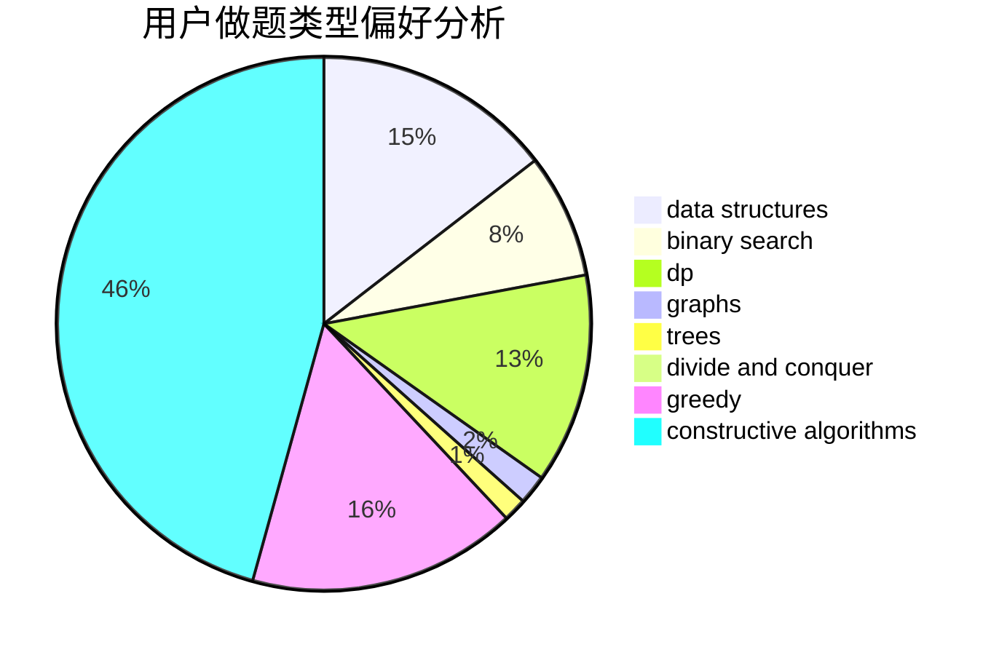
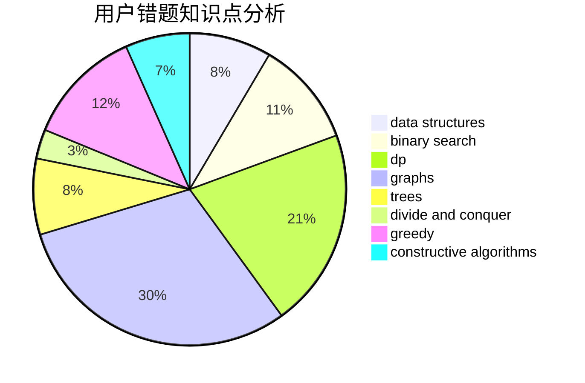

# Myrcella

<!-- tabs:start -->

#### **用户提交结果分析**

#### **用户做题类型偏好分析**

#### **用户错题知识点分析**

<!-- tabs:end -->
# 推荐题目
[702A](https://codeforces.com/contest/702/problem/A)		dp,
                        greedy,
                        implementation		  
[916C](https://codeforces.com/contest/916/problem/C)		constructive algorithms,
                        graphs,
                        shortest paths		  
[911C](https://codeforces.com/contest/911/problem/C)		brute force,
                        constructive algorithms		  
[1402B](https://codeforces.com/contest/1402/problem/B)		*special problem,
                        geometry,
                        sortings		  
[1060C](https://codeforces.com/contest/1060/problem/C)		binary search,
                        implementation,
                        two pointers		  
[612A](https://codeforces.com/contest/612/problem/A)		brute force,
                        implementation,
                        strings		  
[915C](https://codeforces.com/contest/915/problem/C)		dp,
                        greedy		  
[946B](https://codeforces.com/contest/946/problem/B)		math,
                        number theory		  
[845A](https://codeforces.com/contest/845/problem/A)		implementation,
                        sortings		  
[616E](https://codeforces.com/contest/616/problem/E)		implementation,
                        math,
                        number theory		  
