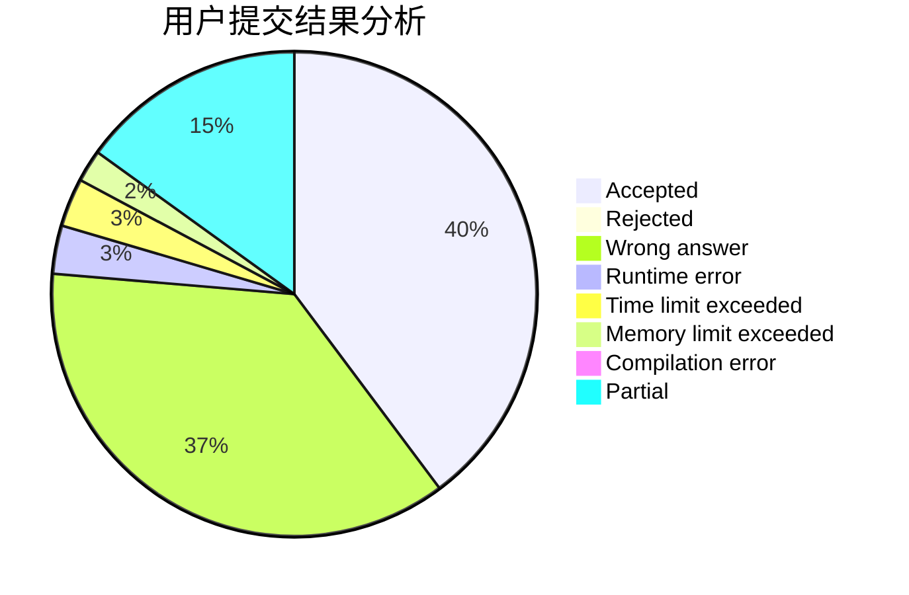
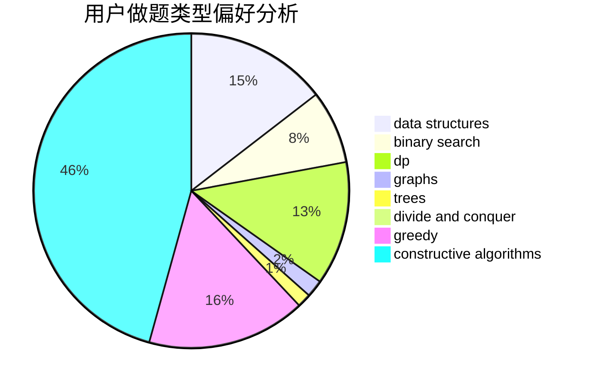
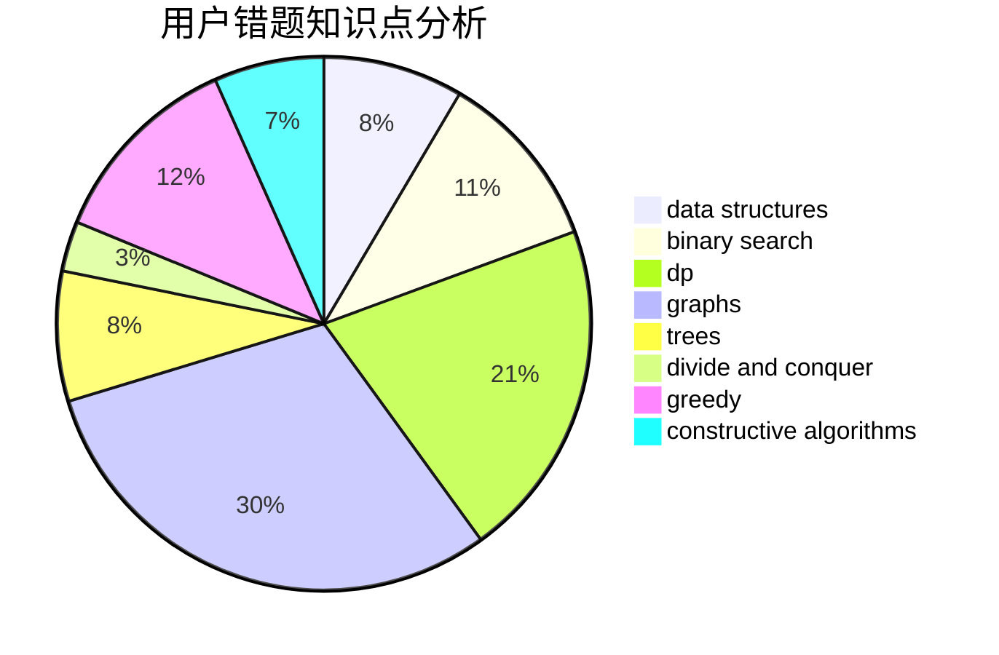

# Myrcella
<!-- tabs:start -->
#### **用户提交结果分析**

#### **用户做题类型偏好分析**

#### **用户错题知识点分析**

<!-- tabs:end -->
# 推荐题目
[The Text Splitting](http://codeforces.com/problemset/problem/612/A)		brute force,
                        implementation,
                        strings		  
[Jamie and Interesting Graph](http://codeforces.com/problemset/problem/916/C)		constructive algorithms,
                        graphs,
                        shortest paths		  
[Madhouse (Hard version)](http://codeforces.com/problemset/problem/1286/C2)		brute force,
                        constructive algorithms,
                        hashing,
                        interactive,
                        math		  
[Weird Subtraction Process](http://codeforces.com/problemset/problem/946/B)		math,
                        number theory		  
[Efim and Strange Grade](https://codeforces.com/contest/719/problem/C)		dp,
                        implementation,
                        math		  
[Chess Tourney](http://codeforces.com/problemset/problem/845/A)		implementation,
                        sortings		  
[Permute Digits](http://codeforces.com/problemset/problem/915/C)		dp,
                        greedy		  
[Bear and Finding Criminals](http://codeforces.com/problemset/problem/680/B)		constructive algorithms,
                        implementation		  
[Three Garlands](http://codeforces.com/problemset/problem/911/C)		brute force,
                        constructive algorithms		  
[Simple Skewness](http://codeforces.com/problemset/problem/626/E)		binary search,
                        math,
                        ternary search		  
<!-- tabs:start -->
#### **data structures**
[The Text Splitting](http://codeforces.com/problemset/problem/103/D)		brute force,
                        data structures,
                        sortings		  
[Jamie and Interesting Graph](https://codeforces.com/contest/1287/problem/D)		constructive algorithms,
                        data structures,
                        dfs and similar,
                        graphs,
                        greedy,
                        trees		  
[Madhouse (Hard version)](http://codeforces.com/problemset/problem/1492/C)		binary search,
                        data structures,
                        dp,
                        greedy,
                        two pointers		  
[Weird Subtraction Process](http://codeforces.com/problemset/problem/1490/G)		binary search,
                        data structures,
                        math		  
[Efim and Strange Grade](http://codeforces.com/problemset/problem/1479/D)		binary search,
                        bitmasks,
                        brute force,
                        data structures,
                        probabilities,
                        trees		  
[Chess Tourney](http://codeforces.com/problemset/problem/1497/A)		brute force,
                        data structures,
                        greedy,
                        sortings		  
[Permute Digits](http://codeforces.com/problemset/problem/1491/C)		brute force,
                        data structures,
                        dp,
                        greedy,
                        implementation		  
[Bear and Finding Criminals](http://codeforces.com/problemset/problem/1492/B)		data structures,
                        greedy,
                        math		  
[Three Garlands](http://codeforces.com/problemset/problem/1436/E)		binary search,
                        data structures,
                        two pointers		  
[Simple Skewness](http://codeforces.com/problemset/problem/1461/D)		binary search,
                        brute force,
                        data structures,
                        divide and conquer,
                        implementation,
                        sortings		  
#### **binary search**
[The Text Splitting](http://codeforces.com/problemset/problem/626/E)		binary search,
                        math,
                        ternary search		  
[Jamie and Interesting Graph](http://codeforces.com/problemset/problem/309/C)		binary search,
                        bitmasks,
                        greedy		  
[Madhouse (Hard version)](http://codeforces.com/problemset/problem/701/C)		binary search,
                        strings,
                        two pointers		  
[Weird Subtraction Process](http://codeforces.com/problemset/problem/1060/C)		binary search,
                        implementation,
                        two pointers		  
[Efim and Strange Grade](http://codeforces.com/problemset/problem/734/C)		binary search,
                        dp,
                        greedy,
                        two pointers		  
[Chess Tourney](http://codeforces.com/problemset/problem/1492/C)		binary search,
                        data structures,
                        dp,
                        greedy,
                        two pointers		  
[Permute Digits](http://codeforces.com/problemset/problem/1463/D)		binary search,
                        constructive algorithms,
                        greedy,
                        two pointers		  
[Bear and Finding Criminals](http://codeforces.com/problemset/problem/1490/G)		binary search,
                        data structures,
                        math		  
[Three Garlands](http://codeforces.com/problemset/problem/1479/D)		binary search,
                        bitmasks,
                        brute force,
                        data structures,
                        probabilities,
                        trees		  
[Simple Skewness](http://codeforces.com/problemset/problem/1436/E)		binary search,
                        data structures,
                        two pointers		  
#### **dp**
[The Text Splitting](https://codeforces.com/contest/719/problem/C)		dp,
                        implementation,
                        math		  
[Jamie and Interesting Graph](http://codeforces.com/problemset/problem/915/C)		dp,
                        greedy		  
[Madhouse (Hard version)](http://codeforces.com/problemset/problem/74/B)		dp,
                        games,
                        greedy		  
[Weird Subtraction Process](https://codeforces.com/contest/1138/problem/E)		dp,
                        graphs,
                        implementation		  
[Efim and Strange Grade](http://codeforces.com/problemset/problem/327/A)		brute force,
                        dp,
                        implementation		  
[Chess Tourney](http://codeforces.com/problemset/problem/702/A)		dp,
                        greedy,
                        implementation		  
[Permute Digits](https://codeforces.com/contest/918/problem/D)		dfs and similar,
                        dp,
                        games,
                        graphs		  
[Bear and Finding Criminals](https://codeforces.com/contest/1248/problem/C)		combinatorics,
                        dp,
                        math		  
[Three Garlands](http://codeforces.com/problemset/problem/734/C)		binary search,
                        dp,
                        greedy,
                        two pointers		  
[Simple Skewness](http://codeforces.com/problemset/problem/917/A)		dp,
                        greedy,
                        implementation,
                        math		  
#### **graph**
[The Text Splitting](http://codeforces.com/problemset/problem/916/C)		constructive algorithms,
                        graphs,
                        shortest paths		  
[Jamie and Interesting Graph](https://codeforces.com/contest/1138/problem/E)		dp,
                        graphs,
                        implementation		  
[Madhouse (Hard version)](https://codeforces.com/contest/918/problem/D)		dfs and similar,
                        dp,
                        games,
                        graphs		  
[Weird Subtraction Process](https://codeforces.com/contest/782/problem/E)		constructive algorithms,
                        dfs and similar,
                        graphs		  
[Efim and Strange Grade](http://codeforces.com/problemset/problem/1361/E)		dfs and similar,
                        graphs,
                        probabilities,
                        trees		  
[Chess Tourney](https://codeforces.com/contest/1287/problem/D)		constructive algorithms,
                        data structures,
                        dfs and similar,
                        graphs,
                        greedy,
                        trees		  
[Permute Digits](http://codeforces.com/problemset/problem/1242/B)		dfs and similar,
                        dsu,
                        graphs,
                        sortings		  
[Bear and Finding Criminals](http://codeforces.com/problemset/problem/1487/C)		brute force,
                        constructive algorithms,
                        dfs and similar,
                        graphs,
                        greedy,
                        implementation,
                        math		  
[Three Garlands](http://codeforces.com/problemset/problem/1437/C)		dp,
                        flows,
                        graph matchings,
                        greedy,
                        math,
                        sortings		  
[Simple Skewness](http://codeforces.com/problemset/problem/1470/D)		constructive algorithms,
                        dfs and similar,
                        graph matchings,
                        graphs,
                        greedy		  
#### **trees**
[The Text Splitting](http://codeforces.com/problemset/problem/321/C)		constructive algorithms,
                        dfs and similar,
                        divide and conquer,
                        greedy,
                        trees		  
[Jamie and Interesting Graph](http://codeforces.com/problemset/problem/846/E)		dfs and similar,
                        greedy,
                        trees		  
[Madhouse (Hard version)](http://codeforces.com/problemset/problem/1361/E)		dfs and similar,
                        graphs,
                        probabilities,
                        trees		  
[Weird Subtraction Process](http://codeforces.com/problemset/problem/734/E)		dfs and similar,
                        dp,
                        trees		  
[Efim and Strange Grade](https://codeforces.com/contest/1287/problem/D)		constructive algorithms,
                        data structures,
                        dfs and similar,
                        graphs,
                        greedy,
                        trees		  
[Chess Tourney](http://codeforces.com/problemset/problem/280/C)		implementation,
                        math,
                        probabilities,
                        trees		  
[Permute Digits](http://codeforces.com/problemset/problem/1479/D)		binary search,
                        bitmasks,
                        brute force,
                        data structures,
                        probabilities,
                        trees		  
[Bear and Finding Criminals](http://codeforces.com/problemset/problem/1511/C)		brute force,
                        data structures,
                        implementation,
                        trees		  
[Three Garlands](http://codeforces.com/problemset/problem/1499/F)		combinatorics,
                        dfs and similar,
                        dp,
                        trees		  
[Simple Skewness](http://codeforces.com/problemset/problem/1491/E)		brute force,
                        dfs and similar,
                        divide and conquer,
                        number theory,
                        trees		  
#### **divide and conquer**
[The Text Splitting](http://codeforces.com/problemset/problem/321/C)		constructive algorithms,
                        dfs and similar,
                        divide and conquer,
                        greedy,
                        trees		  
[Jamie and Interesting Graph](http://codeforces.com/problemset/problem/1461/D)		binary search,
                        brute force,
                        data structures,
                        divide and conquer,
                        implementation,
                        sortings		  
[Madhouse (Hard version)](http://codeforces.com/problemset/problem/1466/G)		combinatorics,
                        divide and conquer,
                        hashing,
                        math,
                        string suffix structures,
                        strings		  
[Weird Subtraction Process](http://codeforces.com/problemset/problem/1490/D)		dfs and similar,
                        divide and conquer,
                        implementation		  
[Efim and Strange Grade](https://codeforces.com/contest/1483/problem/C)		data structures,
                        divide and conquer,
                        dp		  
[Chess Tourney](http://codeforces.com/problemset/problem/1491/E)		brute force,
                        dfs and similar,
                        divide and conquer,
                        number theory,
                        trees		  
[Permute Digits](http://codeforces.com/problemset/problem/1303/G)		data structures,
                        divide and conquer,
                        geometry,
                        trees		  
[Bear and Finding Criminals](http://codeforces.com/problemset/problem/1494/D)		constructive algorithms,
                        data structures,
                        dfs and similar,
                        divide and conquer,
                        dsu,
                        greedy,
                        sortings,
                        trees		  
[Three Garlands](http://codeforces.com/problemset/problem/1482/E)		data structures,
                        divide and conquer,
                        dp		  
[Simple Skewness](http://codeforces.com/problemset/problem/566/C)		dfs and similar,
                        divide and conquer,
                        trees		  
#### **greedy**
[The Text Splitting](http://codeforces.com/problemset/problem/915/C)		dp,
                        greedy		  
[Jamie and Interesting Graph](http://codeforces.com/problemset/problem/321/C)		constructive algorithms,
                        dfs and similar,
                        divide and conquer,
                        greedy,
                        trees		  
[Madhouse (Hard version)](http://codeforces.com/problemset/problem/74/B)		dp,
                        games,
                        greedy		  
[Weird Subtraction Process](http://codeforces.com/problemset/problem/702/A)		dp,
                        greedy,
                        implementation		  
[Efim and Strange Grade](http://codeforces.com/problemset/problem/846/E)		dfs and similar,
                        greedy,
                        trees		  
[Chess Tourney](http://codeforces.com/problemset/problem/309/C)		binary search,
                        bitmasks,
                        greedy		  
[Permute Digits](http://codeforces.com/problemset/problem/734/C)		binary search,
                        dp,
                        greedy,
                        two pointers		  
[Bear and Finding Criminals](http://codeforces.com/problemset/problem/917/A)		dp,
                        greedy,
                        implementation,
                        math		  
[Three Garlands](https://codeforces.com/contest/1287/problem/D)		constructive algorithms,
                        data structures,
                        dfs and similar,
                        graphs,
                        greedy,
                        trees		  
[Simple Skewness](http://codeforces.com/problemset/problem/717/B)		dp,
                        greedy		  
#### **constructive algorithms**
[The Text Splitting](http://codeforces.com/problemset/problem/916/C)		constructive algorithms,
                        graphs,
                        shortest paths		  
[Jamie and Interesting Graph](http://codeforces.com/problemset/problem/1286/C2)		brute force,
                        constructive algorithms,
                        hashing,
                        interactive,
                        math		  
[Madhouse (Hard version)](http://codeforces.com/problemset/problem/680/B)		constructive algorithms,
                        implementation		  
[Weird Subtraction Process](http://codeforces.com/problemset/problem/911/C)		brute force,
                        constructive algorithms		  
[Efim and Strange Grade](http://codeforces.com/problemset/problem/321/C)		constructive algorithms,
                        dfs and similar,
                        divide and conquer,
                        greedy,
                        trees		  
[Chess Tourney](http://codeforces.com/problemset/problem/275/B)		constructive algorithms,
                        implementation		  
[Permute Digits](https://codeforces.com/contest/782/problem/E)		constructive algorithms,
                        dfs and similar,
                        graphs		  
[Bear and Finding Criminals](https://codeforces.com/contest/1287/problem/D)		constructive algorithms,
                        data structures,
                        dfs and similar,
                        graphs,
                        greedy,
                        trees		  
[Three Garlands](http://codeforces.com/problemset/problem/1493/A)		constructive algorithms,
                        greedy		  
[Simple Skewness](http://codeforces.com/problemset/problem/1463/D)		binary search,
                        constructive algorithms,
                        greedy,
                        two pointers		  
#### **sortings**
[The Text Splitting](http://codeforces.com/problemset/problem/845/A)		implementation,
                        sortings		  
[Jamie and Interesting Graph](http://codeforces.com/problemset/problem/1402/B)		*special problem,
                        geometry,
                        sortings		  
[Madhouse (Hard version)](http://codeforces.com/problemset/problem/103/D)		brute force,
                        data structures,
                        sortings		  
[Weird Subtraction Process](http://codeforces.com/problemset/problem/1242/B)		dfs and similar,
                        dsu,
                        graphs,
                        sortings		  
[Efim and Strange Grade](https://codeforces.com/contest/1496/problem/C)		geometry,
                        greedy,
                        math,
                        sortings		  
[Chess Tourney](http://codeforces.com/problemset/problem/1495/A)		geometry,
                        greedy,
                        math,
                        sortings		  
[Permute Digits](http://codeforces.com/problemset/problem/1497/A)		brute force,
                        data structures,
                        greedy,
                        sortings		  
[Bear and Finding Criminals](http://codeforces.com/problemset/problem/1427/A)		math,
                        sortings		  
[Three Garlands](http://codeforces.com/problemset/problem/1461/D)		binary search,
                        brute force,
                        data structures,
                        divide and conquer,
                        implementation,
                        sortings		  
[Simple Skewness](http://codeforces.com/problemset/problem/1437/C)		dp,
                        flows,
                        graph matchings,
                        greedy,
                        math,
                        sortings		  
<!-- tabs:end -->
