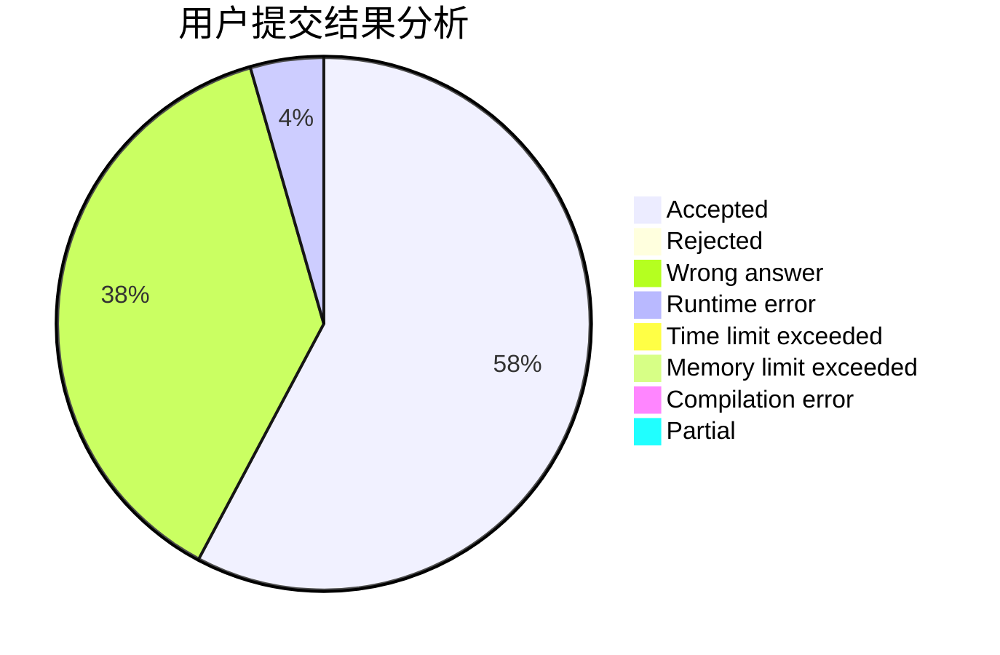
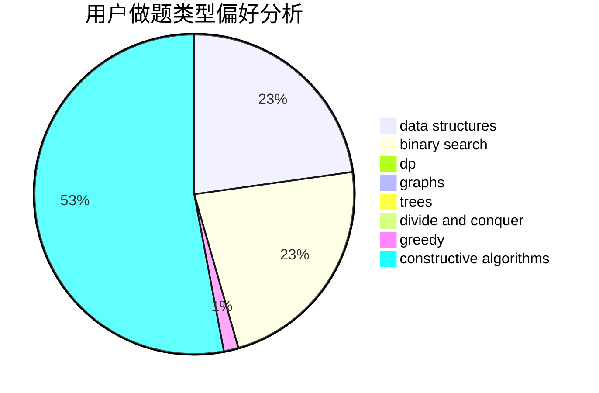
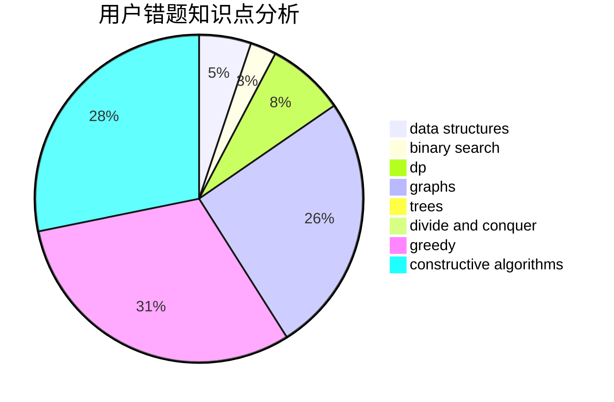

# Mysterious_Heroine_X

<!-- tabs:start -->

#### **用户提交结果分析**

#### **用户做题类型偏好分析**

#### **用户错题知识点分析**

<!-- tabs:end -->
# 推荐题目
[965A](https://codeforces.com/contest/965/problem/A)		math		  
[1113A](https://codeforces.com/contest/1113/problem/A)		dp,
                        greedy,
                        math		  
[682E](https://codeforces.com/contest/682/problem/E)		geometry,
                        two pointers		  
[1152F1](https://codeforces.com/contest/1152F/problem/1)		bitmasks,
                        dp,
                        matrices		  
[334A](https://codeforces.com/contest/334/problem/A)		implementation		  
[1043F](https://codeforces.com/contest/1043/problem/F)		bitmasks,
                        combinatorics,
                        dp,
                        math,
                        number theory,
                        shortest paths		  
[1174E](https://codeforces.com/contest/1174/problem/E)		combinatorics,
                        dp,
                        math,
                        number theory		  
[303D](https://codeforces.com/contest/303/problem/D)		math,
                        number theory		  
[1482E](https://codeforces.com/contest/1482/problem/E)		data structures,
                        divide and conquer,
                        dp		  
[1489D](https://codeforces.com/contest/1489/problem/D)		dsu,graphs,sortings,trees		  
