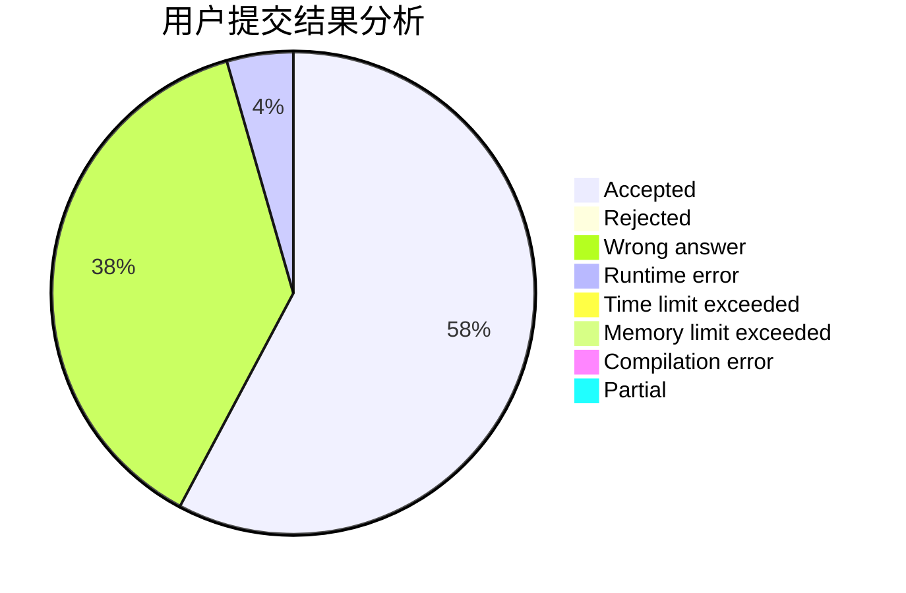
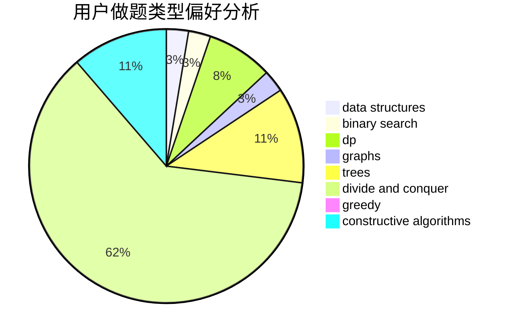
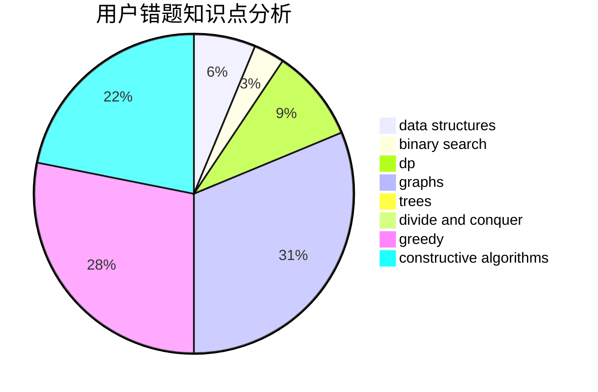

# Mysterious_Heroine_X

<!-- tabs:start -->

#### **用户提交结果分析**

#### **用户做题类型偏好分析**

#### **用户错题知识点分析**

<!-- tabs:end -->
# 推荐题目
[987A](https://codeforces.com/contest/987/problem/A)		implementation		  
[1113D](https://codeforces.com/contest/1113/problem/D)		dsu,graphs,sortings,trees		  
[707A](https://codeforces.com/contest/707/problem/A)		implementation		  
[1154F](https://codeforces.com/contest/1154/problem/F)		dp,
                        greedy,
                        sortings		  
[360C](https://codeforces.com/contest/360/problem/C)		combinatorics,
                        dp		  
[1044B](https://codeforces.com/contest/1044/problem/B)		dfs and similar,
                        interactive,
                        trees		  
[11781](https://codeforces.com/contest/1178/problem/1)		dsu,graphs,sortings,trees		  
[321E](https://codeforces.com/contest/321/problem/E)		data structures,
                        divide and conquer,
                        dp		  
[1490C](https://codeforces.com/contest/1490/problem/C)		binary search,
                        brute force,
                        brute force,
                        math		  
[1497B](https://codeforces.com/contest/1497/problem/B)		constructive algorithms,
                        greedy,
                        math		  
