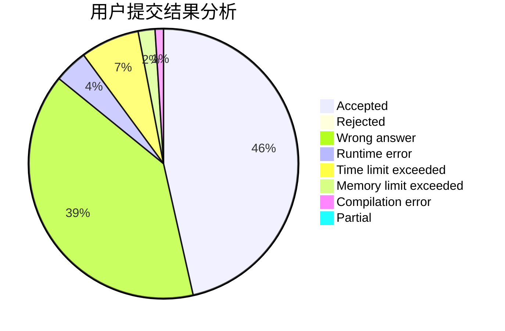
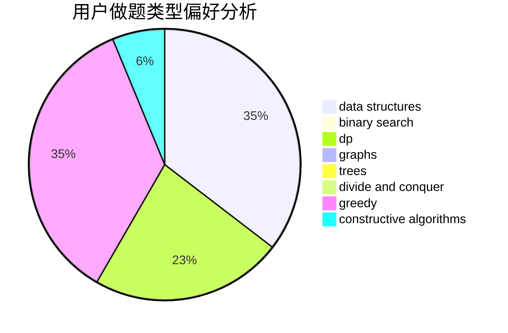
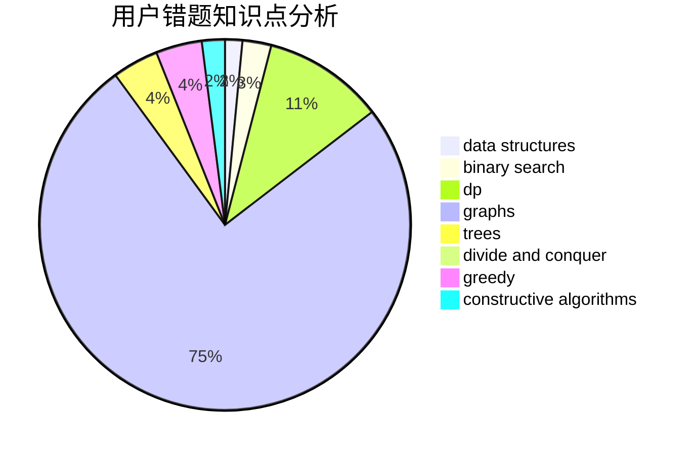

# N-Zoth

<!-- tabs:start -->

#### **用户提交结果分析**

#### **用户做题类型偏好分析**

#### **用户错题知识点分析**

<!-- tabs:end -->
# 推荐题目
[328A](https://codeforces.com/contest/328/problem/A)		implementation		  
[445A](https://codeforces.com/contest/445/problem/A)		dfs and similar,
                        implementation		  
[766D](https://codeforces.com/contest/766/problem/D)		data structures,
                        dfs and similar,
                        dp,
                        dsu,
                        graphs		  
[600E](https://codeforces.com/contest/600/problem/E)		data structures,
                        dfs and similar,
                        dsu,
                        trees		  
[965B](https://codeforces.com/contest/965/problem/B)		implementation		  
[234C](https://codeforces.com/contest/234/problem/C)		dp,
                        implementation		  
[1225A](https://codeforces.com/contest/1225/problem/A)		math		  
[1335E1](https://codeforces.com/contest/1335E/problem/1)		binary search,
                        brute force,
                        data structures,
                        dp,
                        two pointers		  
[1482E](https://codeforces.com/contest/1482/problem/E)		data structures,
                        divide and conquer,
                        dp		  
[1489D](https://codeforces.com/contest/1489/problem/D)		dsu,graphs,sortings,trees		  
