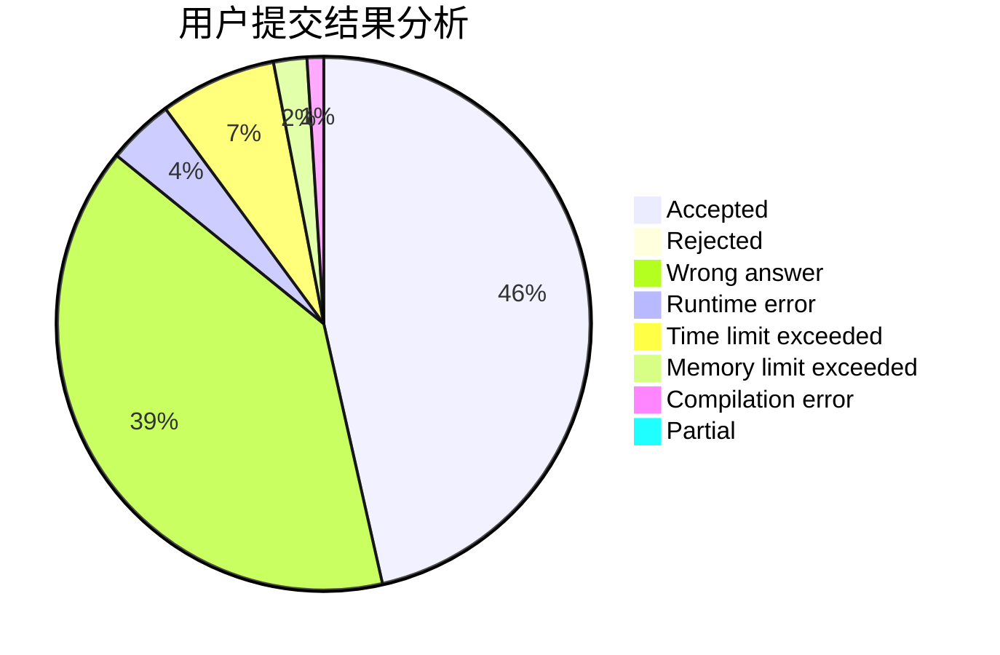
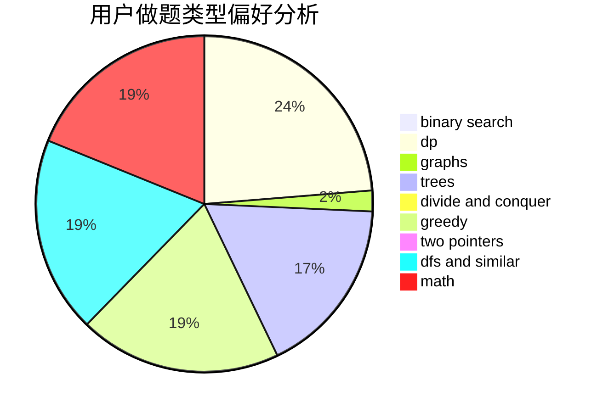

# N-Zoth

<!-- tabs:start -->

#### **用户提交结果分析**

#### **用户做题类型偏好分析**

<!-- tabs:end -->
# 推荐题目
[356D](https://codeforces.com/contest/356/problem/D)
[464E](https://codeforces.com/contest/464/problem/E)
[786A](https://codeforces.com/contest/786/problem/A)
[620A](https://codeforces.com/contest/620/problem/A)
[987B](https://codeforces.com/contest/987/problem/B)
[256D](https://codeforces.com/contest/256/problem/D)
[1231C](https://codeforces.com/contest/1231/problem/C)
[1342E](https://codeforces.com/contest/1342/problem/E)
[1490C](https://codeforces.com/contest/1490/problem/C)
[1497B](https://codeforces.com/contest/1497/problem/B)
