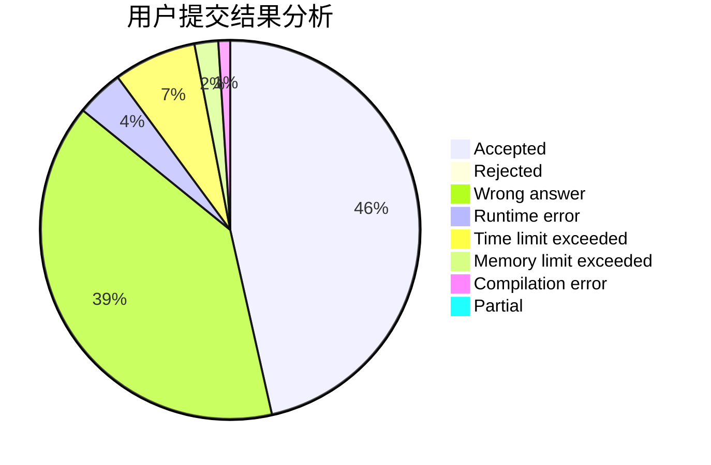
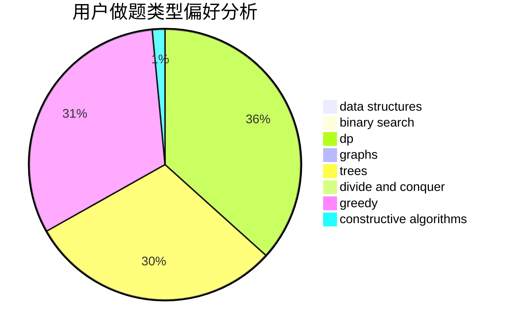
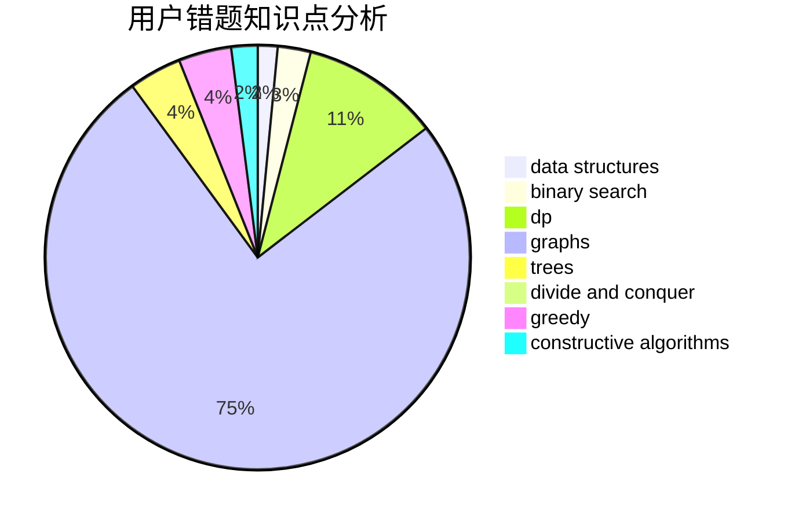

# N-Zoth

<!-- tabs:start -->

#### **用户提交结果分析**

#### **用户做题类型偏好分析**

#### **用户错题知识点分析**

<!-- tabs:end -->
# 推荐题目
[356D](https://codeforces.com/contest/356/problem/D)		bitmasks,
                        constructive algorithms,
                        dp,
                        greedy		  
[464E](https://codeforces.com/contest/464/problem/E)		data structures,
                        graphs,
                        shortest paths		  
[786A](https://codeforces.com/contest/786/problem/A)		dfs and similar,
                        dp,
                        games		  
[620A](https://codeforces.com/contest/620/problem/A)		implementation,
                        math		  
[987B](https://codeforces.com/contest/987/problem/B)		math		  
[256D](https://codeforces.com/contest/256/problem/D)		dp		  
[1231C](https://codeforces.com/contest/1231/problem/C)		greedy		  
[1342E](https://codeforces.com/contest/1342/problem/E)		combinatorics,
                        fft,
                        math		  
[1490C](https://codeforces.com/contest/1490/problem/C)		binary search,
                        brute force,
                        brute force,
                        math		  
[1497B](https://codeforces.com/contest/1497/problem/B)		constructive algorithms,
                        greedy,
                        math		  
