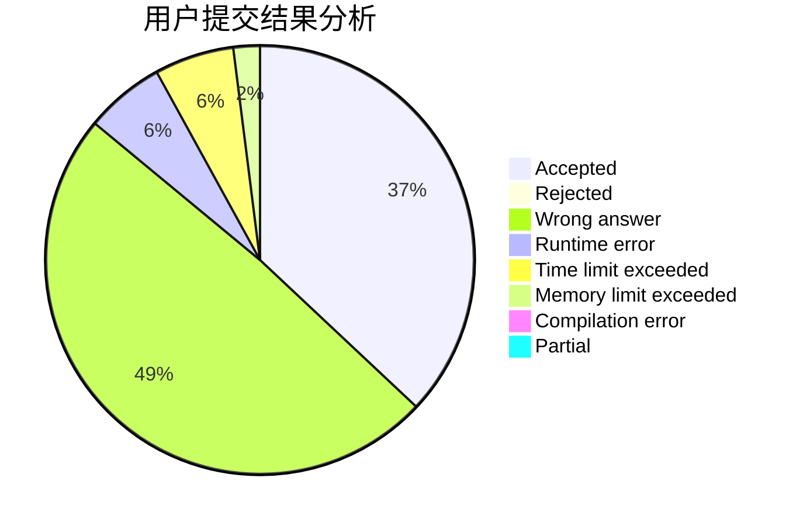
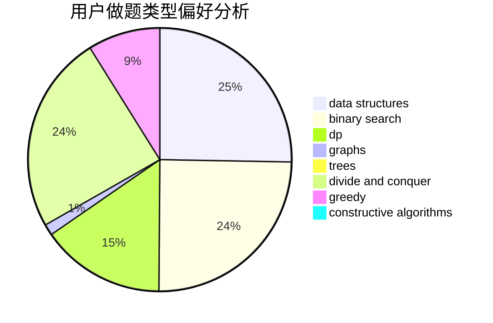
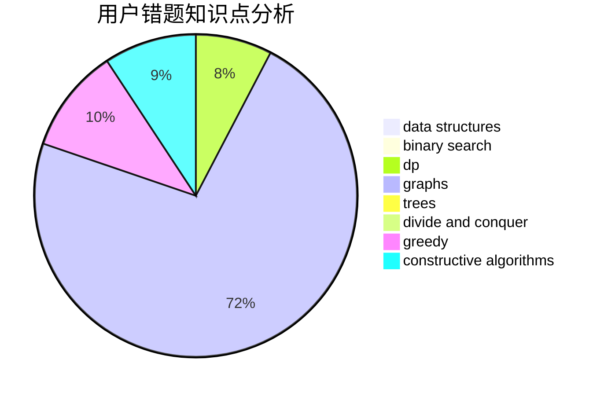

# N00Borz
<!-- tabs:start -->
#### **用户提交结果分析**

#### **用户做题类型偏好分析**

#### **用户错题知识点分析**

<!-- tabs:end -->
# 推荐题目
[Jumping on Walls](http://codeforces.com/problemset/problem/198/B)		shortest paths		  
[To Play or not to Play](http://codeforces.com/problemset/problem/856/F)		greedy		  
[Cowslip Collections](http://codeforces.com/problemset/problem/645/F)		combinatorics,
                        math,
                        number theory		  
[Matching vs  Independent Set](https://codeforces.com/contest/1199/problem/E)		constructive algorithms,
                        graphs,
                        greedy,
                        sortings		  
[DZY Loves Hash](http://codeforces.com/problemset/problem/447/A)		implementation		  
[Convenient For Everybody](http://codeforces.com/problemset/problem/939/C)		binary search,
                        two pointers		  
[Substring](http://codeforces.com/problemset/problem/919/D)		dfs and similar,
                        dp,
                        graphs		  
[Pokermon League challenge](http://codeforces.com/problemset/problem/717/H)		math,
                        probabilities		  
[Minimax Problem](http://codeforces.com/problemset/problem/1288/D)		binary search,
                        bitmasks,
                        dp		  
[Valeriy and Deque](http://codeforces.com/problemset/problem/1179/A)		data structures,
                        implementation		  
<!-- tabs:start -->
#### **data structures**
[Jumping on Walls](http://codeforces.com/problemset/problem/1179/A)		data structures,
                        implementation		  
[To Play or not to Play](http://codeforces.com/problemset/problem/475/D)		brute force,
                        data structures,
                        math		  
[Cowslip Collections](http://codeforces.com/problemset/problem/671/D)		data structures,
                        dp,
                        greedy		  
[Matching vs  Independent Set](http://codeforces.com/problemset/problem/293/E)		data structures,
                        divide and conquer,
                        trees		  
[DZY Loves Hash](http://codeforces.com/problemset/problem/700/D)		data structures,
                        greedy		  
[Convenient For Everybody](http://codeforces.com/problemset/problem/765/F)		data structures		  
[Substring](http://codeforces.com/problemset/problem/1492/C)		binary search,
                        data structures,
                        dp,
                        greedy,
                        two pointers		  
[Pokermon League challenge](http://codeforces.com/problemset/problem/1490/G)		binary search,
                        data structures,
                        math		  
[Minimax Problem](http://codeforces.com/problemset/problem/1479/D)		binary search,
                        bitmasks,
                        brute force,
                        data structures,
                        probabilities,
                        trees		  
[Valeriy and Deque](http://codeforces.com/problemset/problem/1497/A)		brute force,
                        data structures,
                        greedy,
                        sortings		  
#### **binary search**
[Jumping on Walls](http://codeforces.com/problemset/problem/939/C)		binary search,
                        two pointers		  
[To Play or not to Play](http://codeforces.com/problemset/problem/1288/D)		binary search,
                        bitmasks,
                        dp		  
[Cowslip Collections](http://codeforces.com/problemset/problem/1492/C)		binary search,
                        data structures,
                        dp,
                        greedy,
                        two pointers		  
[Matching vs  Independent Set](http://codeforces.com/problemset/problem/1463/D)		binary search,
                        constructive algorithms,
                        greedy,
                        two pointers		  
[DZY Loves Hash](http://codeforces.com/problemset/problem/1490/G)		binary search,
                        data structures,
                        math		  
[Convenient For Everybody](http://codeforces.com/problemset/problem/1479/D)		binary search,
                        bitmasks,
                        brute force,
                        data structures,
                        probabilities,
                        trees		  
[Substring](http://codeforces.com/problemset/problem/1436/E)		binary search,
                        data structures,
                        two pointers		  
[Pokermon League challenge](http://codeforces.com/problemset/problem/1461/D)		binary search,
                        brute force,
                        data structures,
                        divide and conquer,
                        implementation,
                        sortings		  
[Minimax Problem](http://codeforces.com/problemset/problem/1493/C)		binary search,
                        brute force,
                        constructive algorithms,
                        greedy,
                        strings		  
[Valeriy and Deque](http://codeforces.com/problemset/problem/1487/D)		binary search,
                        brute force,
                        math,
                        number theory		  
#### **dp**
[Jumping on Walls](http://codeforces.com/problemset/problem/919/D)		dfs and similar,
                        dp,
                        graphs		  
[To Play or not to Play](http://codeforces.com/problemset/problem/1288/D)		binary search,
                        bitmasks,
                        dp		  
[Cowslip Collections](http://codeforces.com/problemset/problem/321/D)		dp,
                        greedy,
                        math		  
[Matching vs  Independent Set](http://codeforces.com/problemset/problem/671/D)		data structures,
                        dp,
                        greedy		  
[DZY Loves Hash](http://codeforces.com/problemset/problem/294/B)		dp,
                        greedy		  
[Convenient For Everybody](http://codeforces.com/problemset/problem/1385/D)		bitmasks,
                        brute force,
                        divide and conquer,
                        dp,
                        implementation		  
[Substring](http://codeforces.com/problemset/problem/1492/C)		binary search,
                        data structures,
                        dp,
                        greedy,
                        two pointers		  
[Pokermon League challenge](https://codeforces.com/contest/1457/problem/C)		brute force,
                        dp,
                        implementation		  
[Minimax Problem](http://codeforces.com/problemset/problem/1491/C)		brute force,
                        data structures,
                        dp,
                        greedy,
                        implementation		  
[Valeriy and Deque](http://codeforces.com/problemset/problem/1437/C)		dp,
                        flows,
                        graph matchings,
                        greedy,
                        math,
                        sortings		  
#### **graph**
[Jumping on Walls](https://codeforces.com/contest/1199/problem/E)		constructive algorithms,
                        graphs,
                        greedy,
                        sortings		  
[To Play or not to Play](http://codeforces.com/problemset/problem/919/D)		dfs and similar,
                        dp,
                        graphs		  
[Cowslip Collections](http://codeforces.com/problemset/problem/611/H)		constructive algorithms,
                        flows,
                        graphs		  
[Matching vs  Independent Set](http://codeforces.com/problemset/problem/1487/C)		brute force,
                        constructive algorithms,
                        dfs and similar,
                        graphs,
                        greedy,
                        implementation,
                        math		  
[DZY Loves Hash](http://codeforces.com/problemset/problem/1228/D)		brute force,
                        constructive algorithms,
                        graphs,
                        hashing,
                        implementation		  
[Convenient For Everybody](http://codeforces.com/problemset/problem/1487/C)		brute force,
                        constructive algorithms,
                        dfs and similar,
                        graphs,
                        greedy,
                        implementation,
                        math		  
[Substring](http://codeforces.com/problemset/problem/1437/C)		dp,
                        flows,
                        graph matchings,
                        greedy,
                        math,
                        sortings		  
[Pokermon League challenge](http://codeforces.com/problemset/problem/1470/D)		constructive algorithms,
                        dfs and similar,
                        graph matchings,
                        graphs,
                        greedy		  
[Minimax Problem](http://codeforces.com/problemset/problem/1476/C)		dp,
                        graphs,
                        greedy		  
[Valeriy and Deque](http://codeforces.com/problemset/problem/1304/D)		constructive algorithms,
                        graphs,
                        greedy,
                        two pointers		  
#### **trees**
[Jumping on Walls](http://codeforces.com/problemset/problem/293/E)		data structures,
                        divide and conquer,
                        trees		  
[To Play or not to Play](http://codeforces.com/problemset/problem/1479/D)		binary search,
                        bitmasks,
                        brute force,
                        data structures,
                        probabilities,
                        trees		  
[Cowslip Collections](http://codeforces.com/problemset/problem/1511/C)		brute force,
                        data structures,
                        implementation,
                        trees		  
[Matching vs  Independent Set](http://codeforces.com/problemset/problem/1499/F)		combinatorics,
                        dfs and similar,
                        dp,
                        trees		  
[DZY Loves Hash](http://codeforces.com/problemset/problem/1491/E)		brute force,
                        dfs and similar,
                        divide and conquer,
                        number theory,
                        trees		  
[Convenient For Everybody](http://codeforces.com/problemset/problem/1466/D)		data structures,
                        greedy,
                        sortings,
                        trees		  
[Substring](http://codeforces.com/problemset/problem/1495/D)		combinatorics,
                        dfs and similar,
                        graphs,
                        math,
                        shortest paths,
                        trees		  
[Pokermon League challenge](http://codeforces.com/problemset/problem/1303/G)		data structures,
                        divide and conquer,
                        geometry,
                        trees		  
[Minimax Problem](http://codeforces.com/problemset/problem/1454/E)		combinatorics,
                        dfs and similar,
                        graphs,
                        trees		  
[Valeriy and Deque](http://codeforces.com/problemset/problem/1494/D)		constructive algorithms,
                        data structures,
                        dfs and similar,
                        divide and conquer,
                        dsu,
                        greedy,
                        sortings,
                        trees		  
#### **divide and conquer**
[Jumping on Walls](http://codeforces.com/problemset/problem/1385/D)		bitmasks,
                        brute force,
                        divide and conquer,
                        dp,
                        implementation		  
[To Play or not to Play](http://codeforces.com/problemset/problem/293/E)		data structures,
                        divide and conquer,
                        trees		  
[Cowslip Collections](http://codeforces.com/problemset/problem/1461/D)		binary search,
                        brute force,
                        data structures,
                        divide and conquer,
                        implementation,
                        sortings		  
[Matching vs  Independent Set](http://codeforces.com/problemset/problem/1466/G)		combinatorics,
                        divide and conquer,
                        hashing,
                        math,
                        string suffix structures,
                        strings		  
[DZY Loves Hash](http://codeforces.com/problemset/problem/1490/D)		dfs and similar,
                        divide and conquer,
                        implementation		  
[Convenient For Everybody](https://codeforces.com/contest/1483/problem/C)		data structures,
                        divide and conquer,
                        dp		  
[Substring](http://codeforces.com/problemset/problem/1491/E)		brute force,
                        dfs and similar,
                        divide and conquer,
                        number theory,
                        trees		  
[Pokermon League challenge](http://codeforces.com/problemset/problem/1303/G)		data structures,
                        divide and conquer,
                        geometry,
                        trees		  
[Minimax Problem](http://codeforces.com/problemset/problem/1494/D)		constructive algorithms,
                        data structures,
                        dfs and similar,
                        divide and conquer,
                        dsu,
                        greedy,
                        sortings,
                        trees		  
[Valeriy and Deque](http://codeforces.com/problemset/problem/1482/E)		data structures,
                        divide and conquer,
                        dp		  
#### **greedy**
[Jumping on Walls](http://codeforces.com/problemset/problem/856/F)		greedy		  
[To Play or not to Play](https://codeforces.com/contest/1199/problem/E)		constructive algorithms,
                        graphs,
                        greedy,
                        sortings		  
[Cowslip Collections](http://codeforces.com/problemset/problem/1077/B)		greedy		  
[Matching vs  Independent Set](http://codeforces.com/problemset/problem/1271/A)		brute force,
                        greedy,
                        math		  
[DZY Loves Hash](http://codeforces.com/problemset/problem/321/D)		dp,
                        greedy,
                        math		  
[Convenient For Everybody](http://codeforces.com/problemset/problem/671/D)		data structures,
                        dp,
                        greedy		  
[Substring](http://codeforces.com/problemset/problem/294/B)		dp,
                        greedy		  
[Pokermon League challenge](http://codeforces.com/problemset/problem/1186/D)		constructive algorithms,
                        greedy,
                        math		  
[Minimax Problem](http://codeforces.com/problemset/problem/1043/C)		constructive algorithms,
                        greedy,
                        implementation		  
[Valeriy and Deque](http://codeforces.com/problemset/problem/1487/C)		brute force,
                        constructive algorithms,
                        dfs and similar,
                        graphs,
                        greedy,
                        implementation,
                        math		  
#### **constructive algorithms**
[Jumping on Walls](https://codeforces.com/contest/1199/problem/E)		constructive algorithms,
                        graphs,
                        greedy,
                        sortings		  
[To Play or not to Play](http://codeforces.com/problemset/problem/1186/D)		constructive algorithms,
                        greedy,
                        math		  
[Cowslip Collections](http://codeforces.com/problemset/problem/611/H)		constructive algorithms,
                        flows,
                        graphs		  
[Matching vs  Independent Set](http://codeforces.com/problemset/problem/1043/C)		constructive algorithms,
                        greedy,
                        implementation		  
[DZY Loves Hash](http://codeforces.com/problemset/problem/1487/C)		brute force,
                        constructive algorithms,
                        dfs and similar,
                        graphs,
                        greedy,
                        implementation,
                        math		  
[Convenient For Everybody](http://codeforces.com/problemset/problem/1228/D)		brute force,
                        constructive algorithms,
                        graphs,
                        hashing,
                        implementation		  
[Substring](http://codeforces.com/problemset/problem/1451/E2)		bitmasks,
                        constructive algorithms,
                        interactive,
                        math		  
[Pokermon League challenge](http://codeforces.com/problemset/problem/1493/A)		constructive algorithms,
                        greedy		  
[Minimax Problem](http://codeforces.com/problemset/problem/1463/D)		binary search,
                        constructive algorithms,
                        greedy,
                        two pointers		  
[Valeriy and Deque](https://codeforces.com/contest/1456/problem/B)		bitmasks,
                        brute force,
                        constructive algorithms		  
#### **sortings**
[Jumping on Walls](https://codeforces.com/contest/1199/problem/E)		constructive algorithms,
                        graphs,
                        greedy,
                        sortings		  
[To Play or not to Play](https://codeforces.com/contest/1496/problem/C)		geometry,
                        greedy,
                        math,
                        sortings		  
[Cowslip Collections](http://codeforces.com/problemset/problem/1495/A)		geometry,
                        greedy,
                        math,
                        sortings		  
[Matching vs  Independent Set](http://codeforces.com/problemset/problem/1497/A)		brute force,
                        data structures,
                        greedy,
                        sortings		  
[DZY Loves Hash](http://codeforces.com/problemset/problem/1427/A)		math,
                        sortings		  
[Convenient For Everybody](http://codeforces.com/problemset/problem/1461/D)		binary search,
                        brute force,
                        data structures,
                        divide and conquer,
                        implementation,
                        sortings		  
[Substring](http://codeforces.com/problemset/problem/1437/C)		dp,
                        flows,
                        graph matchings,
                        greedy,
                        math,
                        sortings		  
[Pokermon League challenge](http://codeforces.com/problemset/problem/1473/A)		greedy,
                        implementation,
                        math,
                        sortings		  
[Minimax Problem](http://codeforces.com/problemset/problem/1486/B)		binary search,
                        geometry,
                        shortest paths,
                        sortings		  
[Valeriy and Deque](http://codeforces.com/problemset/problem/1480/B)		greedy,
                        implementation,
                        sortings		  
<!-- tabs:end -->
