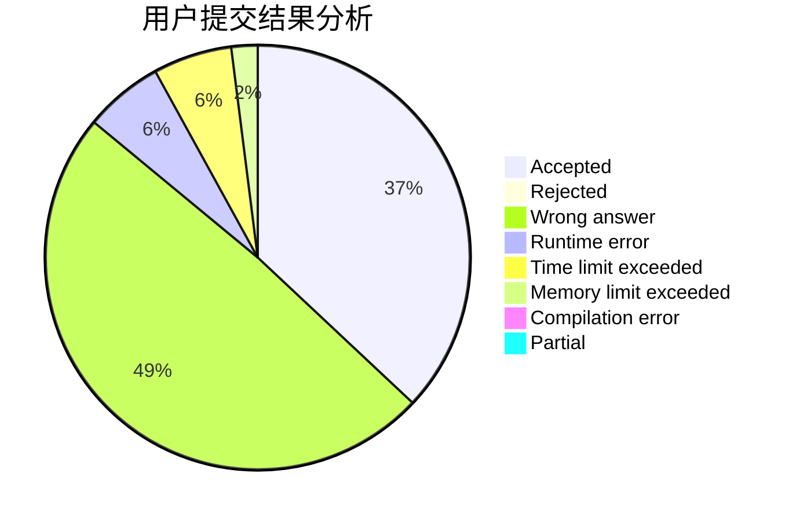
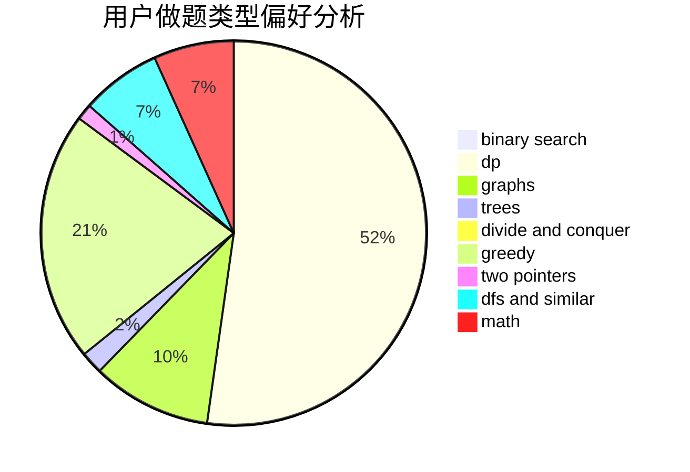

# N00Borz

<!-- tabs:start -->

#### **用户提交结果分析**

#### **用户做题类型偏好分析**

<!-- tabs:end -->
# 推荐题目
[939E](https://codeforces.com/contest/939/problem/E)
[672B](https://codeforces.com/contest/672/problem/B)
[1295F](https://codeforces.com/contest/1295/problem/F)
[875F](https://codeforces.com/contest/875/problem/F)
[960F](https://codeforces.com/contest/960/problem/F)
[785B](https://codeforces.com/contest/785/problem/B)
[467C](https://codeforces.com/contest/467/problem/C)
[1501F](https://codeforces.com/contest/1501/problem/F)
[1203A](https://codeforces.com/contest/1203/problem/A)
[631A](https://codeforces.com/contest/631/problem/A)
