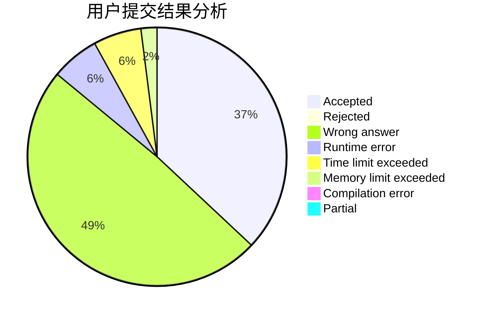
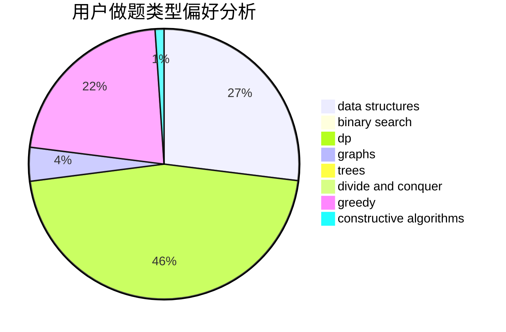
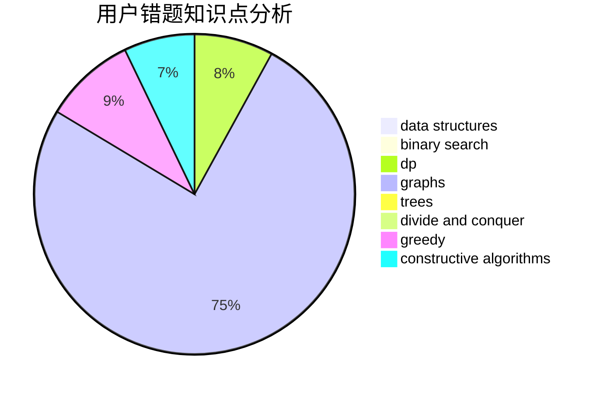

# N00Borz

<!-- tabs:start -->

#### **用户提交结果分析**

#### **用户做题类型偏好分析**

#### **用户错题知识点分析**

<!-- tabs:end -->
# 推荐题目
[939E](https://codeforces.com/contest/939/problem/E)		binary search,
                        greedy,
                        ternary search,
                        two pointers		  
[672B](https://codeforces.com/contest/672/problem/B)		constructive algorithms,
                        implementation,
                        strings		  
[1295F](https://codeforces.com/contest/1295/problem/F)		combinatorics,
                        dp,
                        probabilities		  
[875F](https://codeforces.com/contest/875/problem/F)		dsu,
                        graphs,
                        greedy		  
[960F](https://codeforces.com/contest/960/problem/F)		data structures,
                        dp,
                        graphs		  
[785B](https://codeforces.com/contest/785/problem/B)		greedy,
                        sortings		  
[467C](https://codeforces.com/contest/467/problem/C)		dp,
                        implementation		  
[1501F](https://codeforces.com/contest/1501/problem/F)		dsu,graphs,sortings,trees		  
[1203A](https://codeforces.com/contest/1203/problem/A)		implementation		  
[631A](https://codeforces.com/contest/631/problem/A)		brute force,
                        implementation		  
