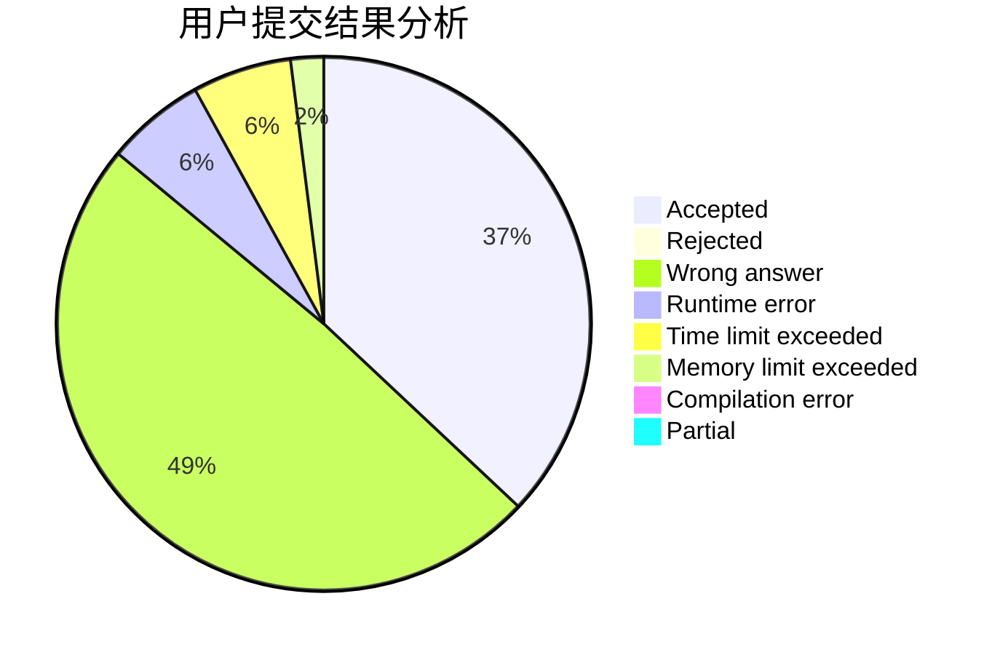
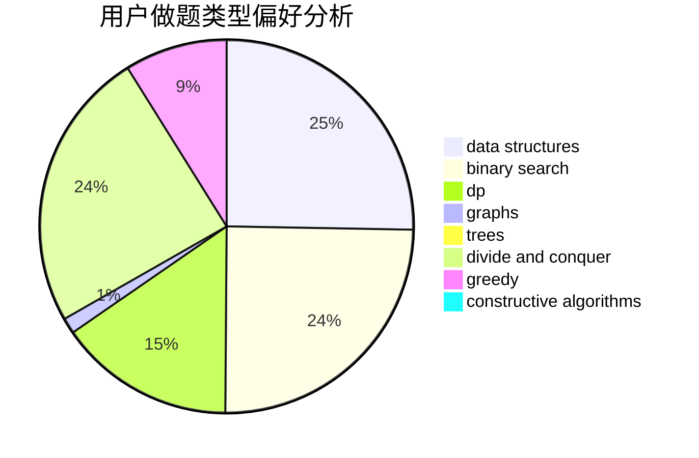
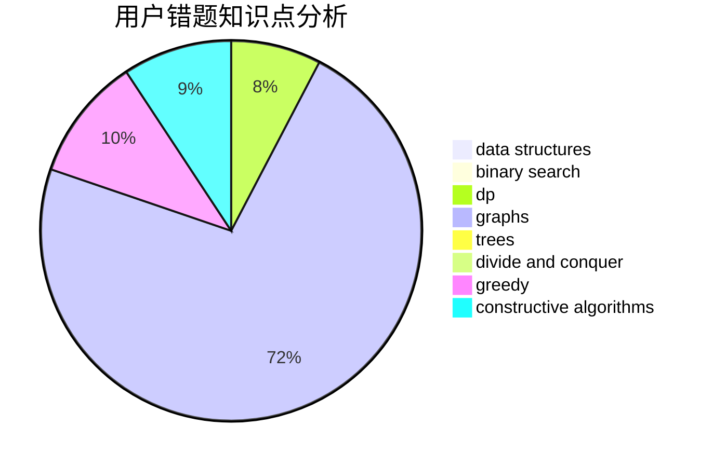

# N00Borz

<!-- tabs:start -->

#### **用户提交结果分析**

#### **用户做题类型偏好分析**

#### **用户错题知识点分析**

<!-- tabs:end -->
# 推荐题目
[919D](https://codeforces.com/contest/919/problem/D)		dfs and similar,
                        dp,
                        graphs		  
[645F](https://codeforces.com/contest/645/problem/F)		combinatorics,
                        math,
                        number theory		  
[1288D](https://codeforces.com/contest/1288/problem/D)		binary search,
                        bitmasks,
                        dp		  
[856F](https://codeforces.com/contest/856/problem/F)		greedy		  
[939C](https://codeforces.com/contest/939/problem/C)		binary search,
                        two pointers		  
[765F](https://codeforces.com/contest/765/problem/F)		data structures		  
[447A](https://codeforces.com/contest/447/problem/A)		implementation		  
[1493F](https://codeforces.com/contest/1493/problem/F)		bitmasks,
                        interactive,
                        number theory		  
[1199E](https://codeforces.com/contest/1199/problem/E)		dsu,graphs,sortings,trees		  
[611H](https://codeforces.com/contest/611/problem/H)		constructive algorithms,
                        flows,
                        graphs		  
