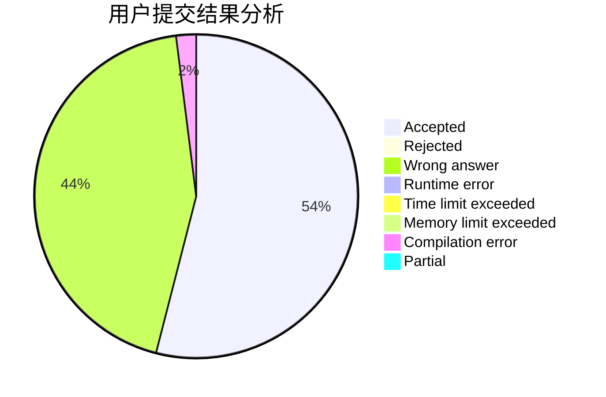
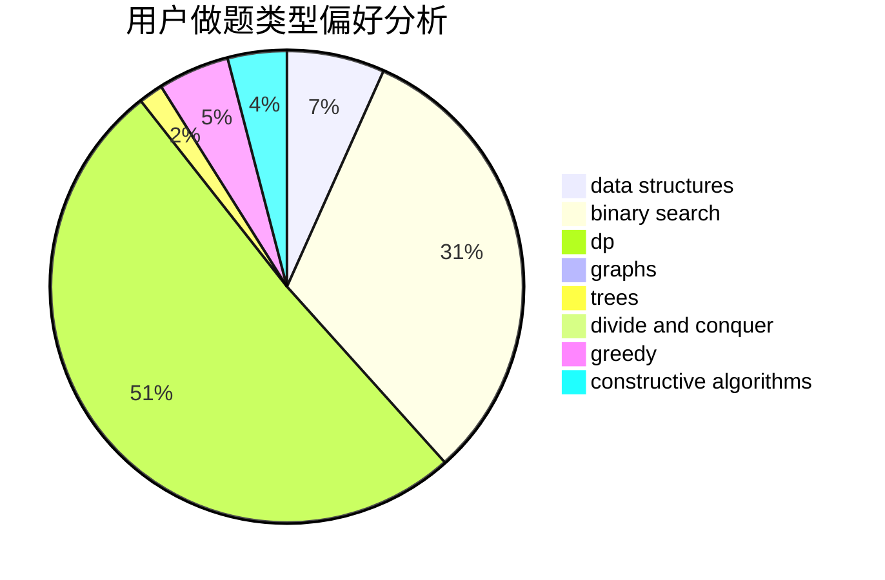
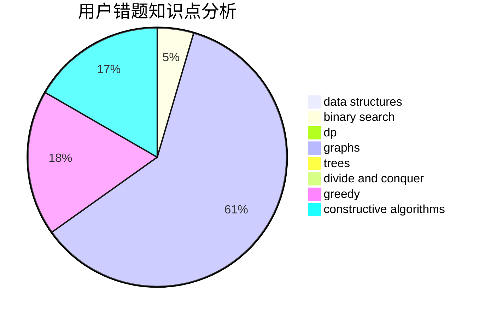

# NAIVE_JUSTIN

<!-- tabs:start -->

#### **用户提交结果分析**

#### **用户做题类型偏好分析**

#### **用户错题知识点分析**

<!-- tabs:end -->
# 推荐题目
[699A](https://codeforces.com/contest/699/problem/A)		implementation		  
[656F](https://codeforces.com/contest/656/problem/F)		*special problem		  
[269E](https://codeforces.com/contest/269/problem/E)		nan		  
[497C](https://codeforces.com/contest/497/problem/C)		dsu,graphs,sortings,trees		  
[659D](https://codeforces.com/contest/659/problem/D)		geometry,
                        implementation,
                        math		  
[1463E](https://codeforces.com/contest/1463/problem/E)		constructive algorithms,
                        dfs and similar,
                        dsu,
                        graphs,
                        implementation,
                        sortings,
                        trees		  
[1133D](https://codeforces.com/contest/1133/problem/D)		hashing,
                        math,
                        number theory		  
[484E](https://codeforces.com/contest/484/problem/E)		binary search,
                        constructive algorithms,
                        data structures		  
[987D](https://codeforces.com/contest/987/problem/D)		dsu,graphs,sortings,trees		  
[280A](https://codeforces.com/contest/280/problem/A)		geometry		  
