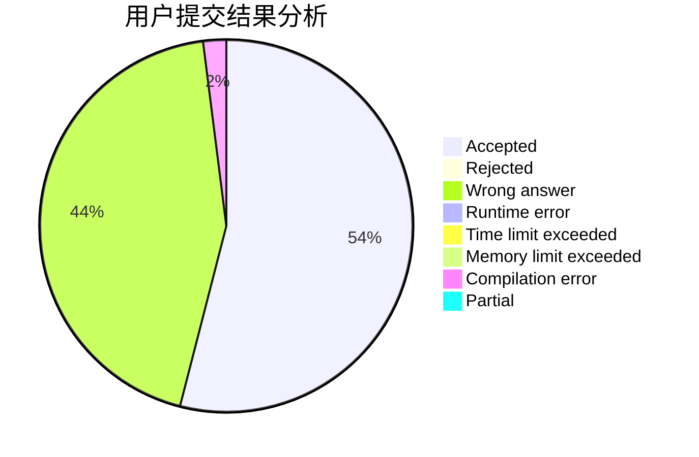
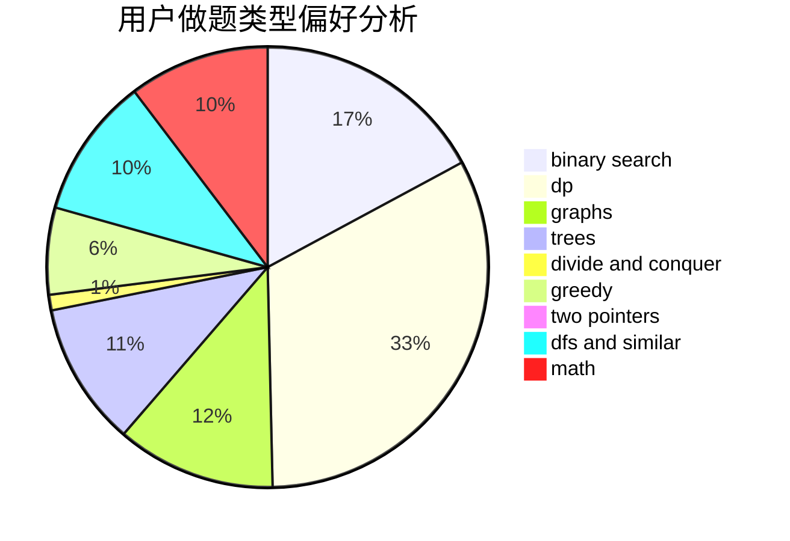

# NAIVE_JUSTIN

<!-- tabs:start -->

#### **用户提交结果分析**

#### **用户做题类型偏好分析**

<!-- tabs:end -->
# 推荐题目
[699A](https://codeforces.com/contest/699/problem/A)
[656F](https://codeforces.com/contest/656/problem/F)
[269E](https://codeforces.com/contest/269/problem/E)
[497C](https://codeforces.com/contest/497/problem/C)
[659D](https://codeforces.com/contest/659/problem/D)
[1463E](https://codeforces.com/contest/1463/problem/E)
[1133D](https://codeforces.com/contest/1133/problem/D)
[484E](https://codeforces.com/contest/484/problem/E)
[987D](https://codeforces.com/contest/987/problem/D)
[280A](https://codeforces.com/contest/280/problem/A)
