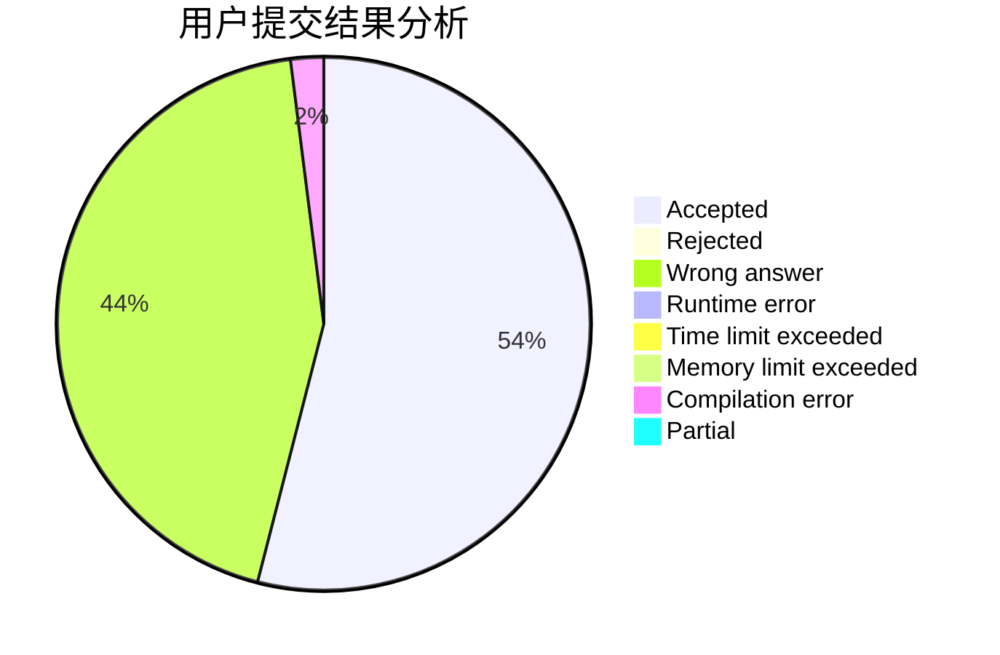
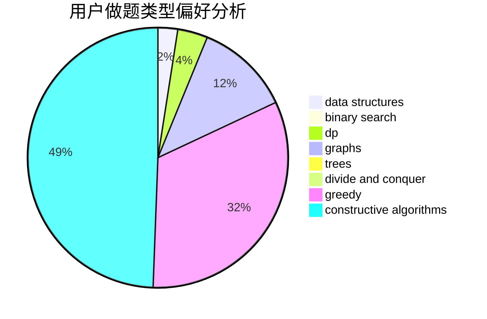
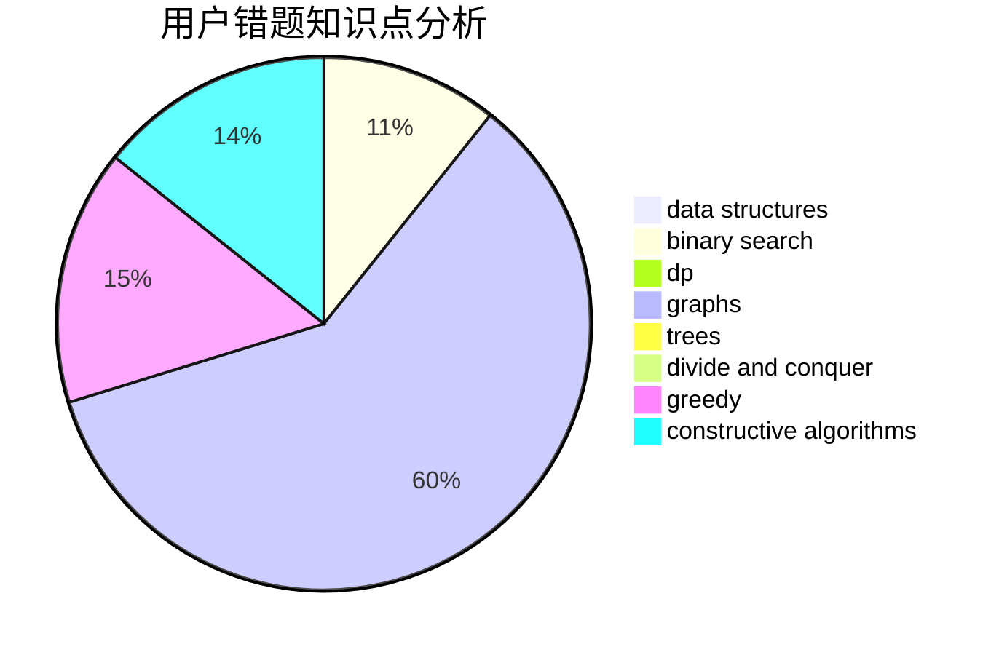

# NAIVE_JUSTIN

<!-- tabs:start -->

#### **用户提交结果分析**

#### **用户做题类型偏好分析**

#### **用户错题知识点分析**

<!-- tabs:end -->
# 推荐题目
[673B](https://codeforces.com/contest/673/problem/B)		greedy,
                        implementation		  
[628F](https://codeforces.com/contest/628/problem/F)		flows		  
[251C](https://codeforces.com/contest/251/problem/C)		dp,
                        greedy,
                        number theory		  
[477C](https://codeforces.com/contest/477/problem/C)		dsu,graphs,sortings,trees		  
[629D](https://codeforces.com/contest/629/problem/D)		data structures,
                        dp		  
[1454B](https://codeforces.com/contest/1454/problem/B)		implementation		  
[1131G](https://codeforces.com/contest/1131/problem/G)		data structures,
                        dp,
                        two pointers		  
[465D](https://codeforces.com/contest/465/problem/D)		dsu,graphs,sortings,trees		  
[965D](https://codeforces.com/contest/965/problem/D)		binary search,
                        flows,
                        greedy,
                        two pointers		  
[263E](https://codeforces.com/contest/263/problem/E)		brute force,
                        data structures,
                        dp		  
