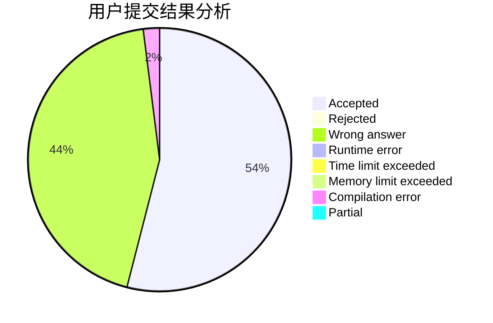
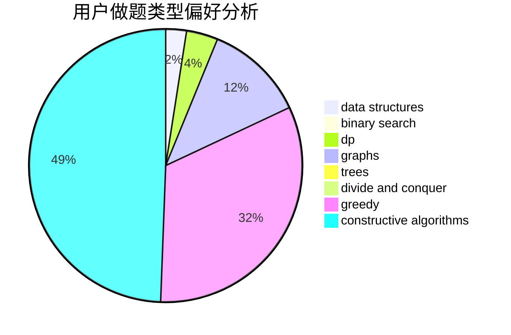
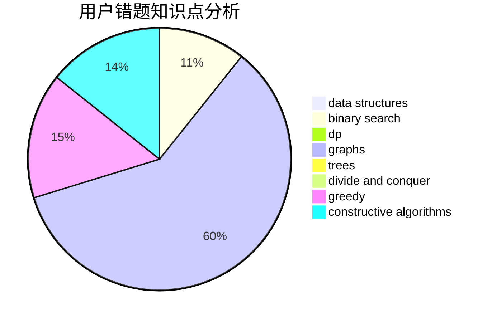

# NAIVE_JUSTIN
<!-- tabs:start -->
#### **用户提交结果分析**

#### **用户做题类型偏好分析**

#### **用户错题知识点分析**

<!-- tabs:end -->
# 推荐题目
[Problems for Round](http://codeforces.com/problemset/problem/673/B)		greedy,
                        implementation		  
[Bear and Fair Set](http://codeforces.com/problemset/problem/628/F)		flows		  
[Restore Cube](https://codeforces.com/contest/465/problem/D)		brute force,
                        geometry		  
[Range Increments](http://codeforces.com/problemset/problem/174/C)		data structures,
                        greedy		  
[Point on Spiral](http://codeforces.com/problemset/problem/279/A)		brute force,
                        geometry,
                        implementation		  
[Number Transformation](http://codeforces.com/problemset/problem/251/C)		dp,
                        greedy,
                        number theory		  
[Dreamoon and Strings](https://codeforces.com/contest/477/problem/C)		dp,
                        strings		  
[Babaei and Birthday Cake](http://codeforces.com/problemset/problem/629/D)		data structures,
                        dp		  
[Rhombus](http://codeforces.com/problemset/problem/263/E)		brute force,
                        data structures,
                        dp		  
[Most Dangerous Shark](http://codeforces.com/problemset/problem/1131/G)		data structures,
                        dp,
                        two pointers		  
<!-- tabs:start -->
#### **data structures**
[Problems for Round](http://codeforces.com/problemset/problem/174/C)		data structures,
                        greedy		  
[Bear and Fair Set](http://codeforces.com/problemset/problem/629/D)		data structures,
                        dp		  
[Restore Cube](http://codeforces.com/problemset/problem/263/E)		brute force,
                        data structures,
                        dp		  
[Range Increments](http://codeforces.com/problemset/problem/1131/G)		data structures,
                        dp,
                        two pointers		  
[Point on Spiral](http://codeforces.com/problemset/problem/739/B)		binary search,
                        data structures,
                        dfs and similar,
                        graphs,
                        trees		  
[Number Transformation](http://codeforces.com/problemset/problem/1381/A2)		constructive algorithms,
                        data structures,
                        implementation,
                        strings,
                        two pointers		  
[Dreamoon and Strings](http://codeforces.com/problemset/problem/1316/F)		data structures,
                        divide and conquer,
                        probabilities		  
[Babaei and Birthday Cake](http://codeforces.com/problemset/problem/1492/C)		binary search,
                        data structures,
                        dp,
                        greedy,
                        two pointers		  
[Rhombus](http://codeforces.com/problemset/problem/1490/G)		binary search,
                        data structures,
                        math		  
[Most Dangerous Shark](http://codeforces.com/problemset/problem/1479/D)		binary search,
                        bitmasks,
                        brute force,
                        data structures,
                        probabilities,
                        trees		  
#### **binary search**
[Problems for Round](http://codeforces.com/problemset/problem/965/D)		binary search,
                        flows,
                        greedy,
                        two pointers		  
[Bear and Fair Set](http://codeforces.com/problemset/problem/778/A)		binary search,
                        greedy,
                        strings		  
[Restore Cube](http://codeforces.com/problemset/problem/739/B)		binary search,
                        data structures,
                        dfs and similar,
                        graphs,
                        trees		  
[Range Increments](http://codeforces.com/problemset/problem/1492/C)		binary search,
                        data structures,
                        dp,
                        greedy,
                        two pointers		  
[Point on Spiral](http://codeforces.com/problemset/problem/1463/D)		binary search,
                        constructive algorithms,
                        greedy,
                        two pointers		  
[Number Transformation](http://codeforces.com/problemset/problem/1490/G)		binary search,
                        data structures,
                        math		  
[Dreamoon and Strings](http://codeforces.com/problemset/problem/1479/D)		binary search,
                        bitmasks,
                        brute force,
                        data structures,
                        probabilities,
                        trees		  
[Babaei and Birthday Cake](http://codeforces.com/problemset/problem/1436/E)		binary search,
                        data structures,
                        two pointers		  
[Rhombus](http://codeforces.com/problemset/problem/1461/D)		binary search,
                        brute force,
                        data structures,
                        divide and conquer,
                        implementation,
                        sortings		  
[Most Dangerous Shark](http://codeforces.com/problemset/problem/1493/C)		binary search,
                        brute force,
                        constructive algorithms,
                        greedy,
                        strings		  
#### **dp**
[Problems for Round](http://codeforces.com/problemset/problem/251/C)		dp,
                        greedy,
                        number theory		  
[Bear and Fair Set](https://codeforces.com/contest/477/problem/C)		dp,
                        strings		  
[Restore Cube](http://codeforces.com/problemset/problem/629/D)		data structures,
                        dp		  
[Range Increments](http://codeforces.com/problemset/problem/263/E)		brute force,
                        data structures,
                        dp		  
[Point on Spiral](http://codeforces.com/problemset/problem/1131/G)		data structures,
                        dp,
                        two pointers		  
[Number Transformation](http://codeforces.com/problemset/problem/382/E)		combinatorics,
                        dp		  
[Dreamoon and Strings](http://codeforces.com/problemset/problem/1234/C)		dp,
                        implementation		  
[Babaei and Birthday Cake](http://codeforces.com/problemset/problem/1194/F)		combinatorics,
                        dp,
                        number theory,
                        probabilities,
                        two pointers		  
[Rhombus](http://codeforces.com/problemset/problem/1492/C)		binary search,
                        data structures,
                        dp,
                        greedy,
                        two pointers		  
[Most Dangerous Shark](https://codeforces.com/contest/1457/problem/C)		brute force,
                        dp,
                        implementation		  
#### **graph**
[Problems for Round](http://codeforces.com/problemset/problem/739/B)		binary search,
                        data structures,
                        dfs and similar,
                        graphs,
                        trees		  
[Bear and Fair Set](http://codeforces.com/problemset/problem/1487/C)		brute force,
                        constructive algorithms,
                        dfs and similar,
                        graphs,
                        greedy,
                        implementation,
                        math		  
[Restore Cube](http://codeforces.com/problemset/problem/1437/C)		dp,
                        flows,
                        graph matchings,
                        greedy,
                        math,
                        sortings		  
[Range Increments](http://codeforces.com/problemset/problem/1470/D)		constructive algorithms,
                        dfs and similar,
                        graph matchings,
                        graphs,
                        greedy		  
[Point on Spiral](http://codeforces.com/problemset/problem/1476/C)		dp,
                        graphs,
                        greedy		  
[Number Transformation](http://codeforces.com/problemset/problem/1304/D)		constructive algorithms,
                        graphs,
                        greedy,
                        two pointers		  
[Dreamoon and Strings](http://codeforces.com/problemset/problem/1475/C)		combinatorics,
                        graphs,
                        math		  
[Babaei and Birthday Cake](http://codeforces.com/problemset/problem/553/E)		dp,
                        fft,
                        graphs,
                        math,
                        probabilities		  
[Rhombus](http://codeforces.com/problemset/problem/1495/C)		constructive algorithms,
                        graphs		  
[Most Dangerous Shark](http://codeforces.com/problemset/problem/1510/K)		brute force,
                        graphs,
                        implementation		  
#### **trees**
[Problems for Round](http://codeforces.com/problemset/problem/739/B)		binary search,
                        data structures,
                        dfs and similar,
                        graphs,
                        trees		  
[Bear and Fair Set](http://codeforces.com/problemset/problem/1479/D)		binary search,
                        bitmasks,
                        brute force,
                        data structures,
                        probabilities,
                        trees		  
[Restore Cube](http://codeforces.com/problemset/problem/1511/C)		brute force,
                        data structures,
                        implementation,
                        trees		  
[Range Increments](http://codeforces.com/problemset/problem/1499/F)		combinatorics,
                        dfs and similar,
                        dp,
                        trees		  
[Point on Spiral](http://codeforces.com/problemset/problem/1491/E)		brute force,
                        dfs and similar,
                        divide and conquer,
                        number theory,
                        trees		  
[Number Transformation](http://codeforces.com/problemset/problem/1466/D)		data structures,
                        greedy,
                        sortings,
                        trees		  
[Dreamoon and Strings](http://codeforces.com/problemset/problem/1495/D)		combinatorics,
                        dfs and similar,
                        graphs,
                        math,
                        shortest paths,
                        trees		  
[Babaei and Birthday Cake](http://codeforces.com/problemset/problem/1303/G)		data structures,
                        divide and conquer,
                        geometry,
                        trees		  
[Rhombus](http://codeforces.com/problemset/problem/1454/E)		combinatorics,
                        dfs and similar,
                        graphs,
                        trees		  
[Most Dangerous Shark](http://codeforces.com/problemset/problem/1494/D)		constructive algorithms,
                        data structures,
                        dfs and similar,
                        divide and conquer,
                        dsu,
                        greedy,
                        sortings,
                        trees		  
#### **divide and conquer**
[Problems for Round](http://codeforces.com/problemset/problem/1316/F)		data structures,
                        divide and conquer,
                        probabilities		  
[Bear and Fair Set](http://codeforces.com/problemset/problem/1461/D)		binary search,
                        brute force,
                        data structures,
                        divide and conquer,
                        implementation,
                        sortings		  
[Restore Cube](http://codeforces.com/problemset/problem/1466/G)		combinatorics,
                        divide and conquer,
                        hashing,
                        math,
                        string suffix structures,
                        strings		  
[Range Increments](http://codeforces.com/problemset/problem/1490/D)		dfs and similar,
                        divide and conquer,
                        implementation		  
[Point on Spiral](https://codeforces.com/contest/1483/problem/C)		data structures,
                        divide and conquer,
                        dp		  
[Number Transformation](http://codeforces.com/problemset/problem/1491/E)		brute force,
                        dfs and similar,
                        divide and conquer,
                        number theory,
                        trees		  
[Dreamoon and Strings](http://codeforces.com/problemset/problem/1303/G)		data structures,
                        divide and conquer,
                        geometry,
                        trees		  
[Babaei and Birthday Cake](http://codeforces.com/problemset/problem/1494/D)		constructive algorithms,
                        data structures,
                        dfs and similar,
                        divide and conquer,
                        dsu,
                        greedy,
                        sortings,
                        trees		  
[Rhombus](http://codeforces.com/problemset/problem/1482/E)		data structures,
                        divide and conquer,
                        dp		  
[Most Dangerous Shark](http://codeforces.com/problemset/problem/566/C)		dfs and similar,
                        divide and conquer,
                        trees		  
#### **greedy**
[Problems for Round](http://codeforces.com/problemset/problem/673/B)		greedy,
                        implementation		  
[Bear and Fair Set](http://codeforces.com/problemset/problem/174/C)		data structures,
                        greedy		  
[Restore Cube](http://codeforces.com/problemset/problem/251/C)		dp,
                        greedy,
                        number theory		  
[Range Increments](http://codeforces.com/problemset/problem/965/D)		binary search,
                        flows,
                        greedy,
                        two pointers		  
[Point on Spiral](http://codeforces.com/problemset/problem/1183/G)		greedy,
                        implementation,
                        sortings		  
[Number Transformation](http://codeforces.com/problemset/problem/778/A)		binary search,
                        greedy,
                        strings		  
[Dreamoon and Strings](http://codeforces.com/problemset/problem/535/D)		greedy,
                        hashing,
                        string suffix structures,
                        strings		  
[Babaei and Birthday Cake](http://codeforces.com/problemset/problem/1445/B)		greedy,
                        math		  
[Rhombus](http://codeforces.com/problemset/problem/1385/C)		greedy		  
[Most Dangerous Shark](http://codeforces.com/problemset/problem/1492/C)		binary search,
                        data structures,
                        dp,
                        greedy,
                        two pointers		  
#### **constructive algorithms**
[Problems for Round](http://codeforces.com/problemset/problem/118/B)		constructive algorithms,
                        implementation		  
[Bear and Fair Set](http://codeforces.com/problemset/problem/1381/A2)		constructive algorithms,
                        data structures,
                        implementation,
                        strings,
                        two pointers		  
[Restore Cube](http://codeforces.com/problemset/problem/1493/A)		constructive algorithms,
                        greedy		  
[Range Increments](http://codeforces.com/problemset/problem/1463/D)		binary search,
                        constructive algorithms,
                        greedy,
                        two pointers		  
[Point on Spiral](https://codeforces.com/contest/1456/problem/B)		bitmasks,
                        brute force,
                        constructive algorithms		  
[Number Transformation](http://codeforces.com/problemset/problem/1492/D)		bitmasks,
                        constructive algorithms,
                        greedy,
                        math		  
[Dreamoon and Strings](https://codeforces.com/contest/1504/problem/D)		constructive algorithms,
                        games,
                        interactive		  
[Babaei and Birthday Cake](https://codeforces.com/contest/1483/problem/A)		brute force,
                        constructive algorithms,
                        greedy,
                        implementation		  
[Rhombus](https://codeforces.com/contest/1457/problem/D)		bitmasks,
                        brute force,
                        constructive algorithms		  
[Most Dangerous Shark](http://codeforces.com/problemset/problem/1513/A)		constructive algorithms,
                        implementation		  
#### **sortings**
[Problems for Round](http://codeforces.com/problemset/problem/1183/G)		greedy,
                        implementation,
                        sortings		  
[Bear and Fair Set](https://codeforces.com/contest/1496/problem/C)		geometry,
                        greedy,
                        math,
                        sortings		  
[Restore Cube](http://codeforces.com/problemset/problem/1495/A)		geometry,
                        greedy,
                        math,
                        sortings		  
[Range Increments](http://codeforces.com/problemset/problem/1497/A)		brute force,
                        data structures,
                        greedy,
                        sortings		  
[Point on Spiral](http://codeforces.com/problemset/problem/1427/A)		math,
                        sortings		  
[Number Transformation](http://codeforces.com/problemset/problem/1461/D)		binary search,
                        brute force,
                        data structures,
                        divide and conquer,
                        implementation,
                        sortings		  
[Dreamoon and Strings](http://codeforces.com/problemset/problem/1437/C)		dp,
                        flows,
                        graph matchings,
                        greedy,
                        math,
                        sortings		  
[Babaei and Birthday Cake](http://codeforces.com/problemset/problem/1473/A)		greedy,
                        implementation,
                        math,
                        sortings		  
[Rhombus](http://codeforces.com/problemset/problem/1486/B)		binary search,
                        geometry,
                        shortest paths,
                        sortings		  
[Most Dangerous Shark](http://codeforces.com/problemset/problem/1480/B)		greedy,
                        implementation,
                        sortings		  
<!-- tabs:end -->
