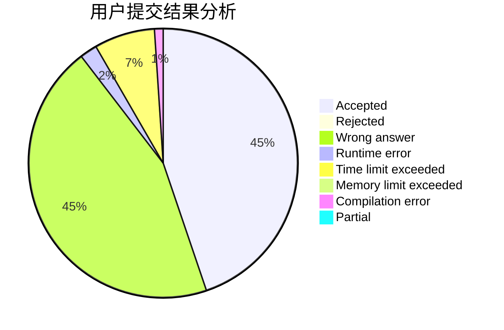
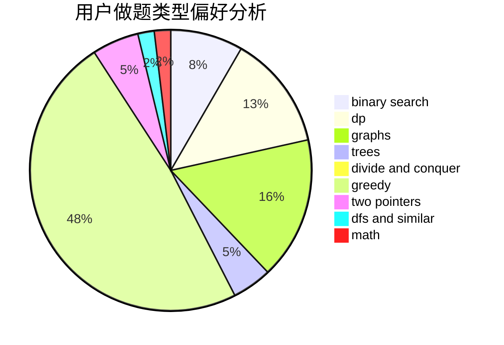

# NCWU_Way

<!-- tabs:start -->

#### **用户提交结果分析**

#### **用户做题类型偏好分析**

<!-- tabs:end -->
# 推荐题目
[830E](https://codeforces.com/contest/830/problem/E)
[817A](https://codeforces.com/contest/817/problem/A)
[551D](https://codeforces.com/contest/551/problem/D)
[631D](https://codeforces.com/contest/631/problem/D)
[1225E](https://codeforces.com/contest/1225/problem/E)
[1088F](https://codeforces.com/contest/1088/problem/F)
[1346A](https://codeforces.com/contest/1346/problem/A)
[871E](https://codeforces.com/contest/871/problem/E)
[568B](https://codeforces.com/contest/568/problem/B)
[13A](https://codeforces.com/contest/13/problem/A)
