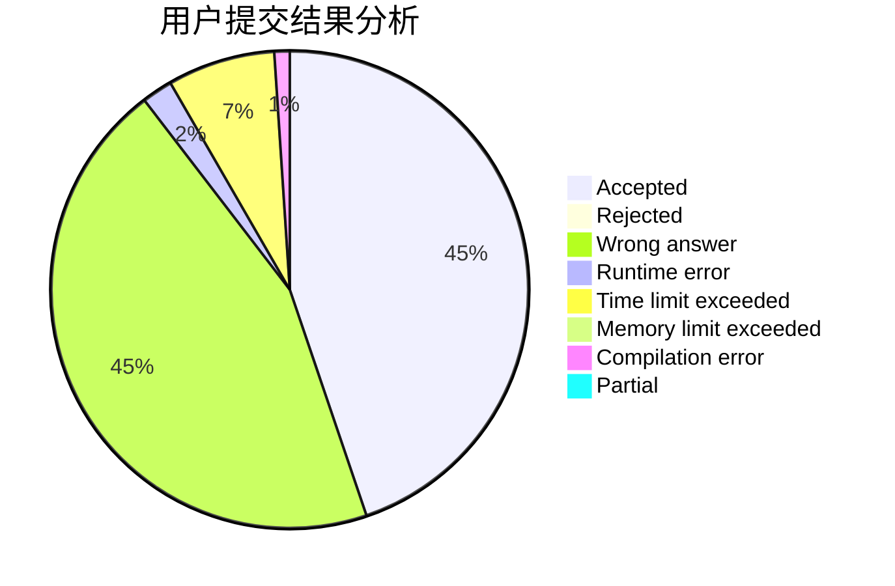
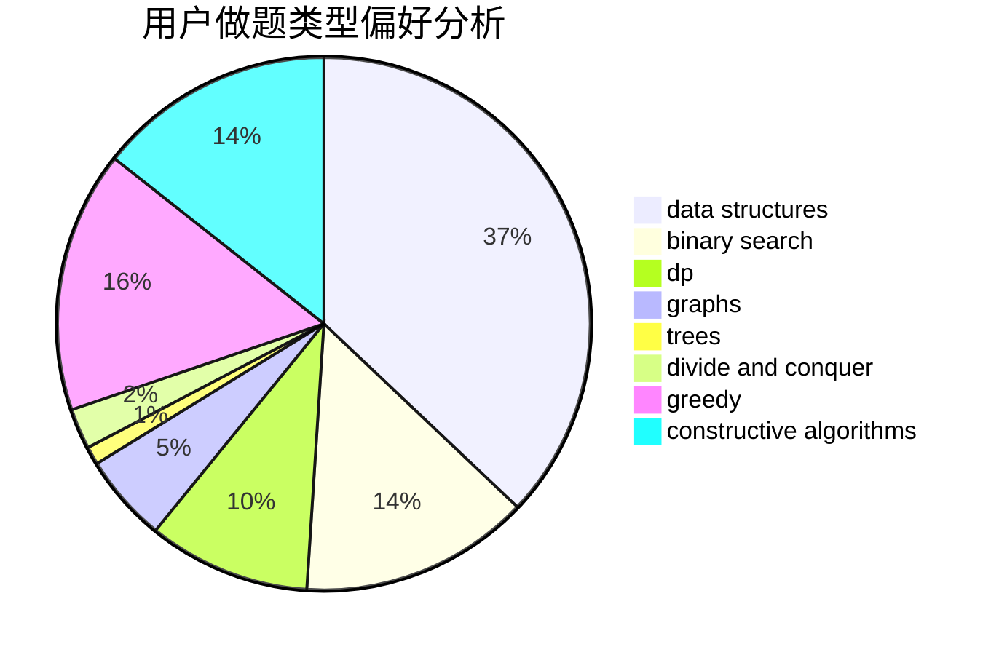
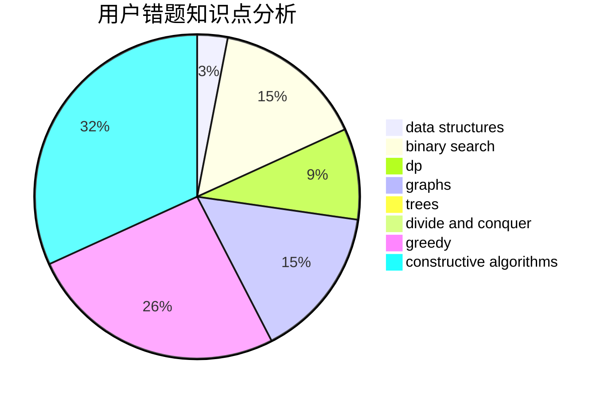

# NCWU_Way

<!-- tabs:start -->

#### **用户提交结果分析**

#### **用户做题类型偏好分析**

#### **用户错题知识点分析**

<!-- tabs:end -->
# 推荐题目
[812B](https://codeforces.com/contest/812/problem/B)		bitmasks,
                        brute force,
                        dp		  
[802B](https://codeforces.com/contest/802/problem/B)		data structures,
                        greedy		  
[527D](https://codeforces.com/contest/527/problem/D)		data structures,
                        dp,
                        greedy,
                        implementation,
                        sortings		  
[612B](https://codeforces.com/contest/612/problem/B)		implementation,
                        math		  
[1218C](https://codeforces.com/contest/1218/problem/C)		dp		  
[1088C](https://codeforces.com/contest/1088/problem/C)		constructive algorithms,
                        greedy,
                        math		  
[1339A](https://codeforces.com/contest/1339/problem/A)		brute force,
                        dp,
                        implementation,
                        math		  
[853C](https://codeforces.com/contest/853/problem/C)		data structures		  
[544A](https://codeforces.com/contest/544/problem/A)		implementation,
                        strings		  
[1391D](https://codeforces.com/contest/1391/problem/D)		bitmasks,
                        brute force,
                        constructive algorithms,
                        dp,
                        greedy,
                        implementation		  
