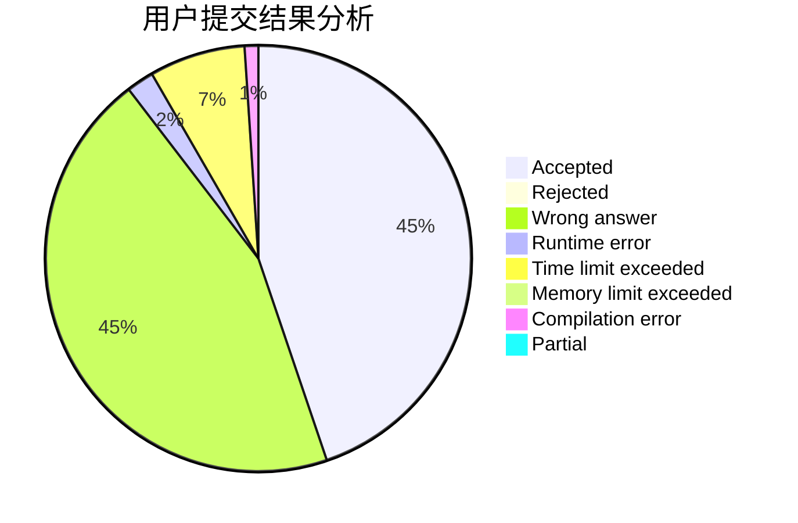
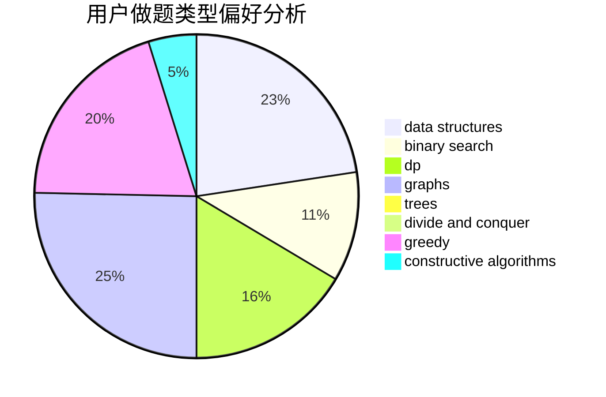
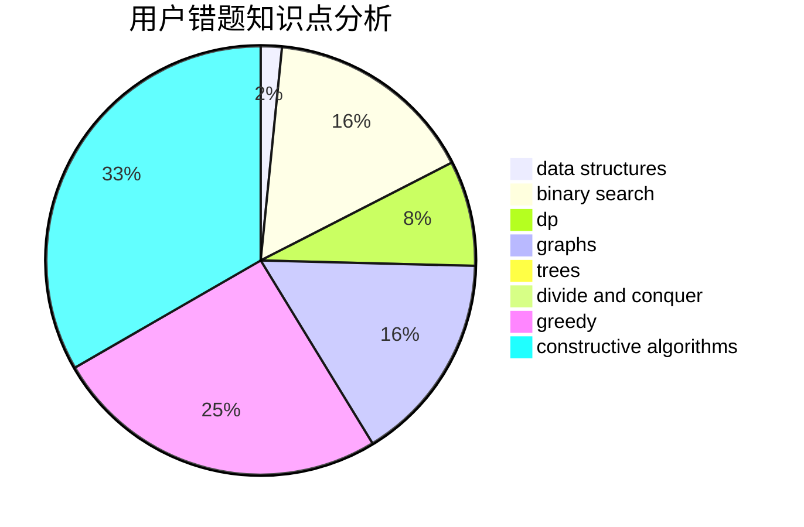

# NCWU_Way

<!-- tabs:start -->

#### **用户提交结果分析**

#### **用户做题类型偏好分析**

#### **用户错题知识点分析**

<!-- tabs:end -->
# 推荐题目
[830E](https://codeforces.com/contest/830/problem/E)		constructive algorithms,
                        dp,
                        graphs,
                        implementation,
                        math,
                        trees		  
[817A](https://codeforces.com/contest/817/problem/A)		implementation,
                        math,
                        number theory		  
[551D](https://codeforces.com/contest/551/problem/D)		combinatorics,
                        implementation,
                        math,
                        matrices,
                        number theory		  
[631D](https://codeforces.com/contest/631/problem/D)		data structures,
                        hashing,
                        implementation,
                        string suffix structures,
                        strings		  
[1225E](https://codeforces.com/contest/1225/problem/E)		binary search,
                        dp		  
[1088F](https://codeforces.com/contest/1088/problem/F)		data structures,
                        trees		  
[1346A](https://codeforces.com/contest/1346/problem/A)		*special problem,
                        math		  
[871E](https://codeforces.com/contest/871/problem/E)		graphs,
                        greedy,
                        trees		  
[568B](https://codeforces.com/contest/568/problem/B)		combinatorics,
                        dp,
                        math		  
[13A](https://codeforces.com/contest/13/problem/A)		implementation,
                        math		  
