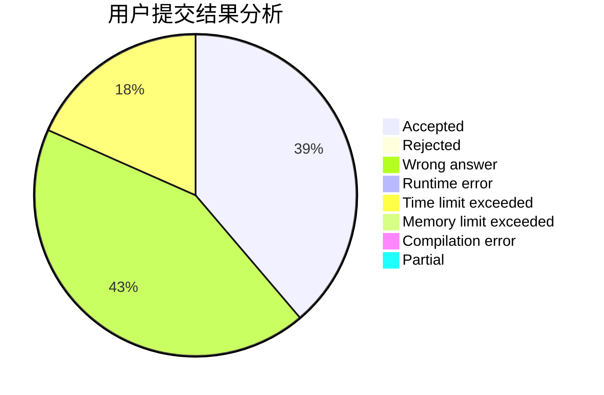
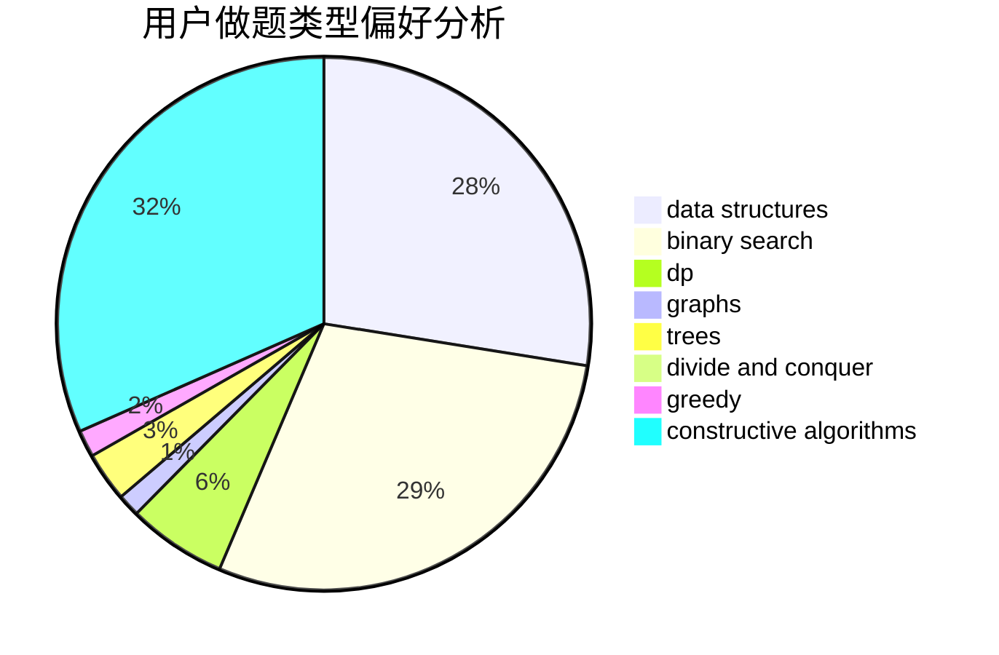
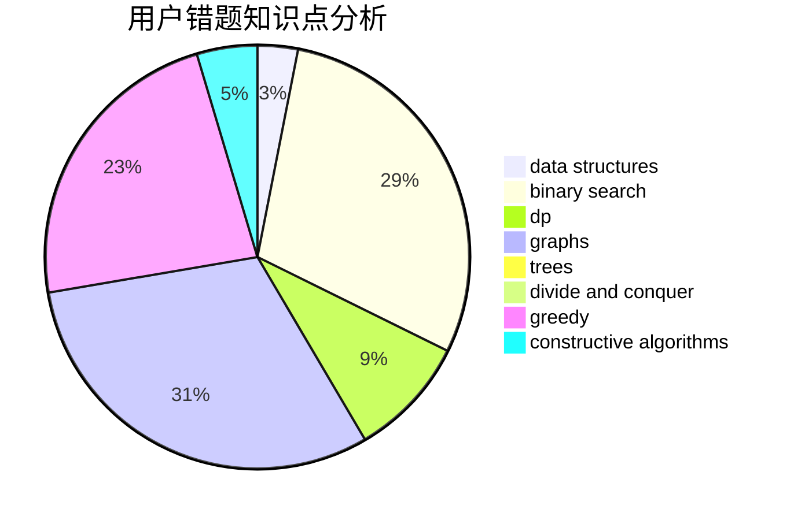

# NEFU_CCZ
<!-- tabs:start -->
#### **用户提交结果分析**

#### **用户做题类型偏好分析**

#### **用户错题知识点分析**

<!-- tabs:end -->
# 推荐题目
[Strange Housing](https://codeforces.com/contest/1471/problem/F)		constructive algorithms,
                        dfs and similar,
                        graph matchings,
                        graphs,
                        greedy		  
["Is the bit string balanced?" oracle](http://codeforces.com/problemset/problem/1357/B1)		nan		  
[Mike and Fax](http://codeforces.com/problemset/problem/548/A)		brute force,
                        implementation,
                        strings		  
[A Colourful Prospect](https://codeforces.com/contest/934/problem/E)		geometry,
                        graphs		  
[Universal Solution](http://codeforces.com/problemset/problem/1380/B)		greedy		  
[Intergalactic Sliding Puzzle](http://codeforces.com/problemset/problem/1280/F)		combinatorics,
                        constructive algorithms,
                        math		  
[Analysis of Pathes in Functional Graph](http://codeforces.com/problemset/problem/702/E)		data structures,
                        graphs		  
[The Untended Antiquity](http://codeforces.com/problemset/problem/869/E)		data structures,
                        hashing		  
[Casinos and travel](http://codeforces.com/problemset/problem/852/E)		dp		  
[Rock Is Push](https://codeforces.com/contest/1246/problem/C)		binary search,
                        dp		  
<!-- tabs:start -->
#### **data structures**
[Strange Housing](http://codeforces.com/problemset/problem/702/E)		data structures,
                        graphs		  
["Is the bit string balanced?" oracle](http://codeforces.com/problemset/problem/869/E)		data structures,
                        hashing		  
[Mike and Fax](http://codeforces.com/problemset/problem/101/B)		binary search,
                        data structures,
                        dp		  
[A Colourful Prospect](https://codeforces.com/contest/1447/problem/F1)		data structures,
                        greedy		  
[Universal Solution](http://codeforces.com/problemset/problem/773/E)		data structures,
                        sortings		  
[Intergalactic Sliding Puzzle](http://codeforces.com/problemset/problem/720/D)		data structures,
                        dp,
                        sortings		  
[Analysis of Pathes in Functional Graph](http://codeforces.com/problemset/problem/930/C)		data structures,
                        dp		  
[The Untended Antiquity](http://codeforces.com/problemset/problem/729/E)		constructive algorithms,
                        data structures,
                        graphs,
                        greedy,
                        sortings		  
[Casinos and travel](https://codeforces.com/contest/1483/problem/F)		data structures,
                        string suffix structures,
                        trees		  
[Rock Is Push](http://codeforces.com/problemset/problem/1207/F)		brute force,
                        data structures,
                        implementation		  
#### **binary search**
[Strange Housing](https://codeforces.com/contest/1246/problem/C)		binary search,
                        dp		  
["Is the bit string balanced?" oracle](http://codeforces.com/problemset/problem/101/B)		binary search,
                        data structures,
                        dp		  
[Mike and Fax](http://codeforces.com/problemset/problem/1315/B)		binary search,
                        dp,
                        greedy,
                        strings		  
[A Colourful Prospect](http://codeforces.com/problemset/problem/1492/C)		binary search,
                        data structures,
                        dp,
                        greedy,
                        two pointers		  
[Universal Solution](http://codeforces.com/problemset/problem/1463/D)		binary search,
                        constructive algorithms,
                        greedy,
                        two pointers		  
[Intergalactic Sliding Puzzle](http://codeforces.com/problemset/problem/1490/G)		binary search,
                        data structures,
                        math		  
[Analysis of Pathes in Functional Graph](http://codeforces.com/problemset/problem/1479/D)		binary search,
                        bitmasks,
                        brute force,
                        data structures,
                        probabilities,
                        trees		  
[The Untended Antiquity](http://codeforces.com/problemset/problem/1436/E)		binary search,
                        data structures,
                        two pointers		  
[Casinos and travel](http://codeforces.com/problemset/problem/1461/D)		binary search,
                        brute force,
                        data structures,
                        divide and conquer,
                        implementation,
                        sortings		  
[Rock Is Push](http://codeforces.com/problemset/problem/1493/C)		binary search,
                        brute force,
                        constructive algorithms,
                        greedy,
                        strings		  
#### **dp**
[Strange Housing](http://codeforces.com/problemset/problem/852/E)		dp		  
["Is the bit string balanced?" oracle](https://codeforces.com/contest/1246/problem/C)		binary search,
                        dp		  
[Mike and Fax](http://codeforces.com/problemset/problem/101/B)		binary search,
                        data structures,
                        dp		  
[A Colourful Prospect](http://codeforces.com/problemset/problem/720/D)		data structures,
                        dp,
                        sortings		  
[Universal Solution](http://codeforces.com/problemset/problem/1315/B)		binary search,
                        dp,
                        greedy,
                        strings		  
[Intergalactic Sliding Puzzle](http://codeforces.com/problemset/problem/930/C)		data structures,
                        dp		  
[Analysis of Pathes in Functional Graph](http://codeforces.com/problemset/problem/1492/C)		binary search,
                        data structures,
                        dp,
                        greedy,
                        two pointers		  
[The Untended Antiquity](https://codeforces.com/contest/1457/problem/C)		brute force,
                        dp,
                        implementation		  
[Casinos and travel](http://codeforces.com/problemset/problem/1491/C)		brute force,
                        data structures,
                        dp,
                        greedy,
                        implementation		  
[Rock Is Push](http://codeforces.com/problemset/problem/1437/C)		dp,
                        flows,
                        graph matchings,
                        greedy,
                        math,
                        sortings		  
#### **graph**
[Strange Housing](https://codeforces.com/contest/1471/problem/F)		constructive algorithms,
                        dfs and similar,
                        graph matchings,
                        graphs,
                        greedy		  
["Is the bit string balanced?" oracle](https://codeforces.com/contest/934/problem/E)		geometry,
                        graphs		  
[Mike and Fax](http://codeforces.com/problemset/problem/702/E)		data structures,
                        graphs		  
[A Colourful Prospect](http://codeforces.com/problemset/problem/1009/D)		brute force,
                        constructive algorithms,
                        graphs,
                        greedy,
                        math		  
[Universal Solution](http://codeforces.com/problemset/problem/729/E)		constructive algorithms,
                        data structures,
                        graphs,
                        greedy,
                        sortings		  
[Intergalactic Sliding Puzzle](http://codeforces.com/problemset/problem/744/A)		dfs and similar,
                        graphs		  
[Analysis of Pathes in Functional Graph](http://codeforces.com/problemset/problem/1487/C)		brute force,
                        constructive algorithms,
                        dfs and similar,
                        graphs,
                        greedy,
                        implementation,
                        math		  
[The Untended Antiquity](http://codeforces.com/problemset/problem/1437/C)		dp,
                        flows,
                        graph matchings,
                        greedy,
                        math,
                        sortings		  
[Casinos and travel](http://codeforces.com/problemset/problem/1470/D)		constructive algorithms,
                        dfs and similar,
                        graph matchings,
                        graphs,
                        greedy		  
[Rock Is Push](http://codeforces.com/problemset/problem/1476/C)		dp,
                        graphs,
                        greedy		  
#### **trees**
[Strange Housing](https://codeforces.com/contest/1483/problem/F)		data structures,
                        string suffix structures,
                        trees		  
["Is the bit string balanced?" oracle](https://codeforces.com/contest/1246/problem/D)		constructive algorithms,
                        greedy,
                        trees		  
[Mike and Fax](http://codeforces.com/problemset/problem/1479/D)		binary search,
                        bitmasks,
                        brute force,
                        data structures,
                        probabilities,
                        trees		  
[A Colourful Prospect](http://codeforces.com/problemset/problem/1511/C)		brute force,
                        data structures,
                        implementation,
                        trees		  
[Universal Solution](http://codeforces.com/problemset/problem/1499/F)		combinatorics,
                        dfs and similar,
                        dp,
                        trees		  
[Intergalactic Sliding Puzzle](http://codeforces.com/problemset/problem/1491/E)		brute force,
                        dfs and similar,
                        divide and conquer,
                        number theory,
                        trees		  
[Analysis of Pathes in Functional Graph](http://codeforces.com/problemset/problem/1466/D)		data structures,
                        greedy,
                        sortings,
                        trees		  
[The Untended Antiquity](http://codeforces.com/problemset/problem/1495/D)		combinatorics,
                        dfs and similar,
                        graphs,
                        math,
                        shortest paths,
                        trees		  
[Casinos and travel](http://codeforces.com/problemset/problem/1303/G)		data structures,
                        divide and conquer,
                        geometry,
                        trees		  
[Rock Is Push](http://codeforces.com/problemset/problem/1454/E)		combinatorics,
                        dfs and similar,
                        graphs,
                        trees		  
#### **divide and conquer**
[Strange Housing](http://codeforces.com/problemset/problem/1461/D)		binary search,
                        brute force,
                        data structures,
                        divide and conquer,
                        implementation,
                        sortings		  
["Is the bit string balanced?" oracle](http://codeforces.com/problemset/problem/1466/G)		combinatorics,
                        divide and conquer,
                        hashing,
                        math,
                        string suffix structures,
                        strings		  
[Mike and Fax](http://codeforces.com/problemset/problem/1490/D)		dfs and similar,
                        divide and conquer,
                        implementation		  
[A Colourful Prospect](https://codeforces.com/contest/1483/problem/C)		data structures,
                        divide and conquer,
                        dp		  
[Universal Solution](http://codeforces.com/problemset/problem/1491/E)		brute force,
                        dfs and similar,
                        divide and conquer,
                        number theory,
                        trees		  
[Intergalactic Sliding Puzzle](http://codeforces.com/problemset/problem/1303/G)		data structures,
                        divide and conquer,
                        geometry,
                        trees		  
[Analysis of Pathes in Functional Graph](http://codeforces.com/problemset/problem/1494/D)		constructive algorithms,
                        data structures,
                        dfs and similar,
                        divide and conquer,
                        dsu,
                        greedy,
                        sortings,
                        trees		  
[The Untended Antiquity](http://codeforces.com/problemset/problem/1482/E)		data structures,
                        divide and conquer,
                        dp		  
[Casinos and travel](http://codeforces.com/problemset/problem/566/C)		dfs and similar,
                        divide and conquer,
                        trees		  
[Rock Is Push](http://codeforces.com/problemset/problem/1428/F)		binary search,
                        data structures,
                        divide and conquer,
                        dp,
                        two pointers		  
#### **greedy**
[Strange Housing](https://codeforces.com/contest/1471/problem/F)		constructive algorithms,
                        dfs and similar,
                        graph matchings,
                        graphs,
                        greedy		  
["Is the bit string balanced?" oracle](http://codeforces.com/problemset/problem/1380/B)		greedy		  
[Mike and Fax](https://codeforces.com/contest/1447/problem/F1)		data structures,
                        greedy		  
[A Colourful Prospect](http://codeforces.com/problemset/problem/1315/B)		binary search,
                        dp,
                        greedy,
                        strings		  
[Universal Solution](http://codeforces.com/problemset/problem/1009/D)		brute force,
                        constructive algorithms,
                        graphs,
                        greedy,
                        math		  
[Intergalactic Sliding Puzzle](http://codeforces.com/problemset/problem/729/E)		constructive algorithms,
                        data structures,
                        graphs,
                        greedy,
                        sortings		  
[Analysis of Pathes in Functional Graph](http://codeforces.com/problemset/problem/1299/A)		brute force,
                        greedy,
                        math		  
[The Untended Antiquity](http://codeforces.com/problemset/problem/1393/A)		greedy,
                        math		  
[Casinos and travel](https://codeforces.com/contest/1246/problem/D)		constructive algorithms,
                        greedy,
                        trees		  
[Rock Is Push](http://codeforces.com/problemset/problem/1282/C)		greedy,
                        sortings,
                        two pointers		  
#### **constructive algorithms**
[Strange Housing](https://codeforces.com/contest/1471/problem/F)		constructive algorithms,
                        dfs and similar,
                        graph matchings,
                        graphs,
                        greedy		  
["Is the bit string balanced?" oracle](http://codeforces.com/problemset/problem/1280/F)		combinatorics,
                        constructive algorithms,
                        math		  
[Mike and Fax](http://codeforces.com/problemset/problem/1009/D)		brute force,
                        constructive algorithms,
                        graphs,
                        greedy,
                        math		  
[A Colourful Prospect](http://codeforces.com/problemset/problem/729/E)		constructive algorithms,
                        data structures,
                        graphs,
                        greedy,
                        sortings		  
[Universal Solution](https://codeforces.com/contest/1246/problem/D)		constructive algorithms,
                        greedy,
                        trees		  
[Intergalactic Sliding Puzzle](http://codeforces.com/problemset/problem/1493/A)		constructive algorithms,
                        greedy		  
[Analysis of Pathes in Functional Graph](http://codeforces.com/problemset/problem/1463/D)		binary search,
                        constructive algorithms,
                        greedy,
                        two pointers		  
[The Untended Antiquity](https://codeforces.com/contest/1456/problem/B)		bitmasks,
                        brute force,
                        constructive algorithms		  
[Casinos and travel](http://codeforces.com/problemset/problem/1492/D)		bitmasks,
                        constructive algorithms,
                        greedy,
                        math		  
[Rock Is Push](https://codeforces.com/contest/1504/problem/D)		constructive algorithms,
                        games,
                        interactive		  
#### **sortings**
[Strange Housing](http://codeforces.com/problemset/problem/1198/A)		sortings,
                        two pointers		  
["Is the bit string balanced?" oracle](http://codeforces.com/problemset/problem/773/E)		data structures,
                        sortings		  
[Mike and Fax](http://codeforces.com/problemset/problem/720/D)		data structures,
                        dp,
                        sortings		  
[A Colourful Prospect](http://codeforces.com/problemset/problem/729/E)		constructive algorithms,
                        data structures,
                        graphs,
                        greedy,
                        sortings		  
[Universal Solution](http://codeforces.com/problemset/problem/1282/C)		greedy,
                        sortings,
                        two pointers		  
[Intergalactic Sliding Puzzle](https://codeforces.com/contest/1496/problem/C)		geometry,
                        greedy,
                        math,
                        sortings		  
[Analysis of Pathes in Functional Graph](http://codeforces.com/problemset/problem/1495/A)		geometry,
                        greedy,
                        math,
                        sortings		  
[The Untended Antiquity](http://codeforces.com/problemset/problem/1497/A)		brute force,
                        data structures,
                        greedy,
                        sortings		  
[Casinos and travel](http://codeforces.com/problemset/problem/1427/A)		math,
                        sortings		  
[Rock Is Push](http://codeforces.com/problemset/problem/1461/D)		binary search,
                        brute force,
                        data structures,
                        divide and conquer,
                        implementation,
                        sortings		  
<!-- tabs:end -->
