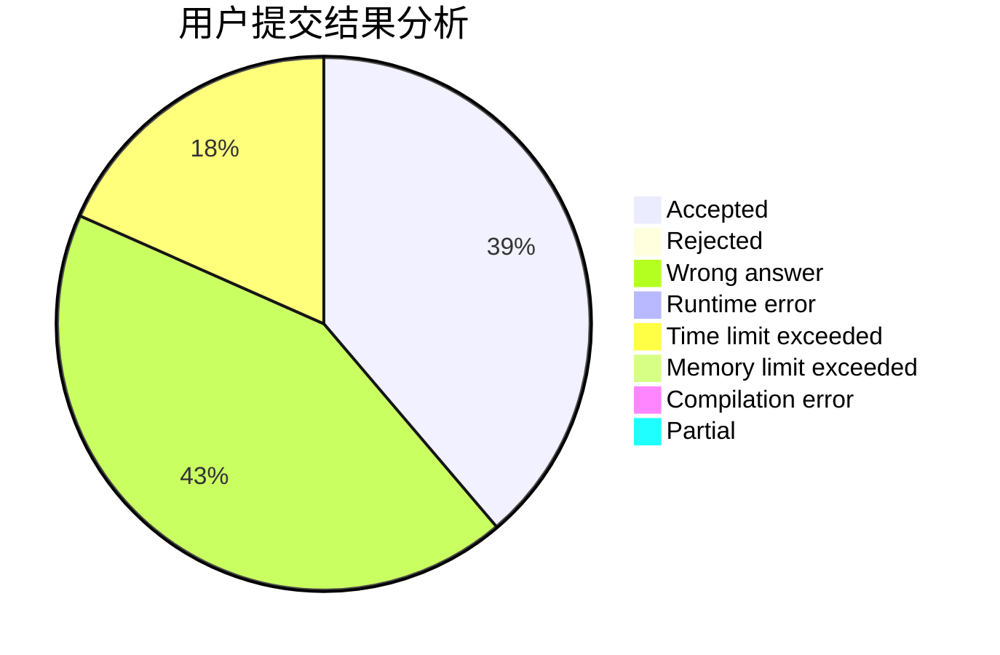
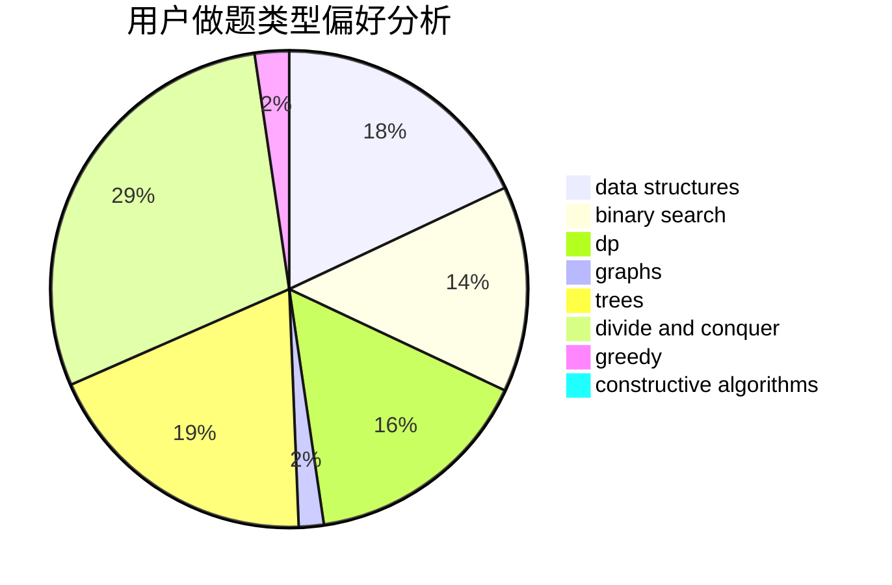
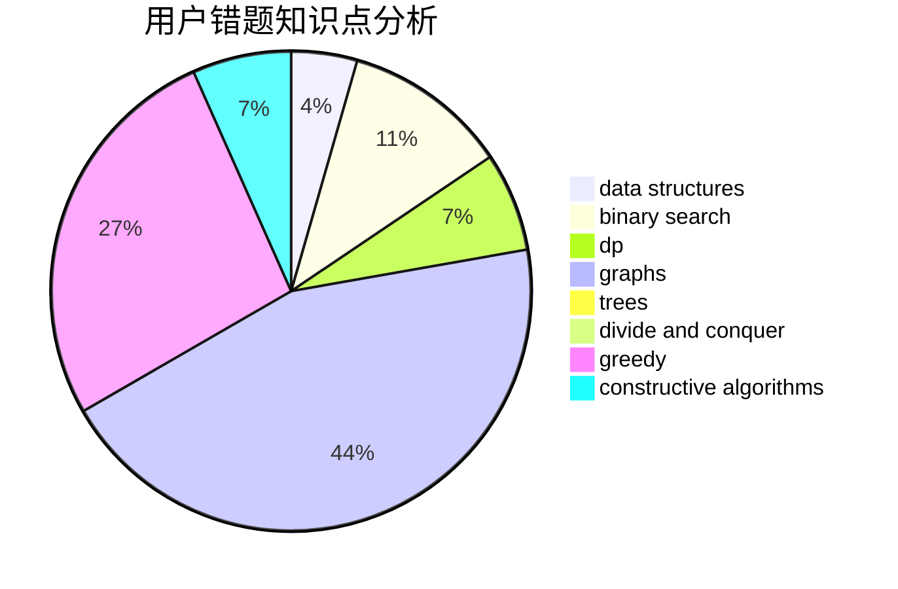

# NEFU_CCZ

<!-- tabs:start -->

#### **用户提交结果分析**

#### **用户做题类型偏好分析**

#### **用户错题知识点分析**

<!-- tabs:end -->
# 推荐题目
[573C](https://codeforces.com/contest/573/problem/C)		constructive algorithms,
                        dfs and similar,
                        trees		  
[1364D](https://codeforces.com/contest/1364/problem/D)		constructive algorithms,
                        dfs and similar,
                        graphs,
                        greedy,
                        implementation,
                        trees		  
[956D](https://codeforces.com/contest/956/problem/D)		dsu,graphs,sortings,trees		  
[1020B](https://codeforces.com/contest/1020/problem/B)		brute force,
                        dfs and similar,
                        graphs		  
[1221G](https://codeforces.com/contest/1221/problem/G)		bitmasks,
                        brute force,
                        combinatorics,
                        dp,
                        meet-in-the-middle		  
[1250L](https://codeforces.com/contest/1250/problem/L)		binary search,
                        greedy,
                        math		  
[12871](https://codeforces.com/contest/1287/problem/1)		dsu,graphs,sortings,trees		  
[1009G](https://codeforces.com/contest/1009/problem/G)		bitmasks,
                        flows,
                        graph matchings,
                        graphs,
                        greedy		  
[870E](https://codeforces.com/contest/870/problem/E)		dfs and similar,
                        dsu,
                        graphs,
                        trees		  
[737E](https://codeforces.com/contest/737/problem/E)		graph matchings,
                        graphs,
                        greedy,
                        schedules		  
