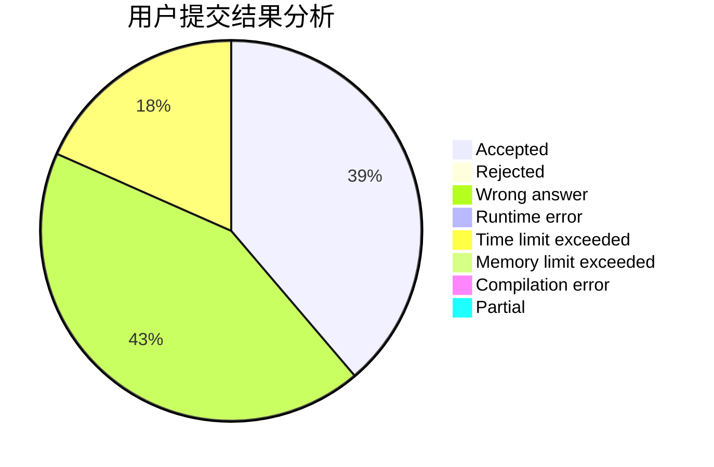
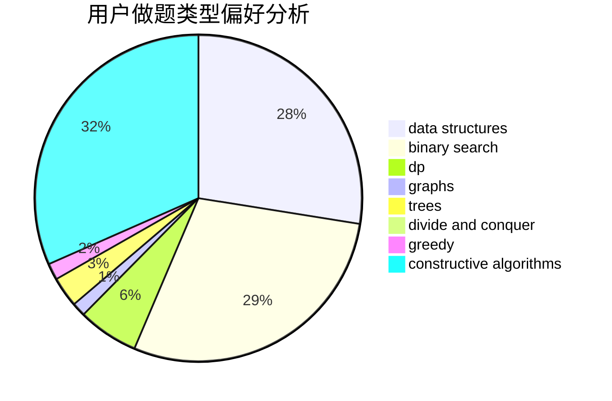
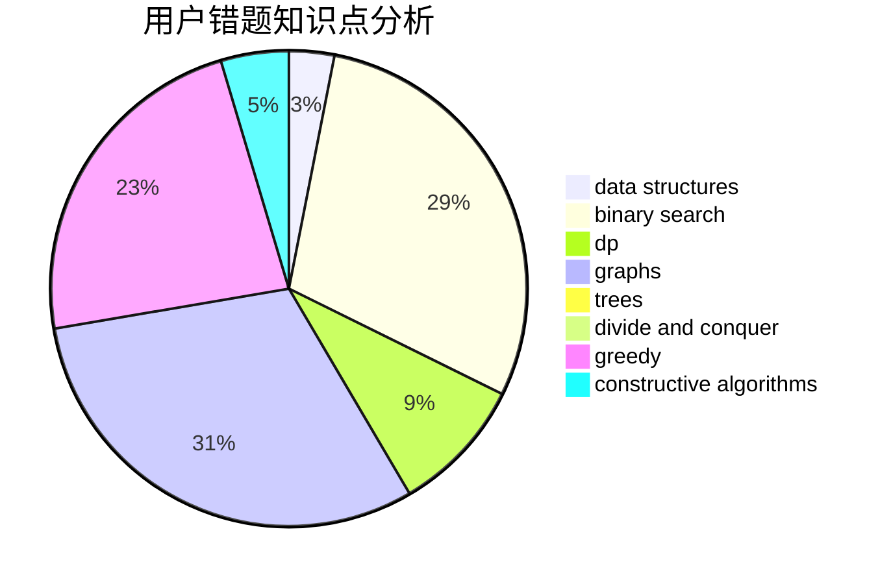

# NEFU_CCZ

<!-- tabs:start -->

#### **用户提交结果分析**

#### **用户做题类型偏好分析**

#### **用户错题知识点分析**

<!-- tabs:end -->
# 推荐题目
[548A](https://codeforces.com/contest/548/problem/A)		brute force,
                        implementation,
                        strings		  
[1357B1](https://codeforces.com/contest/1357B/problem/1)		nan		  
[934E](https://codeforces.com/contest/934/problem/E)		dsu,graphs,sortings,trees		  
[101B](https://codeforces.com/contest/101/problem/B)		binary search,
                        data structures,
                        dp		  
[1216C](https://codeforces.com/contest/1216/problem/C)		geometry,
                        math		  
[1246C](https://codeforces.com/contest/1246/problem/C)		dsu,graphs,sortings,trees		  
[1280F](https://codeforces.com/contest/1280/problem/F)		combinatorics,
                        constructive algorithms,
                        math		  
[1009D](https://codeforces.com/contest/1009/problem/D)		brute force,
                        constructive algorithms,
                        graphs,
                        greedy,
                        math		  
[852E](https://codeforces.com/contest/852/problem/E)		dp		  
[720D](https://codeforces.com/contest/720/problem/D)		data structures,
                        dp,
                        sortings		  
