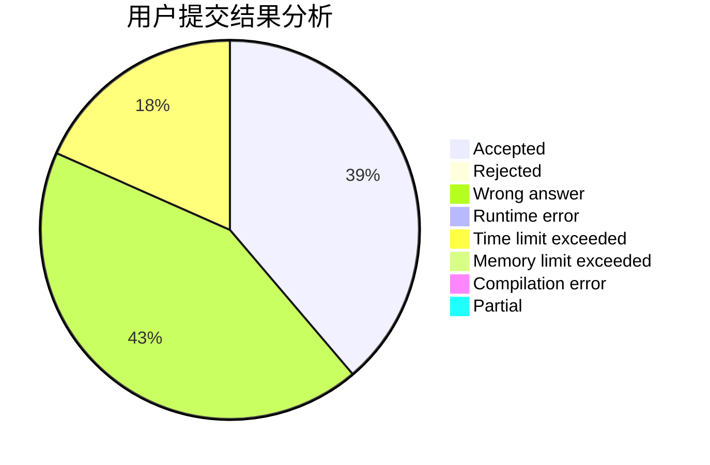
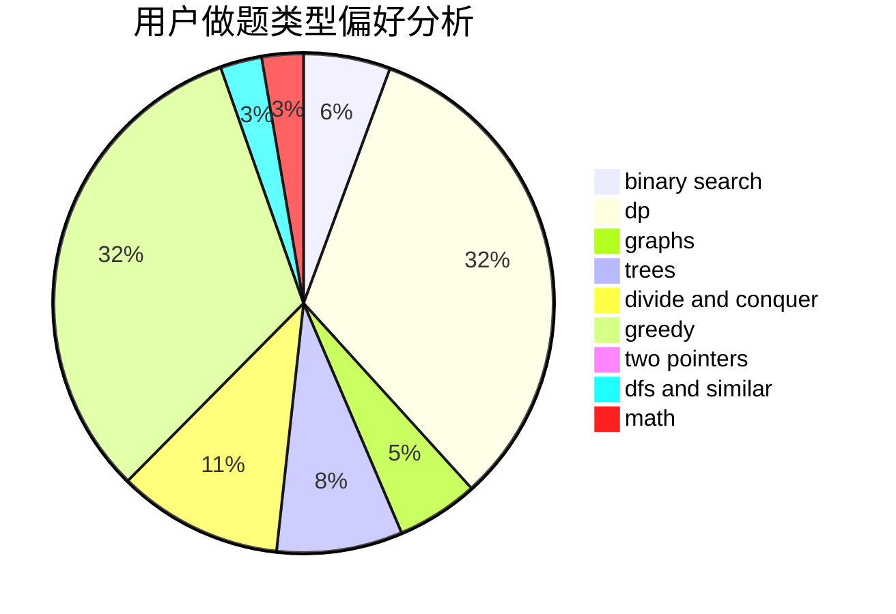

# NEFU_CCZ

<!-- tabs:start -->

#### **用户提交结果分析**

#### **用户做题类型偏好分析**

<!-- tabs:end -->
# 推荐题目
[573C](https://codeforces.com/contest/573/problem/C)
[1364D](https://codeforces.com/contest/1364/problem/D)
[956D](https://codeforces.com/contest/956/problem/D)
[1020B](https://codeforces.com/contest/1020/problem/B)
[1221G](https://codeforces.com/contest/1221/problem/G)
[1250L](https://codeforces.com/contest/1250/problem/L)
[12871](https://codeforces.com/contest/1287/problem/1)
[1009G](https://codeforces.com/contest/1009/problem/G)
[870E](https://codeforces.com/contest/870/problem/E)
[737E](https://codeforces.com/contest/737/problem/E)
