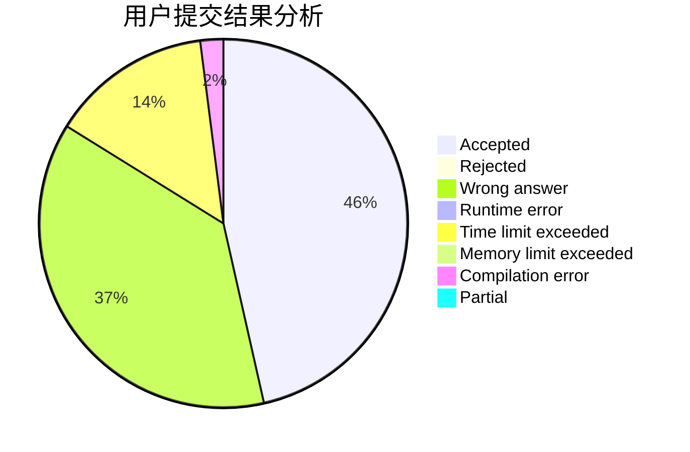
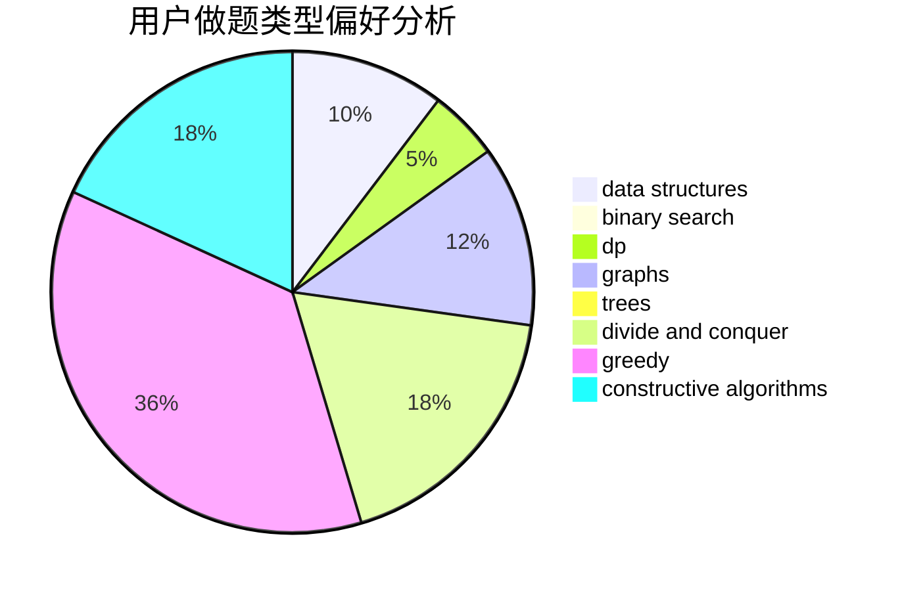

# 89991807

<!-- tabs:start -->

#### **用户提交结果分析**

#### **用户做题类型偏好分析**

#### **用户错题知识点分析**

<!-- tabs:end -->
# 推荐题目
[1451F](https://codeforces.com/contest/1451/problem/F)		constructive algorithms,
                        games		  
[1070H](https://codeforces.com/contest/1070/problem/H)		brute force,
                        implementation		  
[1279E](https://codeforces.com/contest/1279/problem/E)		combinatorics,
                        dp		  
[1068C](https://codeforces.com/contest/1068/problem/C)		constructive algorithms,
                        graphs		  
[1454E](https://codeforces.com/contest/1454/problem/E)		combinatorics,
                        dfs and similar,
                        graphs,
                        trees		  
[121E](https://codeforces.com/contest/121/problem/E)		data structures		  
[1452F](https://codeforces.com/contest/1452/problem/F)		constructive algorithms,
                        greedy		  
[1355E](https://codeforces.com/contest/1355/problem/E)		binary search,
                        greedy,
                        math,
                        sortings,
                        ternary search		  
[1042F](https://codeforces.com/contest/1042/problem/F)		data structures,
                        dfs and similar,
                        dsu,
                        graphs,
                        greedy,
                        sortings,
                        trees		  
[1241B](https://codeforces.com/contest/1241/problem/B)		dsu,graphs,sortings,trees		  
