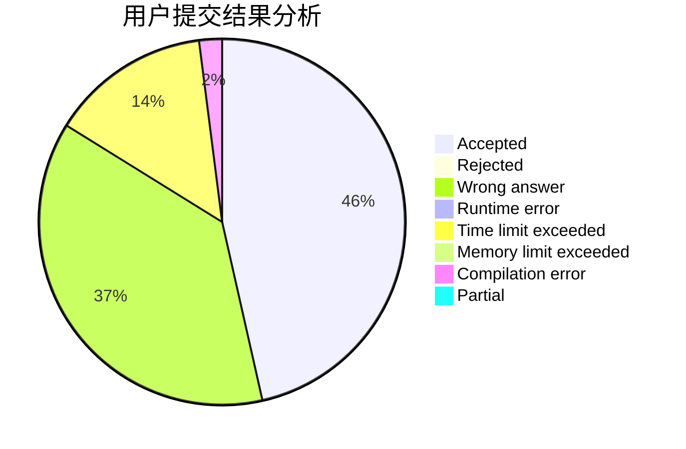
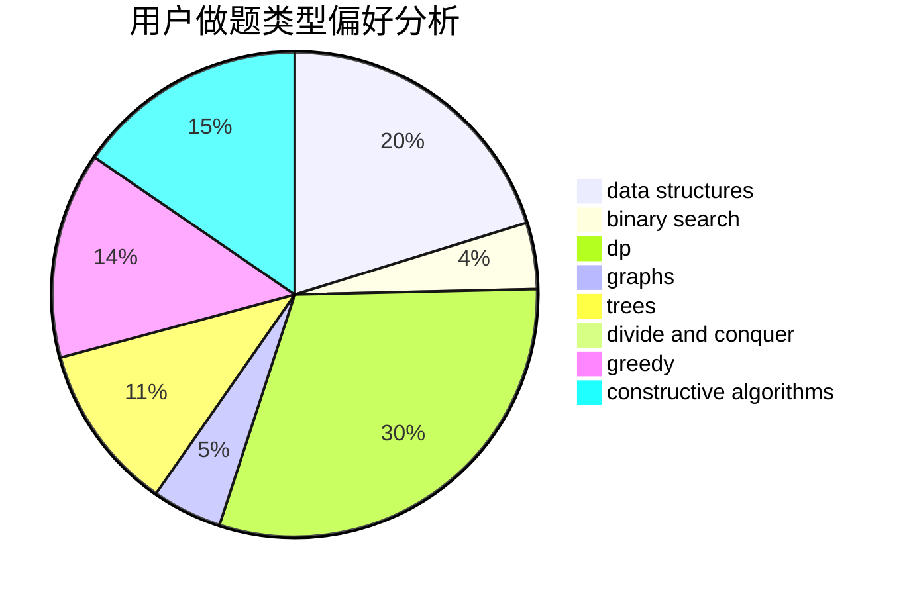

# 89991807

<!-- tabs:start -->

#### **用户提交结果分析**

#### **用户做题类型偏好分析**

#### **用户错题知识点分析**

<!-- tabs:end -->
# 推荐题目
[1442A](https://codeforces.com/contest/1442/problem/A)		constructive algorithms,
                        dp,
                        greedy		  
[1070E](https://codeforces.com/contest/1070/problem/E)		binary search,
                        data structures		  
[1270E](https://codeforces.com/contest/1270/problem/E)		constructive algorithms,
                        geometry,
                        math		  
[1067E](https://codeforces.com/contest/1067/problem/E)		dp,
                        graph matchings,
                        math,
                        trees		  
[1445B](https://codeforces.com/contest/1445/problem/B)		greedy,
                        math		  
[1214D](https://codeforces.com/contest/1214/problem/D)		dfs and similar,
                        dp,
                        flows,
                        hashing		  
[1443A](https://codeforces.com/contest/1443/problem/A)		constructive algorithms,
                        math		  
[1349A](https://codeforces.com/contest/1349/problem/A)		data structures,
                        math,
                        number theory		  
[1042C](https://codeforces.com/contest/1042/problem/C)		constructive algorithms,
                        greedy,
                        math		  
[1236E](https://codeforces.com/contest/1236/problem/E)		binary search,
                        data structures,
                        dp,
                        dsu		  
