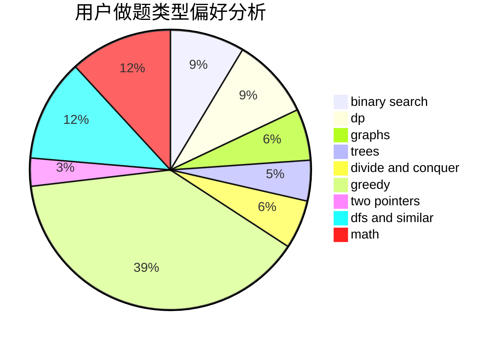

# 89991807

<!-- tabs:start -->

#### **用户提交结果分析**

#### **用户做题类型偏好分析**

<!-- tabs:end -->
# 推荐题目
[1451F](https://codeforces.com/contest/1451/problem/F)
[1070H](https://codeforces.com/contest/1070/problem/H)
[1279E](https://codeforces.com/contest/1279/problem/E)
[1068C](https://codeforces.com/contest/1068/problem/C)
[1454E](https://codeforces.com/contest/1454/problem/E)
[121E](https://codeforces.com/contest/121/problem/E)
[1452F](https://codeforces.com/contest/1452/problem/F)
[1355E](https://codeforces.com/contest/1355/problem/E)
[1042F](https://codeforces.com/contest/1042/problem/F)
[1241B](https://codeforces.com/contest/1241/problem/B)
