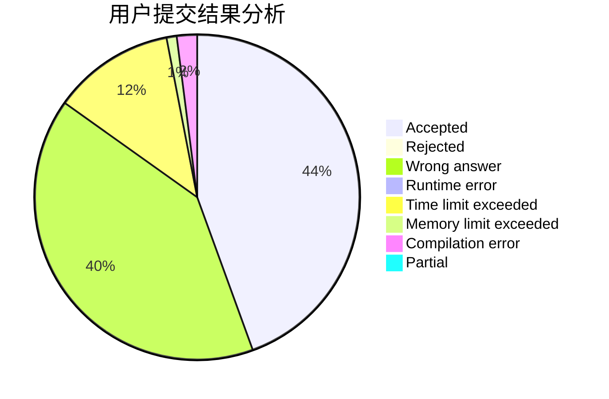
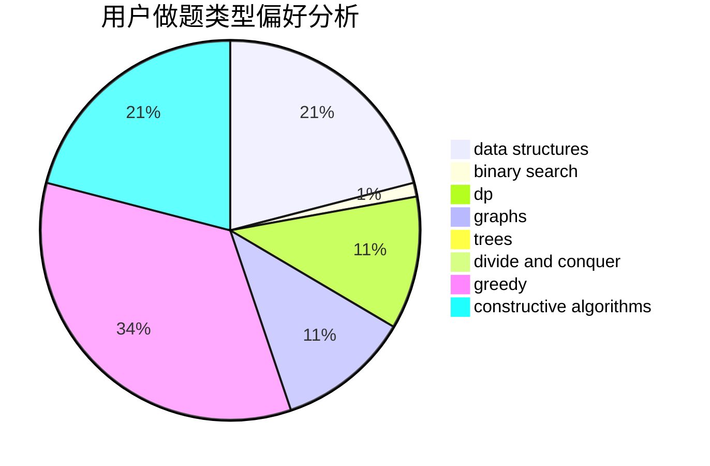
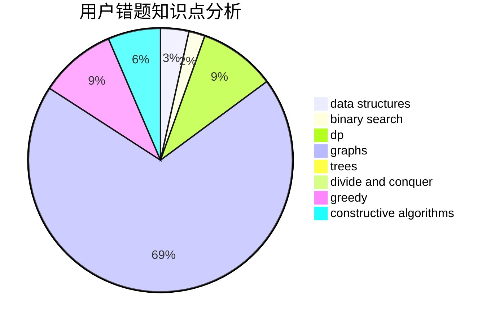

# NEFU_DaTieJiang

<!-- tabs:start -->

#### **用户提交结果分析**

#### **用户做题类型偏好分析**

#### **用户错题知识点分析**

<!-- tabs:end -->
# 推荐题目
[283C](https://codeforces.com/contest/283/problem/C)		dp		  
[13351](https://codeforces.com/contest/1335/problem/1)		dsu,graphs,sortings,trees		  
[1153C](https://codeforces.com/contest/1153/problem/C)		greedy,
                        strings		  
[543E](https://codeforces.com/contest/543/problem/E)		constructive algorithms,
                        data structures		  
[987E](https://codeforces.com/contest/987/problem/E)		dsu,graphs,sortings,trees		  
[1100A](https://codeforces.com/contest/1100/problem/A)		implementation		  
[1154D](https://codeforces.com/contest/1154/problem/D)		greedy		  
[453C](https://codeforces.com/contest/453/problem/C)		constructive algorithms,
                        dfs and similar,
                        graphs		  
[1352B](https://codeforces.com/contest/1352/problem/B)		constructive algorithms,
                        math		  
[660E](https://codeforces.com/contest/660/problem/E)		combinatorics		  
