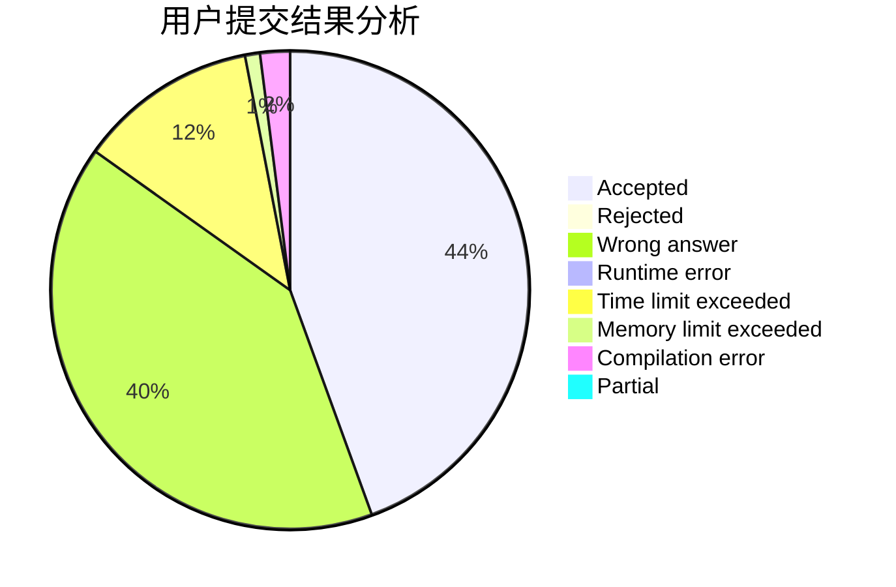
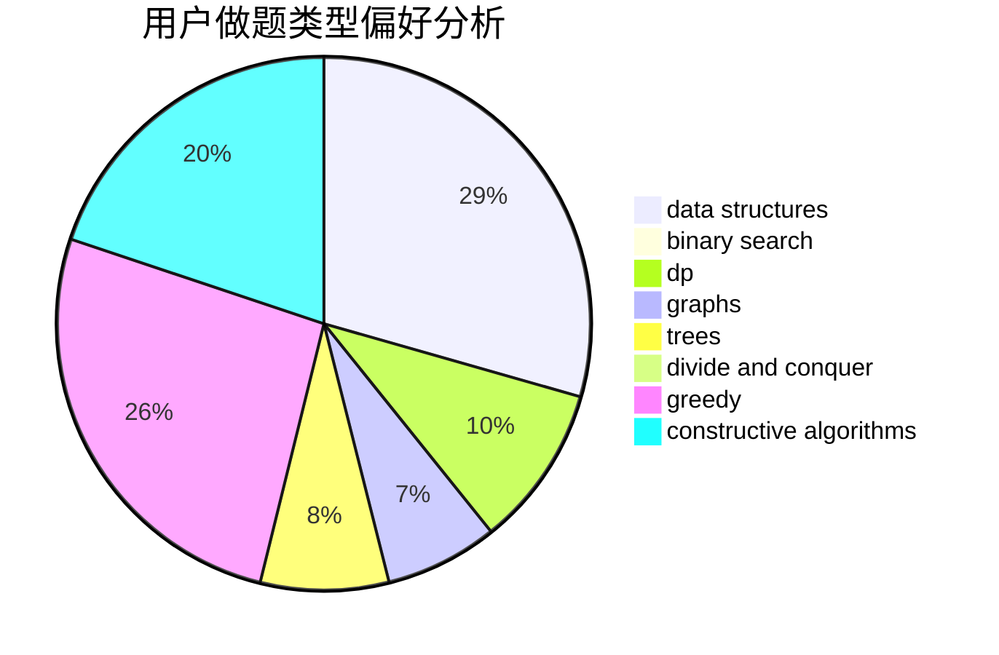
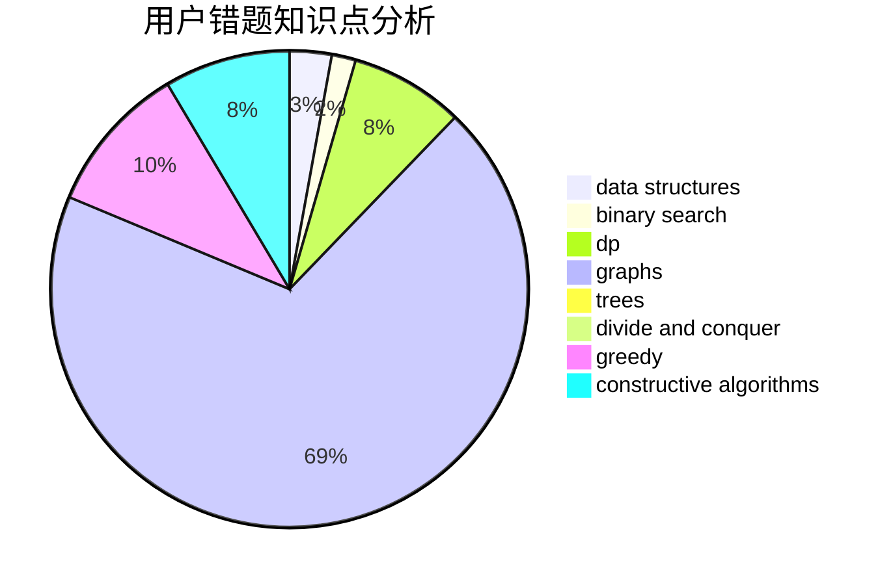

# NEFU_DaTieJiang
<!-- tabs:start -->
#### **用户提交结果分析**

#### **用户做题类型偏好分析**

#### **用户错题知识点分析**

<!-- tabs:end -->
# 推荐题目
[Nezzar and Binary String](https://codeforces.com/contest/1478/problem/E)		data structures,
                        greedy		  
[Three Sequences](http://codeforces.com/problemset/problem/1406/D)		constructive algorithms,
                        data structures,
                        greedy,
                        math		  
[Short Code](http://codeforces.com/problemset/problem/965/E)		data structures,
                        dp,
                        greedy,
                        strings,
                        trees		  
[Igor In the Museum](http://codeforces.com/problemset/problem/598/D)		dfs and similar,
                        graphs,
                        shortest paths		  
[Badge](http://codeforces.com/problemset/problem/1020/B)		brute force,
                        dfs and similar,
                        graphs		  
[Problem for Nazar](http://codeforces.com/problemset/problem/1151/C)		constructive algorithms,
                        math		  
[Digital Root](http://codeforces.com/problemset/problem/10/C)		number theory		  
[Tree Queries](http://codeforces.com/problemset/problem/1328/E)		dfs and similar,
                        graphs,
                        trees		  
[Neko and Aki's Prank](http://codeforces.com/problemset/problem/1152/D)		dp,
                        greedy,
                        trees		  
[There Are Two Types Of Burgers](http://codeforces.com/problemset/problem/1207/A)		brute force,
                        greedy,
                        implementation,
                        math		  
<!-- tabs:start -->
#### **data structures**
[Nezzar and Binary String](https://codeforces.com/contest/1478/problem/E)		data structures,
                        greedy		  
[Three Sequences](http://codeforces.com/problemset/problem/1406/D)		constructive algorithms,
                        data structures,
                        greedy,
                        math		  
[Short Code](http://codeforces.com/problemset/problem/965/E)		data structures,
                        dp,
                        greedy,
                        strings,
                        trees		  
[Igor In the Museum](https://codeforces.com/contest/831/problem/E)		data structures,
                        implementation,
                        sortings		  
[Badge](http://codeforces.com/problemset/problem/431/E)		binary search,
                        data structures,
                        ternary search		  
[Problem for Nazar](http://codeforces.com/problemset/problem/895/E)		data structures,
                        probabilities		  
[Digital Root](http://codeforces.com/problemset/problem/13/E)		data structures,
                        dsu		  
[Tree Queries](http://codeforces.com/problemset/problem/372/C)		data structures,
                        dp,
                        math		  
[Neko and Aki's Prank](http://codeforces.com/problemset/problem/242/E)		bitmasks,
                        data structures		  
[There Are Two Types Of Burgers](https://codeforces.com/contest/1199/problem/D)		binary search,
                        brute force,
                        data structures,
                        sortings		  
#### **binary search**
[Nezzar and Binary String](http://codeforces.com/problemset/problem/431/E)		binary search,
                        data structures,
                        ternary search		  
[Three Sequences](https://codeforces.com/contest/956/problem/B)		binary search,
                        greedy,
                        two pointers		  
[Short Code](http://codeforces.com/problemset/problem/181/B)		binary search,
                        brute force		  
[Igor In the Museum](https://codeforces.com/contest/1199/problem/D)		binary search,
                        brute force,
                        data structures,
                        sortings		  
[Badge](http://codeforces.com/problemset/problem/1492/C)		binary search,
                        data structures,
                        dp,
                        greedy,
                        two pointers		  
[Problem for Nazar](http://codeforces.com/problemset/problem/1463/D)		binary search,
                        constructive algorithms,
                        greedy,
                        two pointers		  
[Digital Root](http://codeforces.com/problemset/problem/1490/G)		binary search,
                        data structures,
                        math		  
[Tree Queries](http://codeforces.com/problemset/problem/1479/D)		binary search,
                        bitmasks,
                        brute force,
                        data structures,
                        probabilities,
                        trees		  
[Neko and Aki's Prank](http://codeforces.com/problemset/problem/1436/E)		binary search,
                        data structures,
                        two pointers		  
[There Are Two Types Of Burgers](http://codeforces.com/problemset/problem/1461/D)		binary search,
                        brute force,
                        data structures,
                        divide and conquer,
                        implementation,
                        sortings		  
#### **dp**
[Nezzar and Binary String](http://codeforces.com/problemset/problem/965/E)		data structures,
                        dp,
                        greedy,
                        strings,
                        trees		  
[Three Sequences](http://codeforces.com/problemset/problem/1152/D)		dp,
                        greedy,
                        trees		  
[Short Code](http://codeforces.com/problemset/problem/585/F)		dp,
                        implementation,
                        strings		  
[Igor In the Museum](http://codeforces.com/problemset/problem/792/C)		dp,
                        greedy,
                        math,
                        number theory		  
[Badge](http://codeforces.com/problemset/problem/372/C)		data structures,
                        dp,
                        math		  
[Problem for Nazar](http://codeforces.com/problemset/problem/1492/C)		binary search,
                        data structures,
                        dp,
                        greedy,
                        two pointers		  
[Digital Root](https://codeforces.com/contest/1457/problem/C)		brute force,
                        dp,
                        implementation		  
[Tree Queries](http://codeforces.com/problemset/problem/1491/C)		brute force,
                        data structures,
                        dp,
                        greedy,
                        implementation		  
[Neko and Aki's Prank](http://codeforces.com/problemset/problem/1437/C)		dp,
                        flows,
                        graph matchings,
                        greedy,
                        math,
                        sortings		  
[There Are Two Types Of Burgers](http://codeforces.com/problemset/problem/1499/B)		brute force,
                        dp,
                        greedy,
                        implementation		  
#### **graph**
[Nezzar and Binary String](http://codeforces.com/problemset/problem/598/D)		dfs and similar,
                        graphs,
                        shortest paths		  
[Three Sequences](http://codeforces.com/problemset/problem/1020/B)		brute force,
                        dfs and similar,
                        graphs		  
[Short Code](http://codeforces.com/problemset/problem/1328/E)		dfs and similar,
                        graphs,
                        trees		  
[Igor In the Museum](http://codeforces.com/problemset/problem/939/A)		graphs		  
[Badge](http://codeforces.com/problemset/problem/1327/B)		brute force,
                        graphs,
                        greedy		  
[Problem for Nazar](http://codeforces.com/problemset/problem/1487/C)		brute force,
                        constructive algorithms,
                        dfs and similar,
                        graphs,
                        greedy,
                        implementation,
                        math		  
[Digital Root](http://codeforces.com/problemset/problem/1437/C)		dp,
                        flows,
                        graph matchings,
                        greedy,
                        math,
                        sortings		  
[Tree Queries](http://codeforces.com/problemset/problem/1470/D)		constructive algorithms,
                        dfs and similar,
                        graph matchings,
                        graphs,
                        greedy		  
[Neko and Aki's Prank](http://codeforces.com/problemset/problem/1476/C)		dp,
                        graphs,
                        greedy		  
[There Are Two Types Of Burgers](http://codeforces.com/problemset/problem/1304/D)		constructive algorithms,
                        graphs,
                        greedy,
                        two pointers		  
#### **trees**
[Nezzar and Binary String](http://codeforces.com/problemset/problem/965/E)		data structures,
                        dp,
                        greedy,
                        strings,
                        trees		  
[Three Sequences](http://codeforces.com/problemset/problem/1328/E)		dfs and similar,
                        graphs,
                        trees		  
[Short Code](http://codeforces.com/problemset/problem/1152/D)		dp,
                        greedy,
                        trees		  
[Igor In the Museum](http://codeforces.com/problemset/problem/1479/D)		binary search,
                        bitmasks,
                        brute force,
                        data structures,
                        probabilities,
                        trees		  
[Badge](http://codeforces.com/problemset/problem/1511/C)		brute force,
                        data structures,
                        implementation,
                        trees		  
[Problem for Nazar](http://codeforces.com/problemset/problem/1499/F)		combinatorics,
                        dfs and similar,
                        dp,
                        trees		  
[Digital Root](http://codeforces.com/problemset/problem/1491/E)		brute force,
                        dfs and similar,
                        divide and conquer,
                        number theory,
                        trees		  
[Tree Queries](http://codeforces.com/problemset/problem/1466/D)		data structures,
                        greedy,
                        sortings,
                        trees		  
[Neko and Aki's Prank](http://codeforces.com/problemset/problem/1495/D)		combinatorics,
                        dfs and similar,
                        graphs,
                        math,
                        shortest paths,
                        trees		  
[There Are Two Types Of Burgers](http://codeforces.com/problemset/problem/1303/G)		data structures,
                        divide and conquer,
                        geometry,
                        trees		  
#### **divide and conquer**
[Nezzar and Binary String](http://codeforces.com/problemset/problem/120/J)		divide and conquer,
                        geometry,
                        sortings		  
[Three Sequences](http://codeforces.com/problemset/problem/1461/D)		binary search,
                        brute force,
                        data structures,
                        divide and conquer,
                        implementation,
                        sortings		  
[Short Code](http://codeforces.com/problemset/problem/1466/G)		combinatorics,
                        divide and conquer,
                        hashing,
                        math,
                        string suffix structures,
                        strings		  
[Igor In the Museum](http://codeforces.com/problemset/problem/1490/D)		dfs and similar,
                        divide and conquer,
                        implementation		  
[Badge](https://codeforces.com/contest/1483/problem/C)		data structures,
                        divide and conquer,
                        dp		  
[Problem for Nazar](http://codeforces.com/problemset/problem/1491/E)		brute force,
                        dfs and similar,
                        divide and conquer,
                        number theory,
                        trees		  
[Digital Root](http://codeforces.com/problemset/problem/1303/G)		data structures,
                        divide and conquer,
                        geometry,
                        trees		  
[Tree Queries](http://codeforces.com/problemset/problem/1494/D)		constructive algorithms,
                        data structures,
                        dfs and similar,
                        divide and conquer,
                        dsu,
                        greedy,
                        sortings,
                        trees		  
[Neko and Aki's Prank](http://codeforces.com/problemset/problem/1482/E)		data structures,
                        divide and conquer,
                        dp		  
[There Are Two Types Of Burgers](http://codeforces.com/problemset/problem/566/C)		dfs and similar,
                        divide and conquer,
                        trees		  
#### **greedy**
[Nezzar and Binary String](https://codeforces.com/contest/1478/problem/E)		data structures,
                        greedy		  
[Three Sequences](http://codeforces.com/problemset/problem/1406/D)		constructive algorithms,
                        data structures,
                        greedy,
                        math		  
[Short Code](http://codeforces.com/problemset/problem/965/E)		data structures,
                        dp,
                        greedy,
                        strings,
                        trees		  
[Igor In the Museum](http://codeforces.com/problemset/problem/1152/D)		dp,
                        greedy,
                        trees		  
[Badge](http://codeforces.com/problemset/problem/1207/A)		brute force,
                        greedy,
                        implementation,
                        math		  
[Problem for Nazar](http://codeforces.com/problemset/problem/297/B)		constructive algorithms,
                        greedy		  
[Digital Root](http://codeforces.com/problemset/problem/792/C)		dp,
                        greedy,
                        math,
                        number theory		  
[Tree Queries](https://codeforces.com/contest/956/problem/B)		binary search,
                        greedy,
                        two pointers		  
[Neko and Aki's Prank](http://codeforces.com/problemset/problem/1271/B)		greedy,
                        math		  
[There Are Two Types Of Burgers](http://codeforces.com/problemset/problem/1267/E)		greedy		  
#### **constructive algorithms**
[Nezzar and Binary String](http://codeforces.com/problemset/problem/1406/D)		constructive algorithms,
                        data structures,
                        greedy,
                        math		  
[Three Sequences](http://codeforces.com/problemset/problem/1151/C)		constructive algorithms,
                        math		  
[Short Code](https://codeforces.com/contest/1243/problem/C)		constructive algorithms,
                        math,
                        number theory		  
[Igor In the Museum](http://codeforces.com/problemset/problem/297/B)		constructive algorithms,
                        greedy		  
[Badge](http://codeforces.com/problemset/problem/1267/C)		constructive algorithms		  
[Problem for Nazar](http://codeforces.com/problemset/problem/949/B)		constructive algorithms,
                        math		  
[Digital Root](http://codeforces.com/problemset/problem/128/B)		brute force,
                        constructive algorithms,
                        hashing,
                        implementation,
                        string suffix structures,
                        strings		  
[Tree Queries](http://codeforces.com/problemset/problem/1453/B)		constructive algorithms,
                        implementation		  
[Neko and Aki's Prank](http://codeforces.com/problemset/problem/1493/A)		constructive algorithms,
                        greedy		  
[There Are Two Types Of Burgers](http://codeforces.com/problemset/problem/1463/D)		binary search,
                        constructive algorithms,
                        greedy,
                        two pointers		  
#### **sortings**
[Nezzar and Binary String](https://codeforces.com/contest/831/problem/E)		data structures,
                        implementation,
                        sortings		  
[Three Sequences](http://codeforces.com/problemset/problem/120/J)		divide and conquer,
                        geometry,
                        sortings		  
[Short Code](https://codeforces.com/contest/1199/problem/D)		binary search,
                        brute force,
                        data structures,
                        sortings		  
[Igor In the Museum](https://codeforces.com/contest/1496/problem/C)		geometry,
                        greedy,
                        math,
                        sortings		  
[Badge](http://codeforces.com/problemset/problem/1495/A)		geometry,
                        greedy,
                        math,
                        sortings		  
[Problem for Nazar](http://codeforces.com/problemset/problem/1497/A)		brute force,
                        data structures,
                        greedy,
                        sortings		  
[Digital Root](http://codeforces.com/problemset/problem/1427/A)		math,
                        sortings		  
[Tree Queries](http://codeforces.com/problemset/problem/1461/D)		binary search,
                        brute force,
                        data structures,
                        divide and conquer,
                        implementation,
                        sortings		  
[Neko and Aki's Prank](http://codeforces.com/problemset/problem/1437/C)		dp,
                        flows,
                        graph matchings,
                        greedy,
                        math,
                        sortings		  
[There Are Two Types Of Burgers](http://codeforces.com/problemset/problem/1473/A)		greedy,
                        implementation,
                        math,
                        sortings		  
<!-- tabs:end -->
