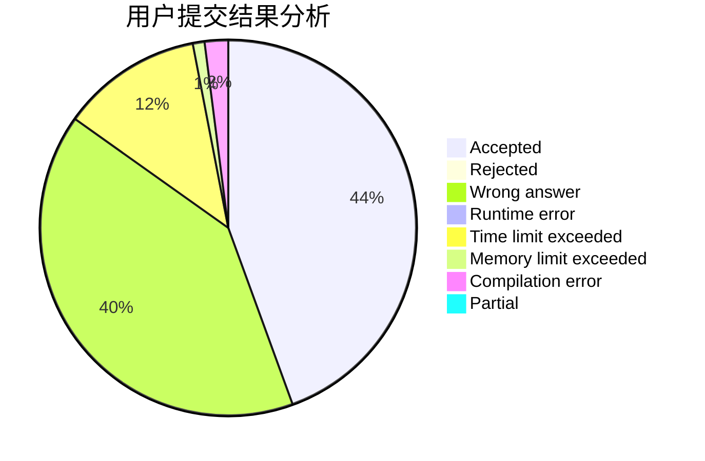
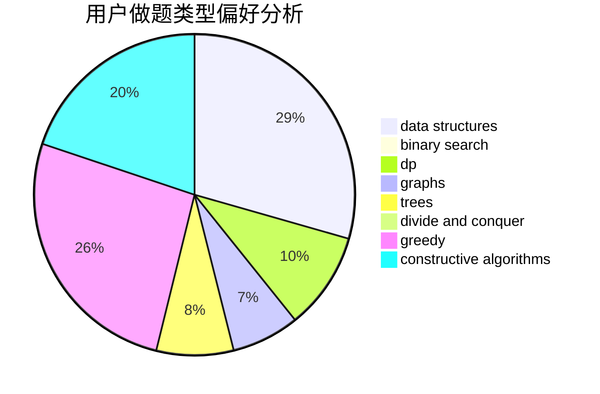
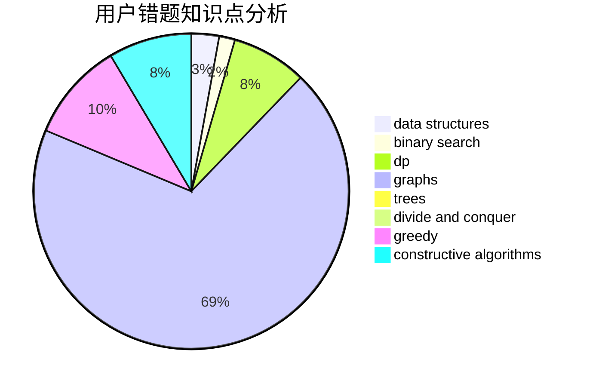

# NEFU_DaTieJiang

<!-- tabs:start -->

#### **用户提交结果分析**

#### **用户做题类型偏好分析**

#### **用户错题知识点分析**

<!-- tabs:end -->
# 推荐题目
[268B](https://codeforces.com/contest/268/problem/B)		implementation,
                        math		  
[1328E](https://codeforces.com/contest/1328/problem/E)		dfs and similar,
                        graphs,
                        trees		  
[1151C](https://codeforces.com/contest/1151/problem/C)		constructive algorithms,
                        math		  
[516E](https://codeforces.com/contest/516/problem/E)		math,
                        number theory		  
[965E](https://codeforces.com/contest/965/problem/E)		data structures,
                        dp,
                        greedy,
                        strings,
                        trees		  
[10C](https://codeforces.com/contest/10/problem/C)		number theory		  
[1152D](https://codeforces.com/contest/1152/problem/D)		dp,
                        greedy,
                        trees		  
[431E](https://codeforces.com/contest/431/problem/E)		binary search,
                        data structures,
                        ternary search		  
[1344F](https://codeforces.com/contest/1344/problem/F)		matrices		  
[630J](https://codeforces.com/contest/630/problem/J)		math,
                        number theory		  
