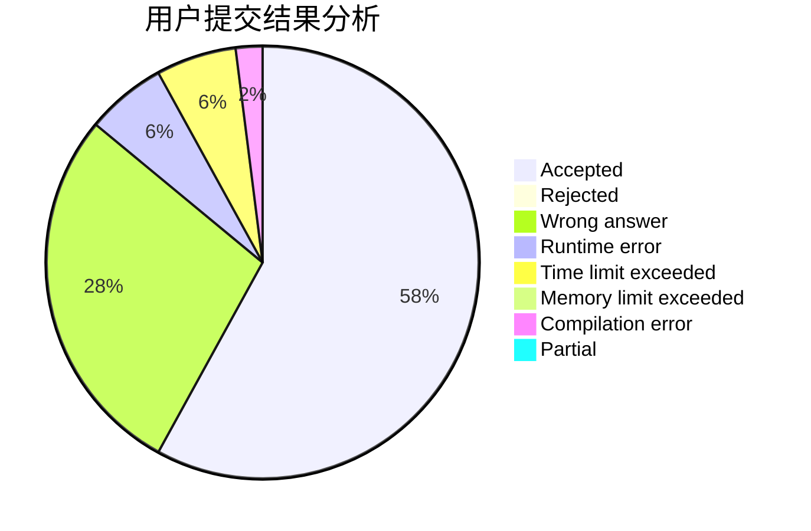
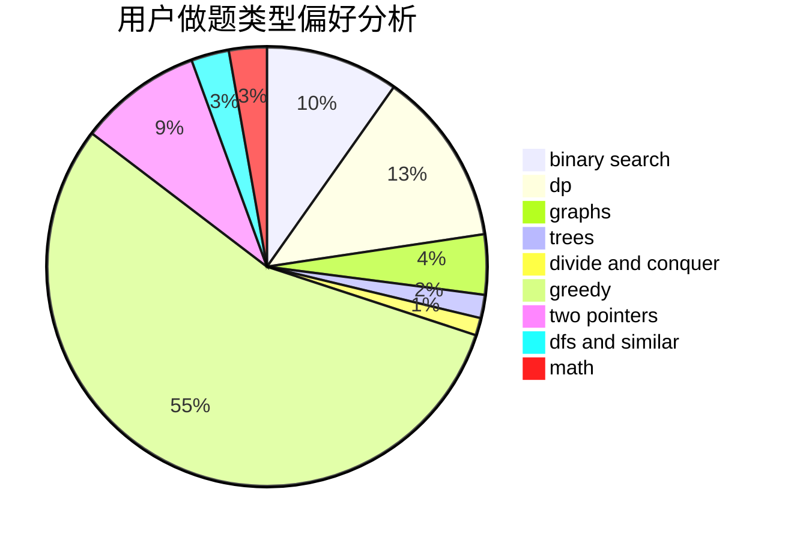

# NEFU_Smith

<!-- tabs:start -->

#### **用户提交结果分析**

#### **用户做题类型偏好分析**

<!-- tabs:end -->
# 推荐题目
[600F](https://codeforces.com/contest/600/problem/F)
[1129D](https://codeforces.com/contest/1129/problem/D)
[263A](https://codeforces.com/contest/263/problem/A)
[198C](https://codeforces.com/contest/198/problem/C)
[699A](https://codeforces.com/contest/699/problem/A)
[1088B](https://codeforces.com/contest/1088/problem/B)
[346D](https://codeforces.com/contest/346/problem/D)
[190C](https://codeforces.com/contest/190/problem/C)
[848A](https://codeforces.com/contest/848/problem/A)
[77E](https://codeforces.com/contest/77/problem/E)
