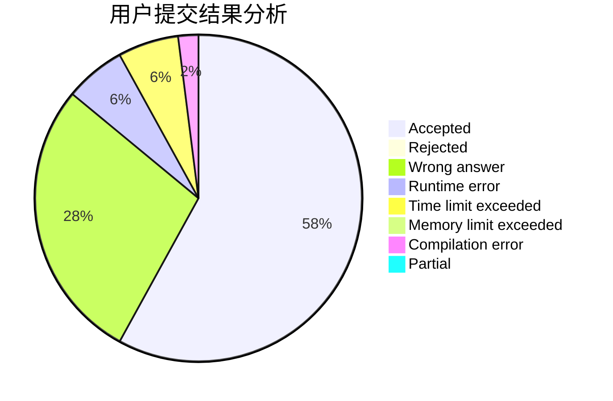
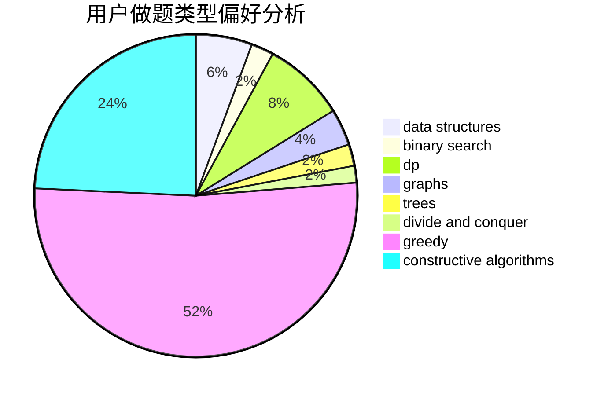

# NEFU_Smith

<!-- tabs:start -->

#### **用户提交结果分析**

#### **用户做题类型偏好分析**

#### **用户错题知识点分析**

<!-- tabs:end -->
# 推荐题目
[600F](https://codeforces.com/contest/600/problem/F)		graphs		  
[1129D](https://codeforces.com/contest/1129/problem/D)		data structures,
                        dp		  
[263A](https://codeforces.com/contest/263/problem/A)		implementation		  
[198C](https://codeforces.com/contest/198/problem/C)		binary search,
                        geometry		  
[699A](https://codeforces.com/contest/699/problem/A)		implementation		  
[1088B](https://codeforces.com/contest/1088/problem/B)		implementation,
                        sortings		  
[346D](https://codeforces.com/contest/346/problem/D)		dp,
                        graphs,
                        shortest paths		  
[190C](https://codeforces.com/contest/190/problem/C)		dfs and similar		  
[848A](https://codeforces.com/contest/848/problem/A)		constructive algorithms		  
[77E](https://codeforces.com/contest/77/problem/E)		geometry		  
