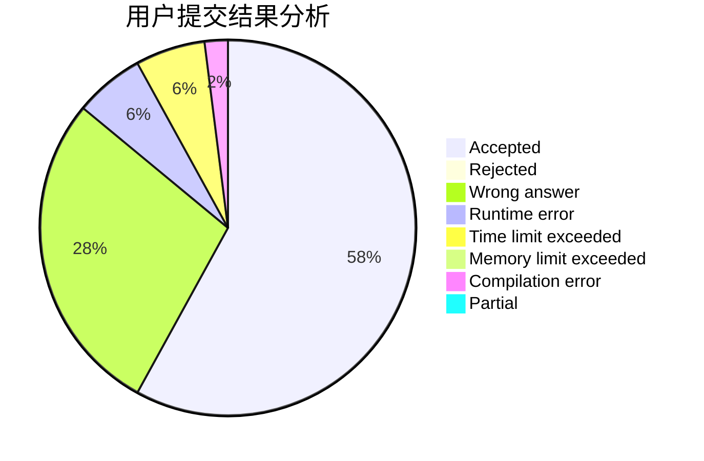
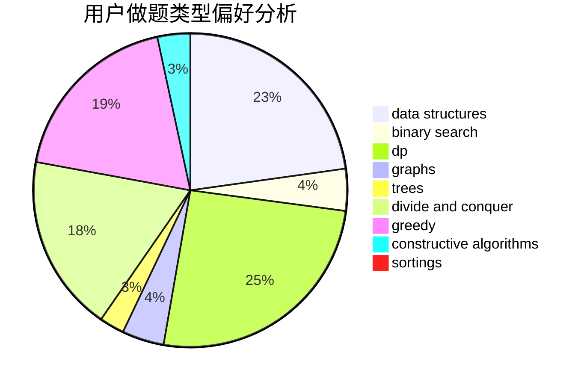

# NEFU_Smith
<!-- tabs:start -->
#### **用户提交结果分析**

#### **用户做题类型偏好分析**

#### **用户错题知识点分析**

<!-- tabs:end -->
# 推荐题目
[1446D1](http://codeforces.com/problemset/problem/1446/D1)		data structures,
                        greedy		  
[618F](http://codeforces.com/problemset/problem/618/F)		constructive algorithms,
                        two pointers		  
[486D](http://codeforces.com/problemset/problem/486/D)		dfs and similar,
                        dp,
                        math,
                        trees		  
[171C](http://codeforces.com/problemset/problem/171/C)		*special problem,
                        implementation		  
[864E](http://codeforces.com/problemset/problem/864/E)		dp,
                        sortings		  
[673B](http://codeforces.com/problemset/problem/673/B)		greedy,
                        implementation		  
[317B](http://codeforces.com/problemset/problem/317/B)		brute force,
                        implementation		  
[1119H](http://codeforces.com/problemset/problem/1119/H)		fft,
                        math		  
[311A](http://codeforces.com/problemset/problem/311/A)		constructive algorithms,
                        implementation		  
[830A](http://codeforces.com/problemset/problem/830/A)		binary search,
                        brute force,
                        dp,
                        greedy,
                        sortings		  
<!-- tabs:start -->
#### **data structures**
[1446D1](http://codeforces.com/problemset/problem/1446/D1)		data structures,
                        greedy		  
[69E](http://codeforces.com/problemset/problem/69/E)		data structures,
                        implementation		  
[165D](http://codeforces.com/problemset/problem/165/D)		data structures,
                        dsu,
                        trees		  
[847B](http://codeforces.com/problemset/problem/847/B)		binary search,
                        data structures		  
[900C](http://codeforces.com/problemset/problem/900/C)		brute force,
                        data structures,
                        math		  
[5C](http://codeforces.com/problemset/problem/5/C)		constructive algorithms,
                        data structures,
                        dp,
                        greedy,
                        sortings,
                        strings		  
[863D](http://codeforces.com/problemset/problem/863/D)		data structures,
                        implementation		  
[242E](http://codeforces.com/problemset/problem/242/E)		bitmasks,
                        data structures		  
[833B](http://codeforces.com/problemset/problem/833/B)		binary search,
                        data structures,
                        divide and conquer,
                        dp,
                        two pointers		  
[609F](http://codeforces.com/problemset/problem/609/F)		data structures,
                        greedy		  
#### **binary search**
[830A](http://codeforces.com/problemset/problem/830/A)		binary search,
                        brute force,
                        dp,
                        greedy,
                        sortings		  
[1279F](http://codeforces.com/problemset/problem/1279/F)		binary search,
                        dp		  
[847B](http://codeforces.com/problemset/problem/847/B)		binary search,
                        data structures		  
[833B](http://codeforces.com/problemset/problem/833/B)		binary search,
                        data structures,
                        divide and conquer,
                        dp,
                        two pointers		  
[1166D](http://codeforces.com/problemset/problem/1166/D)		binary search,
                        brute force,
                        greedy,
                        math		  
[1492C](http://codeforces.com/problemset/problem/1492/C)		binary search,
                        data structures,
                        dp,
                        greedy,
                        two pointers		  
[1463D](http://codeforces.com/problemset/problem/1463/D)		binary search,
                        constructive algorithms,
                        greedy,
                        two pointers		  
[1490G](http://codeforces.com/problemset/problem/1490/G)		binary search,
                        data structures,
                        math		  
[1479D](http://codeforces.com/problemset/problem/1479/D)		binary search,
                        bitmasks,
                        brute force,
                        data structures,
                        probabilities,
                        trees		  
[1436E](http://codeforces.com/problemset/problem/1436/E)		binary search,
                        data structures,
                        two pointers		  
#### **dp**
[486D](http://codeforces.com/problemset/problem/486/D)		dfs and similar,
                        dp,
                        math,
                        trees		  
[864E](http://codeforces.com/problemset/problem/864/E)		dp,
                        sortings		  
[830A](http://codeforces.com/problemset/problem/830/A)		binary search,
                        brute force,
                        dp,
                        greedy,
                        sortings		  
[10D](http://codeforces.com/problemset/problem/10/D)		dp		  
[1154F](http://codeforces.com/problemset/problem/1154/F)		dp,
                        greedy,
                        sortings		  
[1279F](http://codeforces.com/problemset/problem/1279/F)		binary search,
                        dp		  
[668C](https://codeforces.com/contest/668/problem/C)		dp,
                        implementation,
                        math,
                        probabilities		  
[580D](http://codeforces.com/problemset/problem/580/D)		bitmasks,
                        dp		  
[464D](http://codeforces.com/problemset/problem/464/D)		dp,
                        probabilities		  
[5C](http://codeforces.com/problemset/problem/5/C)		constructive algorithms,
                        data structures,
                        dp,
                        greedy,
                        sortings,
                        strings		  
#### **graph**
[1210D](http://codeforces.com/problemset/problem/1210/D)		graphs		  
[1325F](http://codeforces.com/problemset/problem/1325/F)		constructive algorithms,
                        dfs and similar,
                        graphs,
                        greedy		  
[1487C](http://codeforces.com/problemset/problem/1487/C)		brute force,
                        constructive algorithms,
                        dfs and similar,
                        graphs,
                        greedy,
                        implementation,
                        math		  
[1437C](http://codeforces.com/problemset/problem/1437/C)		dp,
                        flows,
                        graph matchings,
                        greedy,
                        math,
                        sortings		  
[1470D](http://codeforces.com/problemset/problem/1470/D)		constructive algorithms,
                        dfs and similar,
                        graph matchings,
                        graphs,
                        greedy		  
[1476C](http://codeforces.com/problemset/problem/1476/C)		dp,
                        graphs,
                        greedy		  
[1304D](http://codeforces.com/problemset/problem/1304/D)		constructive algorithms,
                        graphs,
                        greedy,
                        two pointers		  
[1475C](http://codeforces.com/problemset/problem/1475/C)		combinatorics,
                        graphs,
                        math		  
[553E](http://codeforces.com/problemset/problem/553/E)		dp,
                        fft,
                        graphs,
                        math,
                        probabilities		  
[1495C](http://codeforces.com/problemset/problem/1495/C)		constructive algorithms,
                        graphs		  
#### **trees**
[486D](http://codeforces.com/problemset/problem/486/D)		dfs and similar,
                        dp,
                        math,
                        trees		  
[165D](http://codeforces.com/problemset/problem/165/D)		data structures,
                        dsu,
                        trees		  
[430C](https://codeforces.com/contest/430/problem/C)		dfs and similar,
                        trees		  
[1276D](http://codeforces.com/problemset/problem/1276/D)		dp,
                        trees		  
[161D](http://codeforces.com/problemset/problem/161/D)		dfs and similar,
                        dp,
                        trees		  
[1085D](http://codeforces.com/problemset/problem/1085/D)		constructive algorithms,
                        implementation,
                        trees		  
[1479D](http://codeforces.com/problemset/problem/1479/D)		binary search,
                        bitmasks,
                        brute force,
                        data structures,
                        probabilities,
                        trees		  
[1511C](http://codeforces.com/problemset/problem/1511/C)		brute force,
                        data structures,
                        implementation,
                        trees		  
[1499F](http://codeforces.com/problemset/problem/1499/F)		combinatorics,
                        dfs and similar,
                        dp,
                        trees		  
[1491E](http://codeforces.com/problemset/problem/1491/E)		brute force,
                        dfs and similar,
                        divide and conquer,
                        number theory,
                        trees		  
#### **divide and conquer**
[833B](http://codeforces.com/problemset/problem/833/B)		binary search,
                        data structures,
                        divide and conquer,
                        dp,
                        two pointers		  
[1461D](http://codeforces.com/problemset/problem/1461/D)		binary search,
                        brute force,
                        data structures,
                        divide and conquer,
                        implementation,
                        sortings		  
[1466G](http://codeforces.com/problemset/problem/1466/G)		combinatorics,
                        divide and conquer,
                        hashing,
                        math,
                        string suffix structures,
                        strings		  
[1490D](http://codeforces.com/problemset/problem/1490/D)		dfs and similar,
                        divide and conquer,
                        implementation		  
[1483C](https://codeforces.com/contest/1483/problem/C)		data structures,
                        divide and conquer,
                        dp		  
[1491E](http://codeforces.com/problemset/problem/1491/E)		brute force,
                        dfs and similar,
                        divide and conquer,
                        number theory,
                        trees		  
[1303G](http://codeforces.com/problemset/problem/1303/G)		data structures,
                        divide and conquer,
                        geometry,
                        trees		  
[1494D](http://codeforces.com/problemset/problem/1494/D)		constructive algorithms,
                        data structures,
                        dfs and similar,
                        divide and conquer,
                        dsu,
                        greedy,
                        sortings,
                        trees		  
[1482E](http://codeforces.com/problemset/problem/1482/E)		data structures,
                        divide and conquer,
                        dp		  
[566C](http://codeforces.com/problemset/problem/566/C)		dfs and similar,
                        divide and conquer,
                        trees		  
#### **greedy**
[1446D1](http://codeforces.com/problemset/problem/1446/D1)		data structures,
                        greedy		  
[673B](http://codeforces.com/problemset/problem/673/B)		greedy,
                        implementation		  
[830A](http://codeforces.com/problemset/problem/830/A)		binary search,
                        brute force,
                        dp,
                        greedy,
                        sortings		  
[1312A](http://codeforces.com/problemset/problem/1312/A)		geometry,
                        greedy,
                        math,
                        number theory		  
[1154F](http://codeforces.com/problemset/problem/1154/F)		dp,
                        greedy,
                        sortings		  
[1087E](https://codeforces.com/contest/1087/problem/E)		greedy,
                        implementation,
                        strings		  
[5C](http://codeforces.com/problemset/problem/5/C)		constructive algorithms,
                        data structures,
                        dp,
                        greedy,
                        sortings,
                        strings		  
[1325F](http://codeforces.com/problemset/problem/1325/F)		constructive algorithms,
                        dfs and similar,
                        graphs,
                        greedy		  
[1419B](http://codeforces.com/problemset/problem/1419/B)		brute force,
                        constructive algorithms,
                        greedy,
                        implementation,
                        math		  
[1358B](http://codeforces.com/problemset/problem/1358/B)		greedy,
                        sortings		  
#### **constructive algorithms**
[618F](http://codeforces.com/problemset/problem/618/F)		constructive algorithms,
                        two pointers		  
[311A](http://codeforces.com/problemset/problem/311/A)		constructive algorithms,
                        implementation		  
[5C](http://codeforces.com/problemset/problem/5/C)		constructive algorithms,
                        data structures,
                        dp,
                        greedy,
                        sortings,
                        strings		  
[1325F](http://codeforces.com/problemset/problem/1325/F)		constructive algorithms,
                        dfs and similar,
                        graphs,
                        greedy		  
[1419B](http://codeforces.com/problemset/problem/1419/B)		brute force,
                        constructive algorithms,
                        greedy,
                        implementation,
                        math		  
[1085D](http://codeforces.com/problemset/problem/1085/D)		constructive algorithms,
                        implementation,
                        trees		  
[1454A](http://codeforces.com/problemset/problem/1454/A)		constructive algorithms,
                        probabilities		  
[1358E](http://codeforces.com/problemset/problem/1358/E)		constructive algorithms,
                        data structures,
                        greedy,
                        implementation		  
[1493A](http://codeforces.com/problemset/problem/1493/A)		constructive algorithms,
                        greedy		  
[1463D](http://codeforces.com/problemset/problem/1463/D)		binary search,
                        constructive algorithms,
                        greedy,
                        two pointers		  
#### **sortings**
[864E](http://codeforces.com/problemset/problem/864/E)		dp,
                        sortings		  
[830A](http://codeforces.com/problemset/problem/830/A)		binary search,
                        brute force,
                        dp,
                        greedy,
                        sortings		  
[1154F](http://codeforces.com/problemset/problem/1154/F)		dp,
                        greedy,
                        sortings		  
[5C](http://codeforces.com/problemset/problem/5/C)		constructive algorithms,
                        data structures,
                        dp,
                        greedy,
                        sortings,
                        strings		  
[1358B](http://codeforces.com/problemset/problem/1358/B)		greedy,
                        sortings		  
[632C](http://codeforces.com/problemset/problem/632/C)		sortings,
                        strings		  
[1452E](http://codeforces.com/problemset/problem/1452/E)		brute force,
                        dp,
                        greedy,
                        sortings,
                        two pointers		  
[1455D](http://codeforces.com/problemset/problem/1455/D)		dp,
                        greedy,
                        sortings		  
[1496C](https://codeforces.com/contest/1496/problem/C)		geometry,
                        greedy,
                        math,
                        sortings		  
[1495A](http://codeforces.com/problemset/problem/1495/A)		geometry,
                        greedy,
                        math,
                        sortings		  
<!-- tabs:end -->
