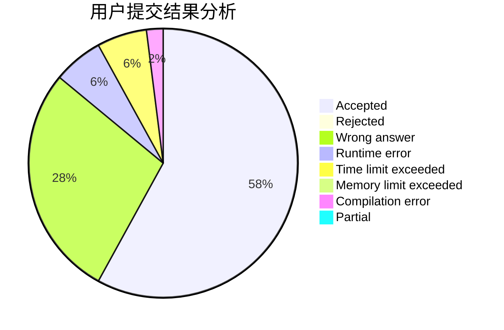
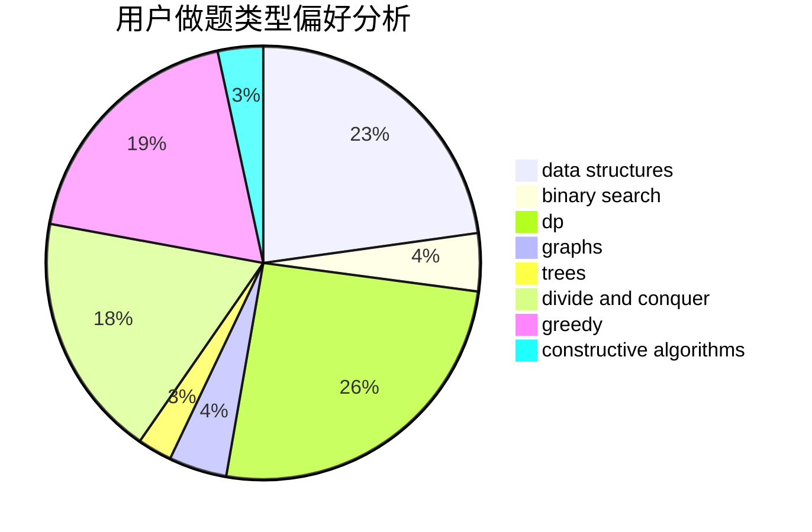

# NEFU_Smith
<!-- tabs:start -->
#### **用户提交结果分析**

#### **用户做题类型偏好分析**

#### **用户错题知识点分析**

<!-- tabs:end -->
# 推荐题目
[Frequency Problem (Easy Version)](http://codeforces.com/problemset/problem/1446/D1)		data structures,
                        greedy		  
[Double Knapsack](http://codeforces.com/problemset/problem/618/F)		constructive algorithms,
                        two pointers		  
[Valid Sets](http://codeforces.com/problemset/problem/486/D)		dfs and similar,
                        dp,
                        math,
                        trees		  
[A Piece of Cake](http://codeforces.com/problemset/problem/171/C)		*special problem,
                        implementation		  
[Fire](http://codeforces.com/problemset/problem/864/E)		dp,
                        sortings		  
[Problems for Round](http://codeforces.com/problemset/problem/673/B)		greedy,
                        implementation		  
[Ants](http://codeforces.com/problemset/problem/317/B)		brute force,
                        implementation		  
[Triple](http://codeforces.com/problemset/problem/1119/H)		fft,
                        math		  
[The Closest Pair](http://codeforces.com/problemset/problem/311/A)		constructive algorithms,
                        implementation		  
[Office Keys](http://codeforces.com/problemset/problem/830/A)		binary search,
                        brute force,
                        dp,
                        greedy,
                        sortings		  
<!-- tabs:start -->
#### **data structures**
[Frequency Problem (Easy Version)](http://codeforces.com/problemset/problem/1446/D1)		data structures,
                        greedy		  
[Double Knapsack](http://codeforces.com/problemset/problem/69/E)		data structures,
                        implementation		  
[Valid Sets](http://codeforces.com/problemset/problem/165/D)		data structures,
                        dsu,
                        trees		  
[A Piece of Cake](http://codeforces.com/problemset/problem/847/B)		binary search,
                        data structures		  
[Fire](http://codeforces.com/problemset/problem/900/C)		brute force,
                        data structures,
                        math		  
[Problems for Round](http://codeforces.com/problemset/problem/5/C)		constructive algorithms,
                        data structures,
                        dp,
                        greedy,
                        sortings,
                        strings		  
[Ants](http://codeforces.com/problemset/problem/863/D)		data structures,
                        implementation		  
[Triple](http://codeforces.com/problemset/problem/242/E)		bitmasks,
                        data structures		  
[The Closest Pair](http://codeforces.com/problemset/problem/833/B)		binary search,
                        data structures,
                        divide and conquer,
                        dp,
                        two pointers		  
[Office Keys](http://codeforces.com/problemset/problem/609/F)		data structures,
                        greedy		  
#### **binary search**
[Frequency Problem (Easy Version)](http://codeforces.com/problemset/problem/830/A)		binary search,
                        brute force,
                        dp,
                        greedy,
                        sortings		  
[Double Knapsack](http://codeforces.com/problemset/problem/1279/F)		binary search,
                        dp		  
[Valid Sets](http://codeforces.com/problemset/problem/847/B)		binary search,
                        data structures		  
[A Piece of Cake](http://codeforces.com/problemset/problem/833/B)		binary search,
                        data structures,
                        divide and conquer,
                        dp,
                        two pointers		  
[Fire](http://codeforces.com/problemset/problem/1166/D)		binary search,
                        brute force,
                        greedy,
                        math		  
[Problems for Round](http://codeforces.com/problemset/problem/1492/C)		binary search,
                        data structures,
                        dp,
                        greedy,
                        two pointers		  
[Ants](http://codeforces.com/problemset/problem/1463/D)		binary search,
                        constructive algorithms,
                        greedy,
                        two pointers		  
[Triple](http://codeforces.com/problemset/problem/1490/G)		binary search,
                        data structures,
                        math		  
[The Closest Pair](http://codeforces.com/problemset/problem/1479/D)		binary search,
                        bitmasks,
                        brute force,
                        data structures,
                        probabilities,
                        trees		  
[Office Keys](http://codeforces.com/problemset/problem/1436/E)		binary search,
                        data structures,
                        two pointers		  
#### **dp**
[Frequency Problem (Easy Version)](http://codeforces.com/problemset/problem/486/D)		dfs and similar,
                        dp,
                        math,
                        trees		  
[Double Knapsack](http://codeforces.com/problemset/problem/864/E)		dp,
                        sortings		  
[Valid Sets](http://codeforces.com/problemset/problem/830/A)		binary search,
                        brute force,
                        dp,
                        greedy,
                        sortings		  
[A Piece of Cake](http://codeforces.com/problemset/problem/10/D)		dp		  
[Fire](http://codeforces.com/problemset/problem/1154/F)		dp,
                        greedy,
                        sortings		  
[Problems for Round](http://codeforces.com/problemset/problem/1279/F)		binary search,
                        dp		  
[Ants](https://codeforces.com/contest/668/problem/C)		dp,
                        implementation,
                        math,
                        probabilities		  
[Triple](http://codeforces.com/problemset/problem/580/D)		bitmasks,
                        dp		  
[The Closest Pair](http://codeforces.com/problemset/problem/464/D)		dp,
                        probabilities		  
[Office Keys](http://codeforces.com/problemset/problem/5/C)		constructive algorithms,
                        data structures,
                        dp,
                        greedy,
                        sortings,
                        strings		  
#### **graph**
[Frequency Problem (Easy Version)](http://codeforces.com/problemset/problem/1210/D)		graphs		  
[Double Knapsack](http://codeforces.com/problemset/problem/1325/F)		constructive algorithms,
                        dfs and similar,
                        graphs,
                        greedy		  
[Valid Sets](http://codeforces.com/problemset/problem/1487/C)		brute force,
                        constructive algorithms,
                        dfs and similar,
                        graphs,
                        greedy,
                        implementation,
                        math		  
[A Piece of Cake](http://codeforces.com/problemset/problem/1437/C)		dp,
                        flows,
                        graph matchings,
                        greedy,
                        math,
                        sortings		  
[Fire](http://codeforces.com/problemset/problem/1470/D)		constructive algorithms,
                        dfs and similar,
                        graph matchings,
                        graphs,
                        greedy		  
[Problems for Round](http://codeforces.com/problemset/problem/1476/C)		dp,
                        graphs,
                        greedy		  
[Ants](http://codeforces.com/problemset/problem/1304/D)		constructive algorithms,
                        graphs,
                        greedy,
                        two pointers		  
[Triple](http://codeforces.com/problemset/problem/1475/C)		combinatorics,
                        graphs,
                        math		  
[The Closest Pair](http://codeforces.com/problemset/problem/553/E)		dp,
                        fft,
                        graphs,
                        math,
                        probabilities		  
[Office Keys](http://codeforces.com/problemset/problem/1495/C)		constructive algorithms,
                        graphs		  
#### **trees**
[Frequency Problem (Easy Version)](http://codeforces.com/problemset/problem/486/D)		dfs and similar,
                        dp,
                        math,
                        trees		  
[Double Knapsack](http://codeforces.com/problemset/problem/165/D)		data structures,
                        dsu,
                        trees		  
[Valid Sets](https://codeforces.com/contest/430/problem/C)		dfs and similar,
                        trees		  
[A Piece of Cake](http://codeforces.com/problemset/problem/1276/D)		dp,
                        trees		  
[Fire](http://codeforces.com/problemset/problem/161/D)		dfs and similar,
                        dp,
                        trees		  
[Problems for Round](http://codeforces.com/problemset/problem/1085/D)		constructive algorithms,
                        implementation,
                        trees		  
[Ants](http://codeforces.com/problemset/problem/1479/D)		binary search,
                        bitmasks,
                        brute force,
                        data structures,
                        probabilities,
                        trees		  
[Triple](http://codeforces.com/problemset/problem/1511/C)		brute force,
                        data structures,
                        implementation,
                        trees		  
[The Closest Pair](http://codeforces.com/problemset/problem/1499/F)		combinatorics,
                        dfs and similar,
                        dp,
                        trees		  
[Office Keys](http://codeforces.com/problemset/problem/1491/E)		brute force,
                        dfs and similar,
                        divide and conquer,
                        number theory,
                        trees		  
#### **divide and conquer**
[Frequency Problem (Easy Version)](http://codeforces.com/problemset/problem/833/B)		binary search,
                        data structures,
                        divide and conquer,
                        dp,
                        two pointers		  
[Double Knapsack](http://codeforces.com/problemset/problem/1461/D)		binary search,
                        brute force,
                        data structures,
                        divide and conquer,
                        implementation,
                        sortings		  
[Valid Sets](http://codeforces.com/problemset/problem/1466/G)		combinatorics,
                        divide and conquer,
                        hashing,
                        math,
                        string suffix structures,
                        strings		  
[A Piece of Cake](http://codeforces.com/problemset/problem/1490/D)		dfs and similar,
                        divide and conquer,
                        implementation		  
[Fire](https://codeforces.com/contest/1483/problem/C)		data structures,
                        divide and conquer,
                        dp		  
[Problems for Round](http://codeforces.com/problemset/problem/1491/E)		brute force,
                        dfs and similar,
                        divide and conquer,
                        number theory,
                        trees		  
[Ants](http://codeforces.com/problemset/problem/1303/G)		data structures,
                        divide and conquer,
                        geometry,
                        trees		  
[Triple](http://codeforces.com/problemset/problem/1494/D)		constructive algorithms,
                        data structures,
                        dfs and similar,
                        divide and conquer,
                        dsu,
                        greedy,
                        sortings,
                        trees		  
[The Closest Pair](http://codeforces.com/problemset/problem/1482/E)		data structures,
                        divide and conquer,
                        dp		  
[Office Keys](http://codeforces.com/problemset/problem/566/C)		dfs and similar,
                        divide and conquer,
                        trees		  
#### **greedy**
[Frequency Problem (Easy Version)](http://codeforces.com/problemset/problem/1446/D1)		data structures,
                        greedy		  
[Double Knapsack](http://codeforces.com/problemset/problem/673/B)		greedy,
                        implementation		  
[Valid Sets](http://codeforces.com/problemset/problem/830/A)		binary search,
                        brute force,
                        dp,
                        greedy,
                        sortings		  
[A Piece of Cake](http://codeforces.com/problemset/problem/1312/A)		geometry,
                        greedy,
                        math,
                        number theory		  
[Fire](http://codeforces.com/problemset/problem/1154/F)		dp,
                        greedy,
                        sortings		  
[Problems for Round](https://codeforces.com/contest/1087/problem/E)		greedy,
                        implementation,
                        strings		  
[Ants](http://codeforces.com/problemset/problem/5/C)		constructive algorithms,
                        data structures,
                        dp,
                        greedy,
                        sortings,
                        strings		  
[Triple](http://codeforces.com/problemset/problem/1325/F)		constructive algorithms,
                        dfs and similar,
                        graphs,
                        greedy		  
[The Closest Pair](http://codeforces.com/problemset/problem/1419/B)		brute force,
                        constructive algorithms,
                        greedy,
                        implementation,
                        math		  
[Office Keys](http://codeforces.com/problemset/problem/1358/B)		greedy,
                        sortings		  
#### **constructive algorithms**
[Frequency Problem (Easy Version)](http://codeforces.com/problemset/problem/618/F)		constructive algorithms,
                        two pointers		  
[Double Knapsack](http://codeforces.com/problemset/problem/311/A)		constructive algorithms,
                        implementation		  
[Valid Sets](http://codeforces.com/problemset/problem/5/C)		constructive algorithms,
                        data structures,
                        dp,
                        greedy,
                        sortings,
                        strings		  
[A Piece of Cake](http://codeforces.com/problemset/problem/1325/F)		constructive algorithms,
                        dfs and similar,
                        graphs,
                        greedy		  
[Fire](http://codeforces.com/problemset/problem/1419/B)		brute force,
                        constructive algorithms,
                        greedy,
                        implementation,
                        math		  
[Problems for Round](http://codeforces.com/problemset/problem/1085/D)		constructive algorithms,
                        implementation,
                        trees		  
[Ants](http://codeforces.com/problemset/problem/1454/A)		constructive algorithms,
                        probabilities		  
[Triple](http://codeforces.com/problemset/problem/1358/E)		constructive algorithms,
                        data structures,
                        greedy,
                        implementation		  
[The Closest Pair](http://codeforces.com/problemset/problem/1493/A)		constructive algorithms,
                        greedy		  
[Office Keys](http://codeforces.com/problemset/problem/1463/D)		binary search,
                        constructive algorithms,
                        greedy,
                        two pointers		  
#### **sortings**
[Frequency Problem (Easy Version)](http://codeforces.com/problemset/problem/864/E)		dp,
                        sortings		  
[Double Knapsack](http://codeforces.com/problemset/problem/830/A)		binary search,
                        brute force,
                        dp,
                        greedy,
                        sortings		  
[Valid Sets](http://codeforces.com/problemset/problem/1154/F)		dp,
                        greedy,
                        sortings		  
[A Piece of Cake](http://codeforces.com/problemset/problem/5/C)		constructive algorithms,
                        data structures,
                        dp,
                        greedy,
                        sortings,
                        strings		  
[Fire](http://codeforces.com/problemset/problem/1358/B)		greedy,
                        sortings		  
[Problems for Round](http://codeforces.com/problemset/problem/632/C)		sortings,
                        strings		  
[Ants](http://codeforces.com/problemset/problem/1452/E)		brute force,
                        dp,
                        greedy,
                        sortings,
                        two pointers		  
[Triple](http://codeforces.com/problemset/problem/1455/D)		dp,
                        greedy,
                        sortings		  
[The Closest Pair](https://codeforces.com/contest/1496/problem/C)		geometry,
                        greedy,
                        math,
                        sortings		  
[Office Keys](http://codeforces.com/problemset/problem/1495/A)		geometry,
                        greedy,
                        math,
                        sortings		  
<!-- tabs:end -->
