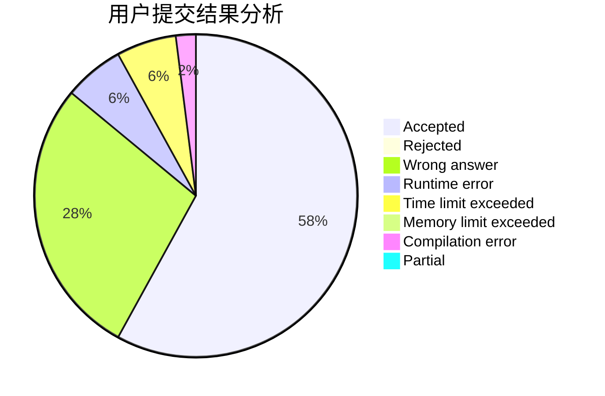
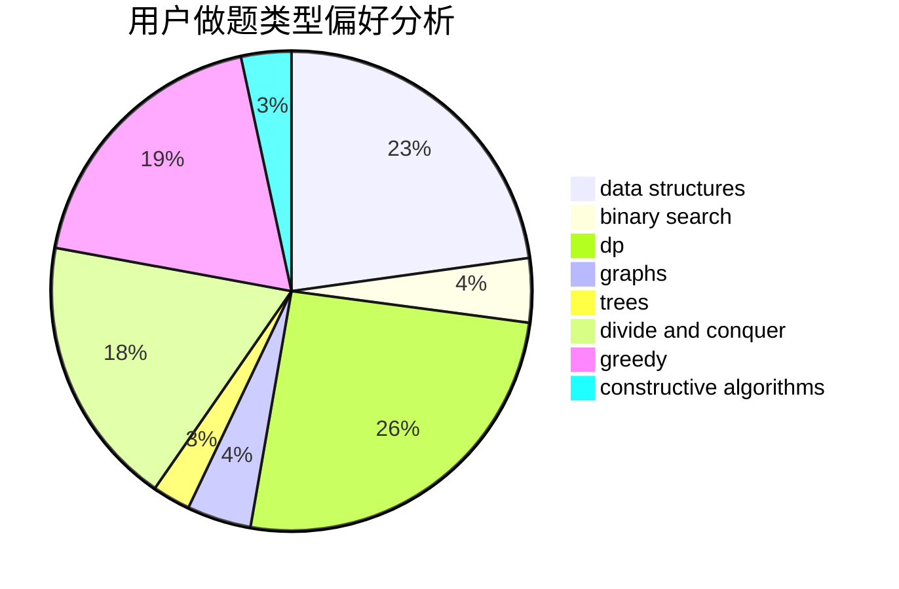

# NEFU_Smith

<!-- tabs:start -->

#### **用户提交结果分析**

#### **用户做题类型偏好分析**

#### **用户错题知识点分析**

<!-- tabs:end -->
# 推荐题目
[580D](https://codeforces.com/contest/580/problem/D)		bitmasks,
                        dp		  
[1119H](https://codeforces.com/contest/1119/problem/H)		fft,
                        math		  
[241D](https://codeforces.com/contest/241/problem/D)		nan		  
[171C](https://codeforces.com/contest/171/problem/C)		*special problem,
                        implementation		  
[673B](https://codeforces.com/contest/673/problem/B)		greedy,
                        implementation		  
[1087E](https://codeforces.com/contest/1087/problem/E)		dsu,graphs,sortings,trees		  
[317B](https://codeforces.com/contest/317/problem/B)		brute force,
                        implementation		  
[165D](https://codeforces.com/contest/165/problem/D)		data structures,
                        dsu,
                        trees		  
[830A](https://codeforces.com/contest/830/problem/A)		binary search,
                        brute force,
                        dp,
                        greedy,
                        sortings		  
[760A](https://codeforces.com/contest/760/problem/A)		implementation,
                        math		  
