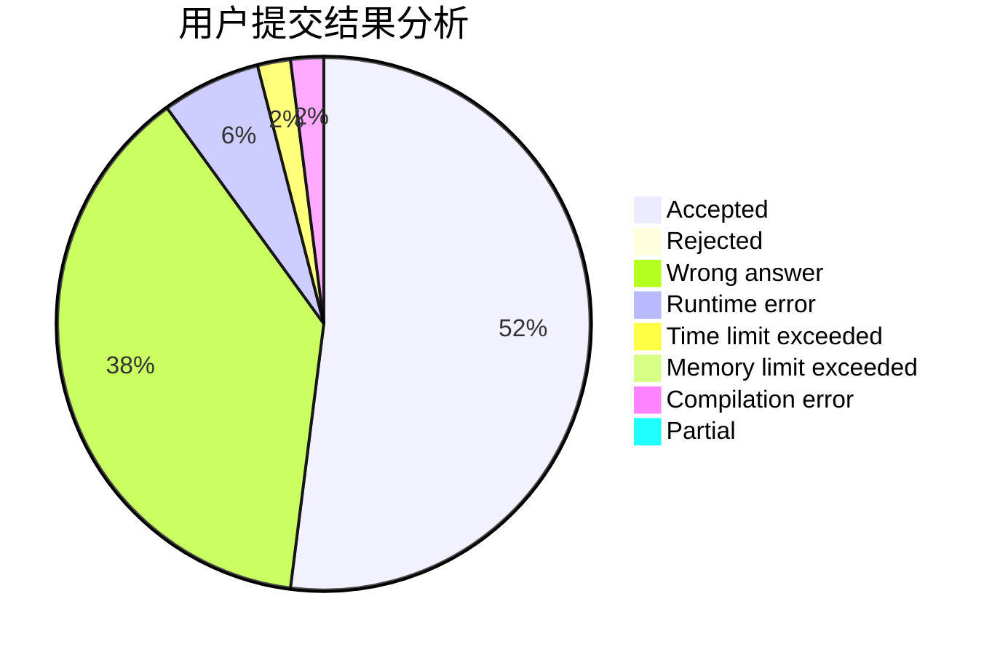
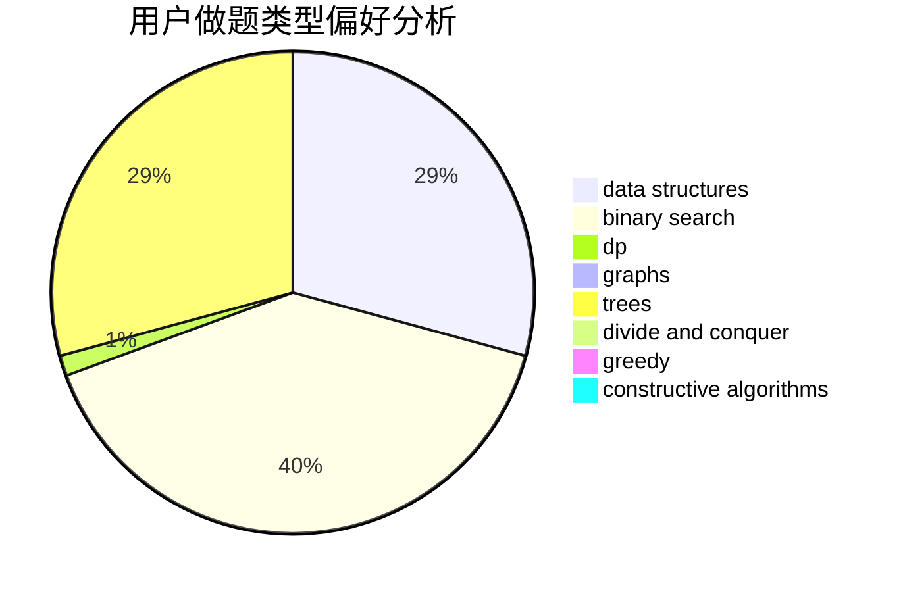

# NXDXML

<!-- tabs:start -->

#### **用户提交结果分析**

#### **用户做题类型偏好分析**

#### **用户错题知识点分析**

<!-- tabs:end -->
# 推荐题目
[1152D](https://codeforces.com/contest/1152/problem/D)		dp,
                        greedy,
                        trees		  
[252A](https://codeforces.com/contest/252/problem/A)		brute force,
                        implementation		  
[369C](https://codeforces.com/contest/369/problem/C)		dfs and similar,
                        graphs,
                        trees		  
[1368A](https://codeforces.com/contest/1368/problem/A)		brute force,
                        greedy,
                        implementation,
                        math		  
[1329B](https://codeforces.com/contest/1329/problem/B)		bitmasks,
                        combinatorics,
                        math		  
[1400G](https://codeforces.com/contest/1400/problem/G)		bitmasks,
                        brute force,
                        combinatorics,
                        dp,
                        dsu,
                        math,
                        two pointers		  
[430C](https://codeforces.com/contest/430/problem/C)		dsu,graphs,sortings,trees		  
[1260B](https://codeforces.com/contest/1260/problem/B)		binary search,
                        math		  
[1482E](https://codeforces.com/contest/1482/problem/E)		data structures,
                        divide and conquer,
                        dp		  
[1489D](https://codeforces.com/contest/1489/problem/D)		dsu,graphs,sortings,trees		  
