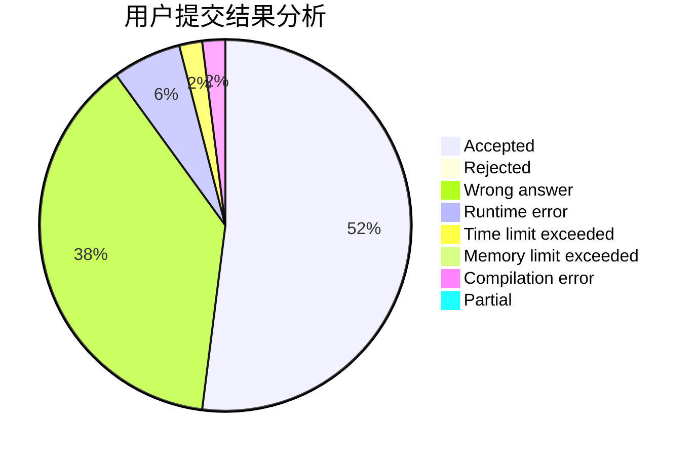
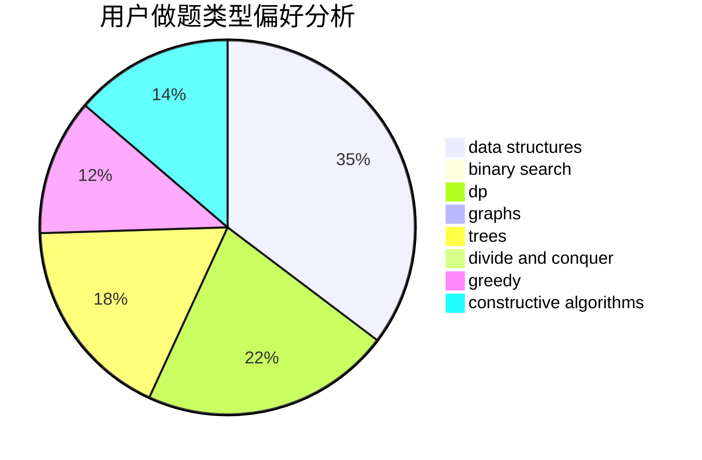

# NXDXML

<!-- tabs:start -->

#### **用户提交结果分析**

#### **用户做题类型偏好分析**

#### **用户错题知识点分析**

<!-- tabs:end -->
# 推荐题目
[1154D](https://codeforces.com/contest/1154/problem/D)		greedy		  
[26B](https://codeforces.com/contest/26/problem/B)		greedy		  
[39E](https://codeforces.com/contest/39/problem/E)		dp,
                        games		  
[1374F](https://codeforces.com/contest/1374/problem/F)		brute force,
                        constructive algorithms,
                        implementation,
                        sortings		  
[1335B](https://codeforces.com/contest/1335/problem/B)		constructive algorithms		  
[1411B](https://codeforces.com/contest/1411/problem/B)		brute force,
                        number theory		  
[452E](https://codeforces.com/contest/452/problem/E)		data structures,
                        dsu,
                        string suffix structures,
                        strings		  
[1266B](https://codeforces.com/contest/1266/problem/B)		constructive algorithms,
                        math		  
[1490C](https://codeforces.com/contest/1490/problem/C)		binary search,
                        brute force,
                        brute force,
                        math		  
[1497B](https://codeforces.com/contest/1497/problem/B)		constructive algorithms,
                        greedy,
                        math		  
