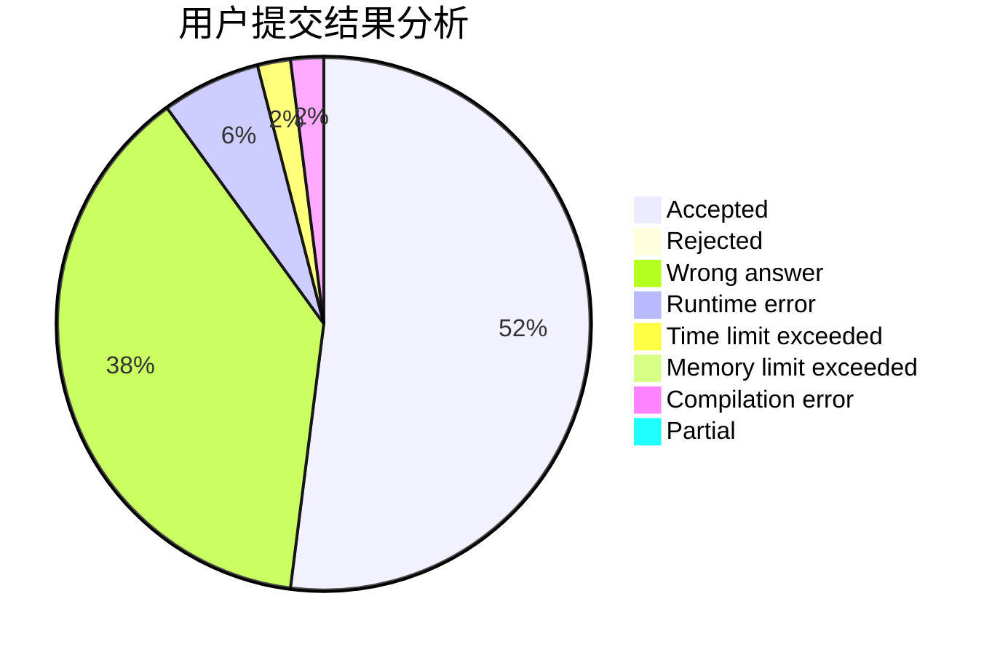
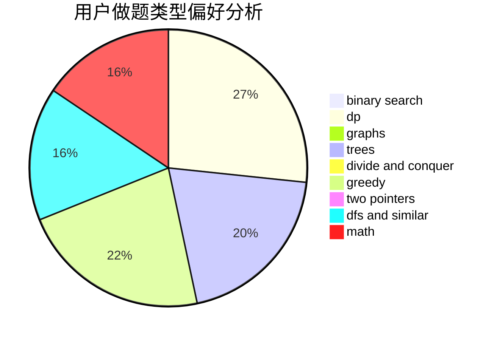

# NXDXML

<!-- tabs:start -->

#### **用户提交结果分析**

#### **用户做题类型偏好分析**

<!-- tabs:end -->
# 推荐题目
[1154D](https://codeforces.com/contest/1154/problem/D)
[26B](https://codeforces.com/contest/26/problem/B)
[39E](https://codeforces.com/contest/39/problem/E)
[1374F](https://codeforces.com/contest/1374/problem/F)
[1335B](https://codeforces.com/contest/1335/problem/B)
[1411B](https://codeforces.com/contest/1411/problem/B)
[452E](https://codeforces.com/contest/452/problem/E)
[1266B](https://codeforces.com/contest/1266/problem/B)
[1490C](https://codeforces.com/contest/1490/problem/C)
[1497B](https://codeforces.com/contest/1497/problem/B)
