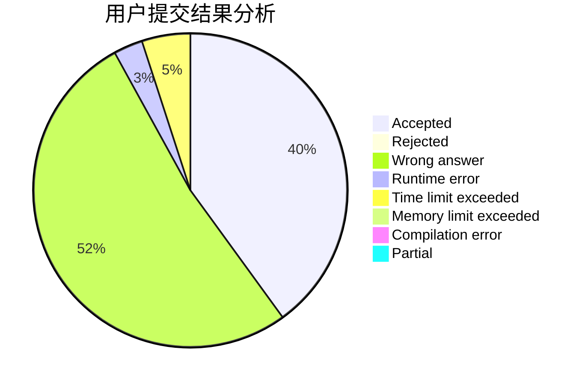
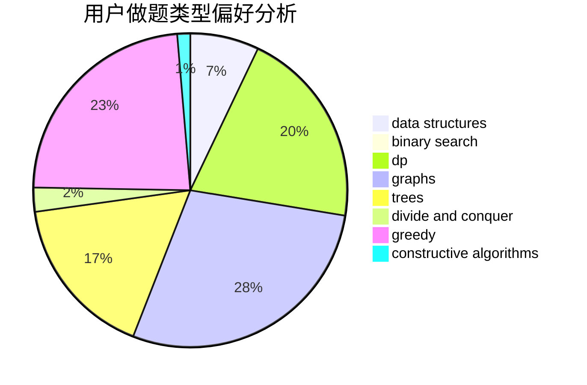

# NaGuT

<!-- tabs:start -->

#### **用户提交结果分析**

#### **用户做题类型偏好分析**

#### **用户错题知识点分析**

<!-- tabs:end -->
# 推荐题目
[1510D](https://codeforces.com/contest/1510/problem/D)		dp,
                        math,
                        number theory		  
[676D](https://codeforces.com/contest/676/problem/D)		graphs,
                        implementation,
                        shortest paths		  
[1298D](https://codeforces.com/contest/1298/problem/D)		dsu,graphs,sortings,trees		  
[353D](https://codeforces.com/contest/353/problem/D)		constructive algorithms,
                        dp		  
[913H](https://codeforces.com/contest/913/problem/H)		math,
                        probabilities		  
[1227G](https://codeforces.com/contest/1227/problem/G)		constructive algorithms		  
[356D](https://codeforces.com/contest/356/problem/D)		bitmasks,
                        constructive algorithms,
                        dp,
                        greedy		  
[246B](https://codeforces.com/contest/246/problem/B)		greedy,
                        math		  
[1042E](https://codeforces.com/contest/1042/problem/E)		dp,
                        math,
                        probabilities		  
[987F](https://codeforces.com/contest/987/problem/F)		dsu,graphs,sortings,trees		  
