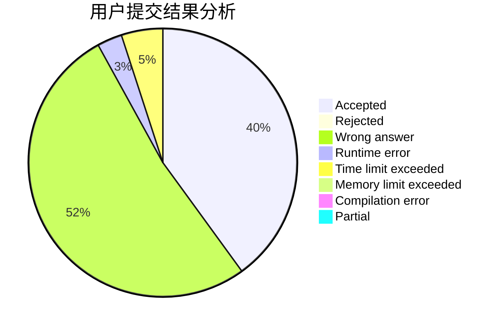
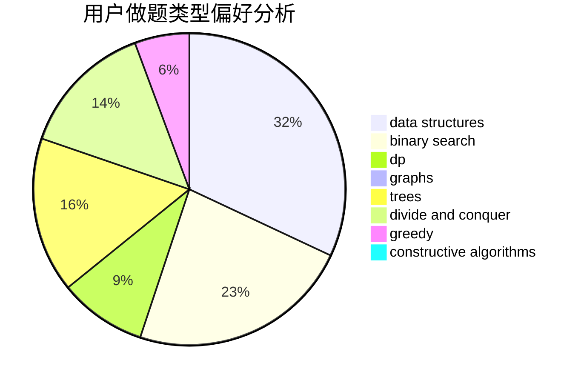

# NaGuT

<!-- tabs:start -->

#### **用户提交结果分析**

#### **用户做题类型偏好分析**

#### **用户错题知识点分析**

<!-- tabs:end -->
# 推荐题目
[14C](https://codeforces.com/contest/14/problem/C)		brute force,
                        constructive algorithms,
                        geometry,
                        implementation,
                        math		  
[652E](https://codeforces.com/contest/652/problem/E)		dfs and similar,
                        dsu,
                        graphs,
                        trees		  
[1291E](https://codeforces.com/contest/1291/problem/E)		dsu,graphs,sortings,trees		  
[321E](https://codeforces.com/contest/321/problem/E)		data structures,
                        divide and conquer,
                        dp		  
[896E](https://codeforces.com/contest/896/problem/E)		data structures,
                        dsu		  
[121E](https://codeforces.com/contest/121/problem/E)		data structures		  
[328A](https://codeforces.com/contest/328/problem/A)		implementation		  
[227A](https://codeforces.com/contest/227/problem/A)		geometry		  
[1042B](https://codeforces.com/contest/1042/problem/B)		bitmasks,
                        brute force,
                        dp,
                        implementation		  
[966A](https://codeforces.com/contest/966/problem/A)		dsu,graphs,sortings,trees		  
