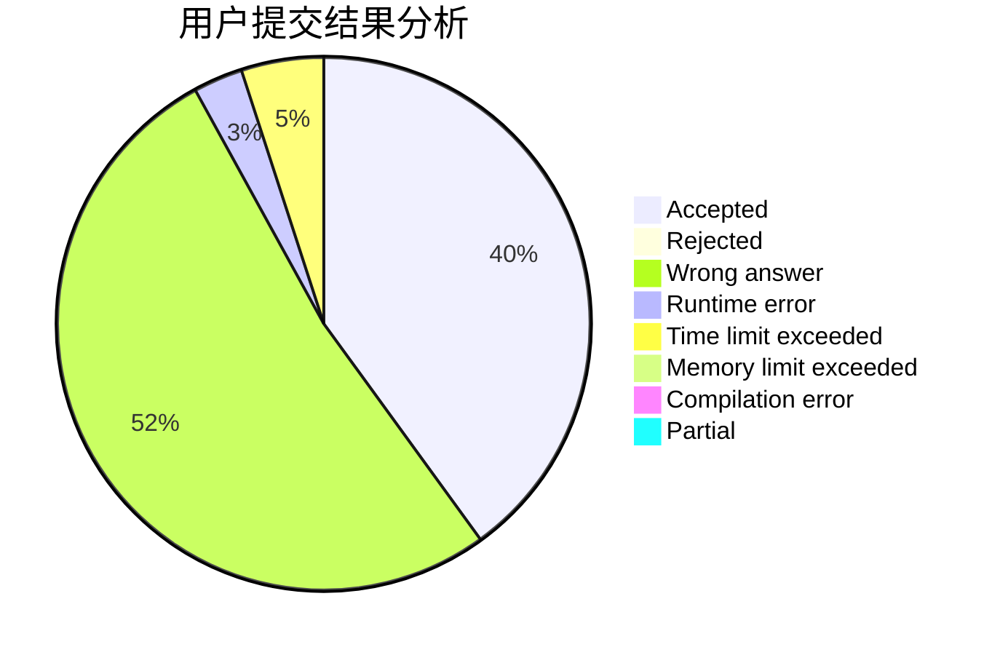
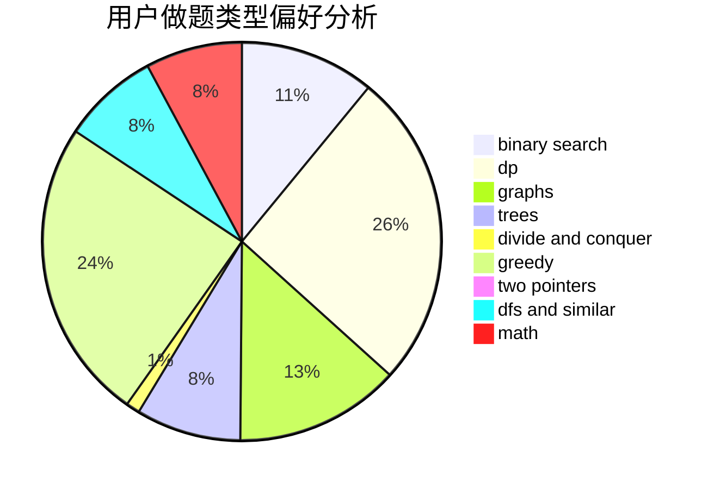

# NaGuT

<!-- tabs:start -->

#### **用户提交结果分析**

#### **用户做题类型偏好分析**

<!-- tabs:end -->
# 推荐题目
[1510D](https://codeforces.com/contest/1510/problem/D)
[676D](https://codeforces.com/contest/676/problem/D)
[1298D](https://codeforces.com/contest/1298/problem/D)
[353D](https://codeforces.com/contest/353/problem/D)
[913H](https://codeforces.com/contest/913/problem/H)
[1227G](https://codeforces.com/contest/1227/problem/G)
[356D](https://codeforces.com/contest/356/problem/D)
[246B](https://codeforces.com/contest/246/problem/B)
[1042E](https://codeforces.com/contest/1042/problem/E)
[987F](https://codeforces.com/contest/987/problem/F)
