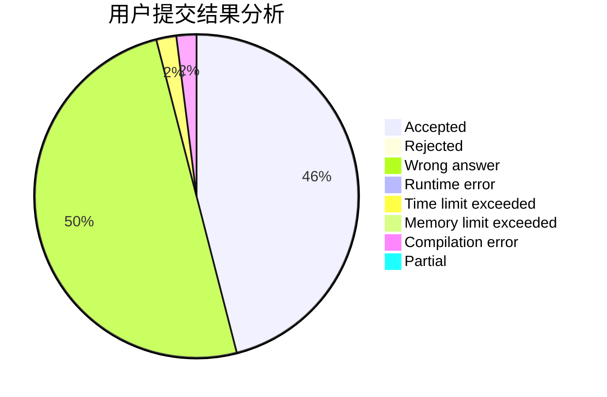
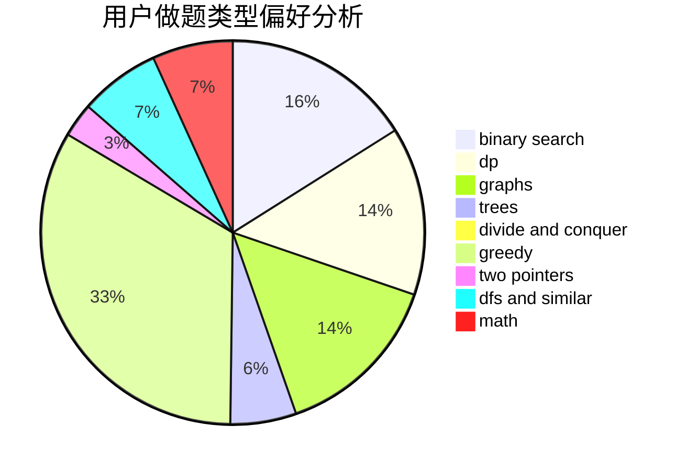

# NaOH_Frog

<!-- tabs:start -->

#### **用户提交结果分析**

#### **用户做题类型偏好分析**

<!-- tabs:end -->
# 推荐题目
[1468D](https://codeforces.com/contest/1468/problem/D)
[515A](https://codeforces.com/contest/515/problem/A)
[1426E](https://codeforces.com/contest/1426/problem/E)
[976E](https://codeforces.com/contest/976/problem/E)
[1138E](https://codeforces.com/contest/1138/problem/E)
[866C](https://codeforces.com/contest/866/problem/C)
[946E](https://codeforces.com/contest/946/problem/E)
[472C](https://codeforces.com/contest/472/problem/C)
[609E](https://codeforces.com/contest/609/problem/E)
[243C](https://codeforces.com/contest/243/problem/C)
