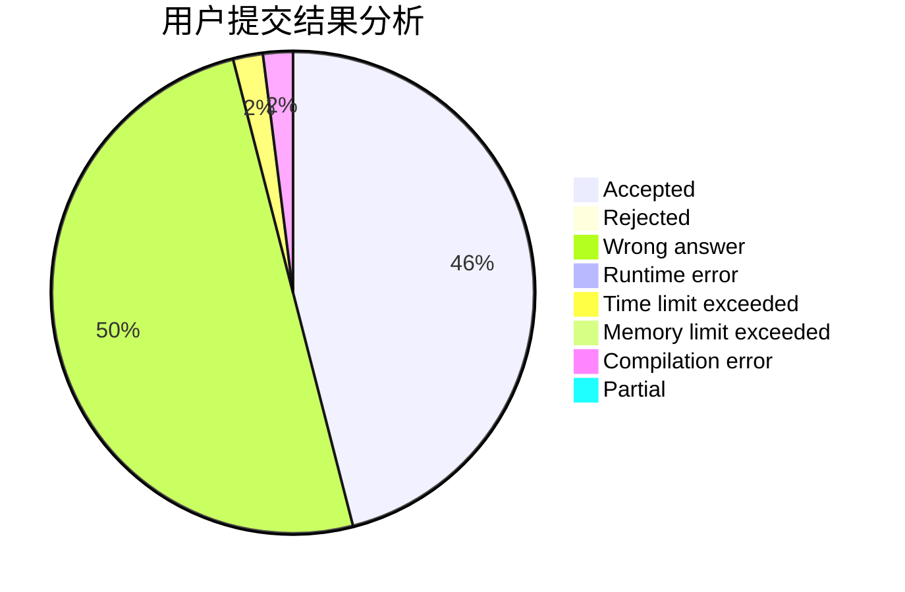
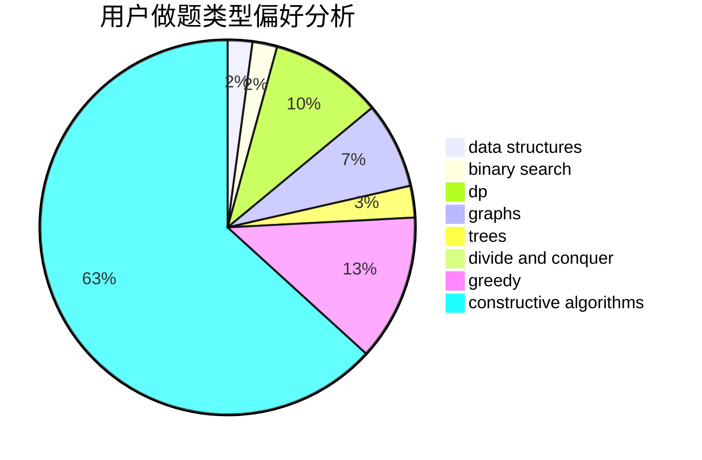

# NaOH_Frog

<!-- tabs:start -->

#### **用户提交结果分析**

#### **用户做题类型偏好分析**

#### **用户错题知识点分析**

<!-- tabs:end -->
# 推荐题目
[1468D](https://codeforces.com/contest/1468/problem/D)		binary search,
                        sortings		  
[515A](https://codeforces.com/contest/515/problem/A)		math		  
[1426E](https://codeforces.com/contest/1426/problem/E)		brute force,
                        constructive algorithms,
                        flows,
                        greedy,
                        math		  
[976E](https://codeforces.com/contest/976/problem/E)		greedy,
                        sortings		  
[1138E](https://codeforces.com/contest/1138/problem/E)		dsu,graphs,sortings,trees		  
[866C](https://codeforces.com/contest/866/problem/C)		dsu,graphs,sortings,trees		  
[946E](https://codeforces.com/contest/946/problem/E)		greedy,
                        implementation		  
[472C](https://codeforces.com/contest/472/problem/C)		greedy		  
[609E](https://codeforces.com/contest/609/problem/E)		data structures,
                        dfs and similar,
                        dsu,
                        graphs,
                        trees		  
[243C](https://codeforces.com/contest/243/problem/C)		dfs and similar,
                        implementation		  
