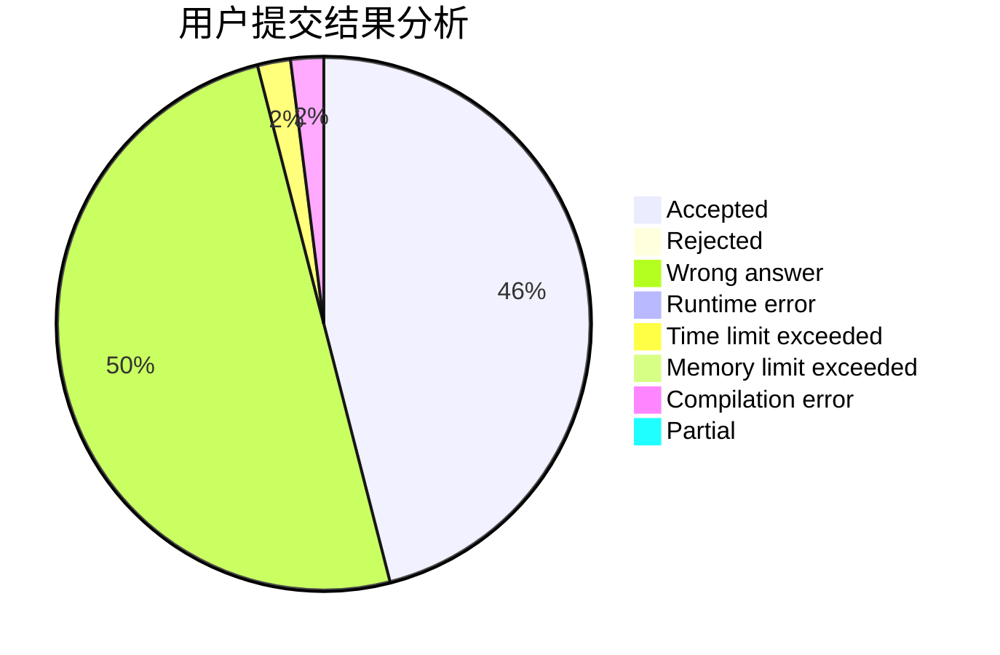
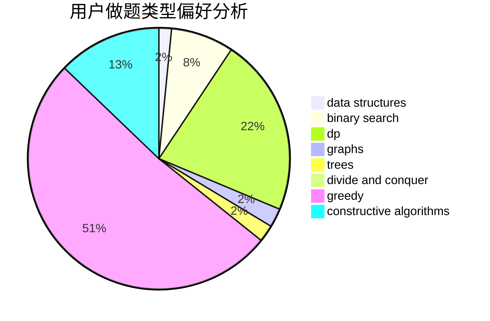

# NaOH_Frog

<!-- tabs:start -->

#### **用户提交结果分析**

#### **用户做题类型偏好分析**

#### **用户错题知识点分析**

<!-- tabs:end -->
# 推荐题目
[1459D](https://codeforces.com/contest/1459/problem/D)		dsu,graphs,sortings,trees		  
[494E](https://codeforces.com/contest/494/problem/E)		data structures,
                        games		  
[1419A](https://codeforces.com/contest/1419/problem/A)		games,
                        greedy,
                        implementation		  
[954H](https://codeforces.com/contest/954/problem/H)		combinatorics,
                        dp		  
[1136C](https://codeforces.com/contest/1136/problem/C)		constructive algorithms,
                        sortings		  
[847K](https://codeforces.com/contest/847/problem/K)		greedy,
                        implementation,
                        sortings		  
[922E](https://codeforces.com/contest/922/problem/E)		dp		  
[450B](https://codeforces.com/contest/450/problem/B)		implementation,
                        math		  
[58E](https://codeforces.com/contest/58/problem/E)		dp		  
[225C](https://codeforces.com/contest/225/problem/C)		dp,
                        matrices		  
