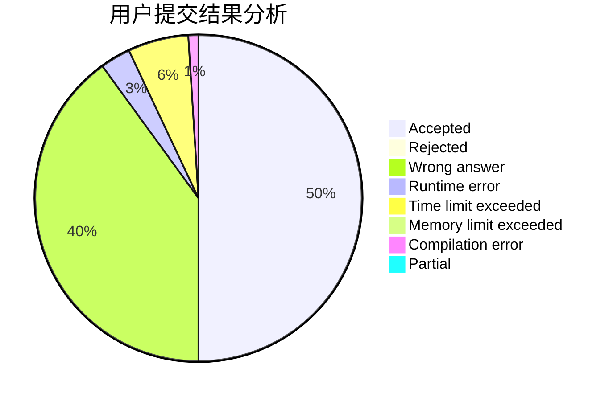
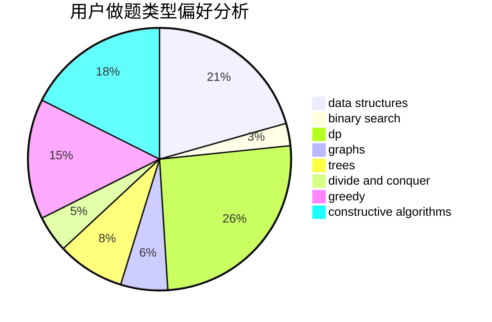
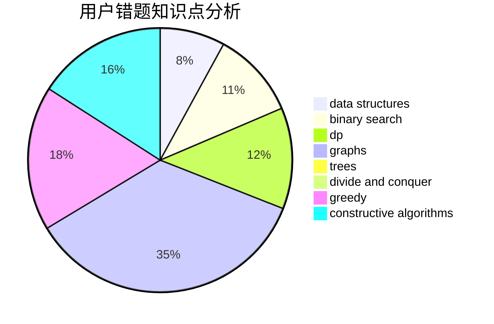

# NaVi.s1mple

<!-- tabs:start -->

#### **用户提交结果分析**

#### **用户做题类型偏好分析**

#### **用户错题知识点分析**

<!-- tabs:end -->
# 推荐题目
[677C](https://codeforces.com/contest/677/problem/C)		bitmasks,
                        combinatorics,
                        implementation,
                        strings		  
[850E](https://codeforces.com/contest/850/problem/E)		bitmasks,
                        brute force,
                        divide and conquer,
                        fft,
                        math		  
[1097E](https://codeforces.com/contest/1097/problem/E)		constructive algorithms,
                        greedy		  
[25E](https://codeforces.com/contest/25/problem/E)		hashing,
                        strings		  
[1300C](https://codeforces.com/contest/1300/problem/C)		dsu,graphs,sortings,trees		  
[1270E](https://codeforces.com/contest/1270/problem/E)		constructive algorithms,
                        geometry,
                        math		  
[317A](https://codeforces.com/contest/317/problem/A)		brute force		  
[676D](https://codeforces.com/contest/676/problem/D)		graphs,
                        implementation,
                        shortest paths		  
[723C](https://codeforces.com/contest/723/problem/C)		greedy		  
[128C](https://codeforces.com/contest/128/problem/C)		combinatorics,
                        dp		  
