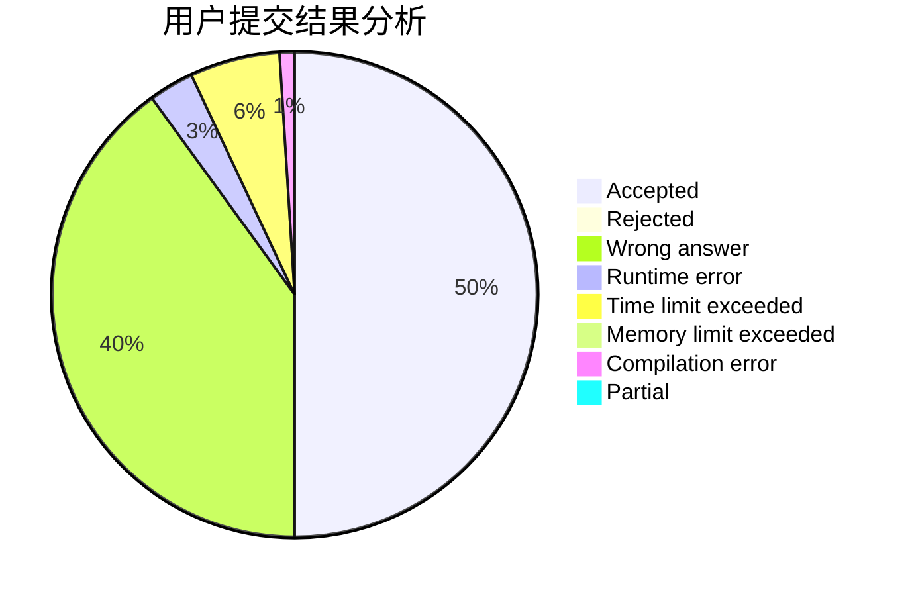
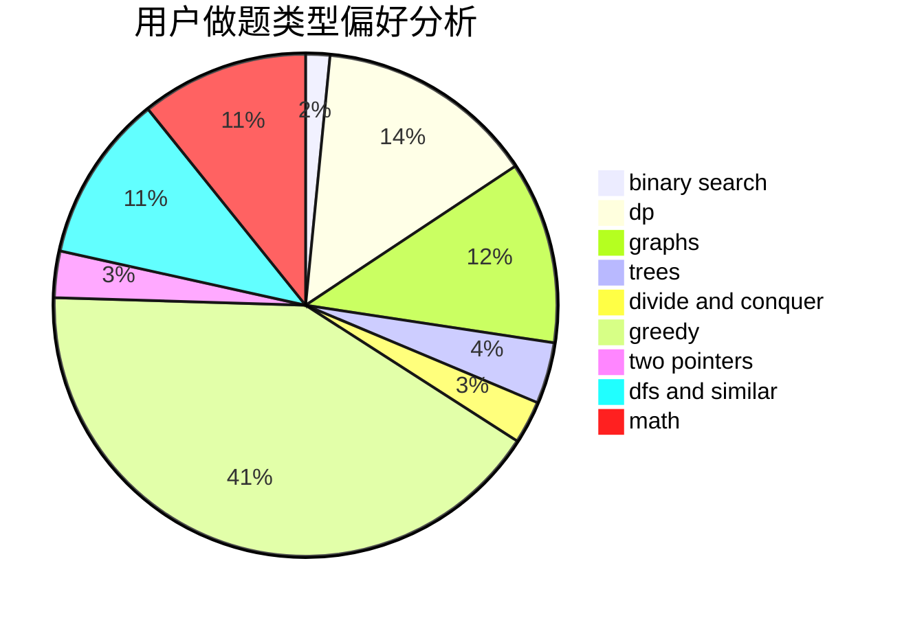

# NaVi.s1mple

<!-- tabs:start -->

#### **用户提交结果分析**

#### **用户做题类型偏好分析**

<!-- tabs:end -->
# 推荐题目
[677C](https://codeforces.com/contest/677/problem/C)
[850E](https://codeforces.com/contest/850/problem/E)
[1097E](https://codeforces.com/contest/1097/problem/E)
[25E](https://codeforces.com/contest/25/problem/E)
[1300C](https://codeforces.com/contest/1300/problem/C)
[1270E](https://codeforces.com/contest/1270/problem/E)
[317A](https://codeforces.com/contest/317/problem/A)
[676D](https://codeforces.com/contest/676/problem/D)
[723C](https://codeforces.com/contest/723/problem/C)
[128C](https://codeforces.com/contest/128/problem/C)
