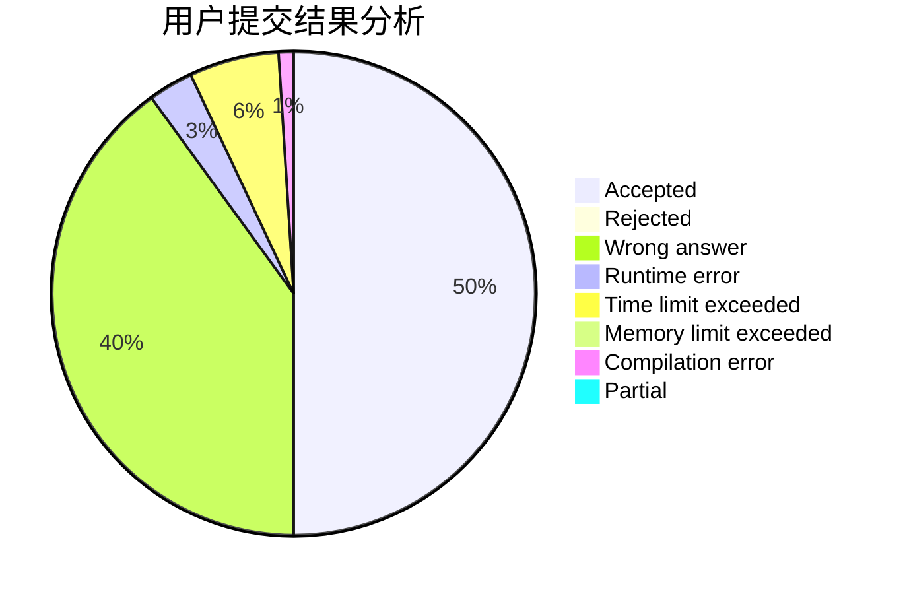
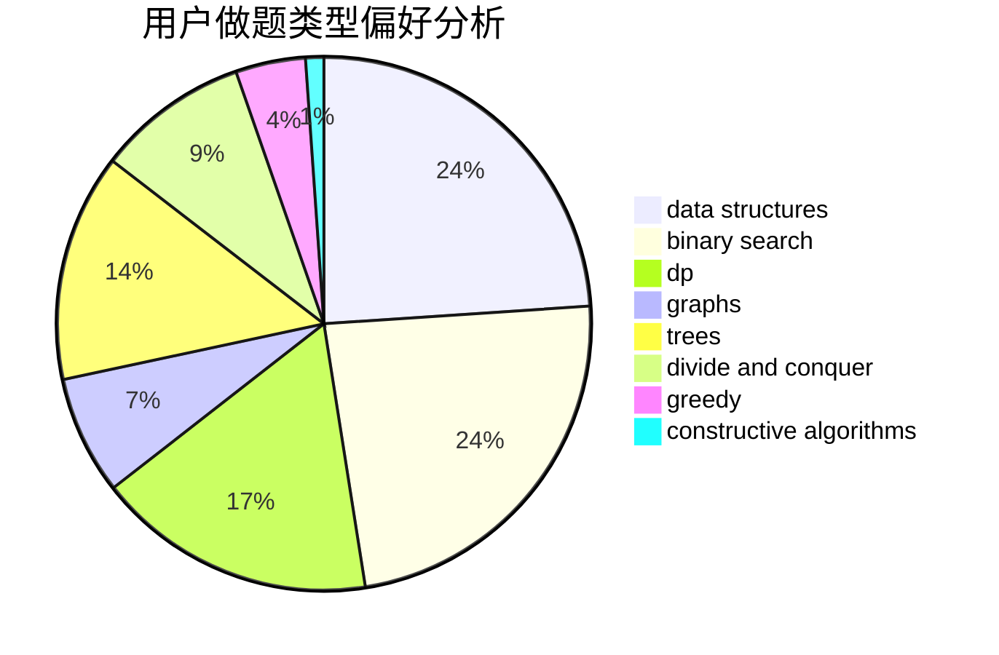
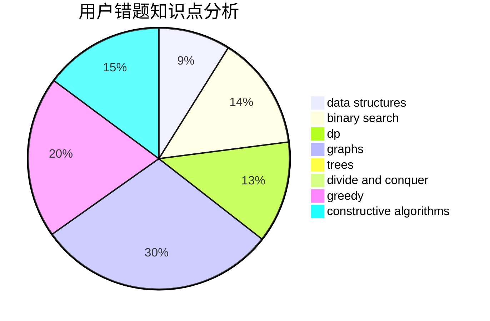

# NaVi.s1mple

<!-- tabs:start -->

#### **用户提交结果分析**

#### **用户做题类型偏好分析**

#### **用户错题知识点分析**

<!-- tabs:end -->
# 推荐题目
[653C](https://codeforces.com/contest/653/problem/C)		brute force,
                        implementation		  
[832C](https://codeforces.com/contest/832/problem/C)		binary search,
                        implementation,
                        math		  
[1097B](https://codeforces.com/contest/1097/problem/B)		bitmasks,
                        brute force,
                        dp		  
[238C](https://codeforces.com/contest/238/problem/C)		dfs and similar,
                        dp,
                        greedy,
                        trees		  
[1294A](https://codeforces.com/contest/1294/problem/A)		math		  
[1264F](https://codeforces.com/contest/1264/problem/F)		constructive algorithms,
                        number theory		  
[29B](https://codeforces.com/contest/29/problem/B)		implementation		  
[652E](https://codeforces.com/contest/652/problem/E)		dfs and similar,
                        dsu,
                        graphs,
                        trees		  
[704C](https://codeforces.com/contest/704/problem/C)		dp,
                        graphs,
                        implementation,
                        math		  
[1282E](https://codeforces.com/contest/1282/problem/E)		constructive algorithms,
                        data structures,
                        dfs and similar,
                        graphs		  
