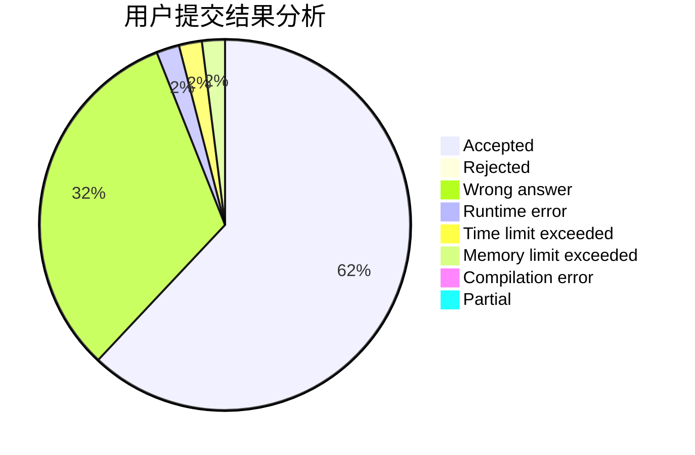
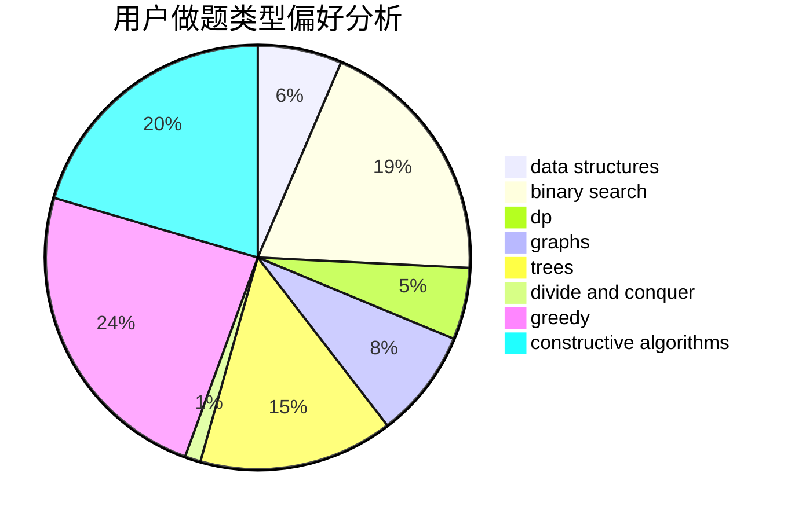
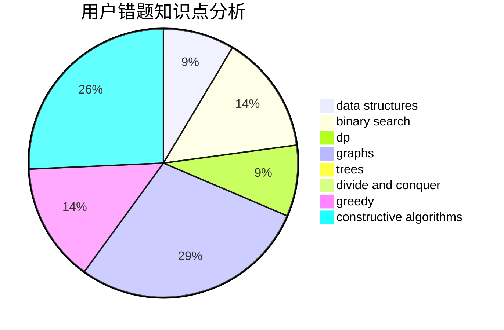

# NaVi_Awson
<!-- tabs:start -->
#### **用户提交结果分析**

#### **用户做题类型偏好分析**

#### **用户错题知识点分析**

<!-- tabs:end -->
# 推荐题目
[A Colourful Prospect](http://codeforces.com/problemset/problem/933/C)		geometry,
                        graphs		  
[Football](http://codeforces.com/problemset/problem/1240/F)		graphs		  
[Make It Equal](http://codeforces.com/problemset/problem/1065/C)		greedy		  
[Two Strings Swaps](http://codeforces.com/problemset/problem/1006/D)		implementation		  
[Memory and De-Evolution](http://codeforces.com/problemset/problem/712/C)		greedy,
                        math		  
[T-primes](http://codeforces.com/problemset/problem/230/B)		binary search,
                        implementation,
                        math,
                        number theory		  
[Random Query](http://codeforces.com/problemset/problem/846/F)		data structures,
                        math,
                        probabilities,
                        two pointers		  
[Controversial Rounds](http://codeforces.com/problemset/problem/1398/F)		binary search,
                        data structures,
                        dp,
                        greedy,
                        two pointers		  
[Ultra-Fast Mathematician](http://codeforces.com/problemset/problem/61/A)		implementation		  
[Serge and Dining Room](http://codeforces.com/problemset/problem/1179/C)		binary search,
                        data structures,
                        graph matchings,
                        greedy,
                        implementation,
                        math,
                        trees		  
<!-- tabs:start -->
#### **data structures**
[A Colourful Prospect](http://codeforces.com/problemset/problem/846/F)		data structures,
                        math,
                        probabilities,
                        two pointers		  
[Football](http://codeforces.com/problemset/problem/1398/F)		binary search,
                        data structures,
                        dp,
                        greedy,
                        two pointers		  
[Make It Equal](http://codeforces.com/problemset/problem/1179/C)		binary search,
                        data structures,
                        graph matchings,
                        greedy,
                        implementation,
                        math,
                        trees		  
[Two Strings Swaps](http://codeforces.com/problemset/problem/523/D)		*special problem,
                        data structures,
                        implementation		  
[Memory and De-Evolution](http://codeforces.com/problemset/problem/601/D)		data structures,
                        dfs and similar,
                        dsu,
                        hashing,
                        strings,
                        trees		  
[T-primes](http://codeforces.com/problemset/problem/1156/E)		data structures,
                        divide and conquer,
                        dsu,
                        two pointers		  
[Random Query](http://codeforces.com/problemset/problem/620/E)		bitmasks,
                        data structures,
                        trees		  
[Controversial Rounds](http://codeforces.com/problemset/problem/1351/C)		data structures,
                        implementation		  
[Ultra-Fast Mathematician](http://codeforces.com/problemset/problem/1474/D)		data structures,
                        dp,
                        greedy,
                        math		  
[Serge and Dining Room](http://codeforces.com/problemset/problem/1492/C)		binary search,
                        data structures,
                        dp,
                        greedy,
                        two pointers		  
#### **binary search**
[A Colourful Prospect](http://codeforces.com/problemset/problem/230/B)		binary search,
                        implementation,
                        math,
                        number theory		  
[Football](http://codeforces.com/problemset/problem/1398/F)		binary search,
                        data structures,
                        dp,
                        greedy,
                        two pointers		  
[Make It Equal](http://codeforces.com/problemset/problem/1179/C)		binary search,
                        data structures,
                        graph matchings,
                        greedy,
                        implementation,
                        math,
                        trees		  
[Two Strings Swaps](http://codeforces.com/problemset/problem/702/C)		binary search,
                        implementation,
                        two pointers		  
[Memory and De-Evolution](http://codeforces.com/problemset/problem/808/E)		binary search,
                        dp,
                        greedy,
                        ternary search		  
[T-primes](http://codeforces.com/problemset/problem/1436/D)		binary search,
                        dfs and similar,
                        graphs,
                        greedy,
                        trees		  
[Random Query](http://codeforces.com/problemset/problem/1492/C)		binary search,
                        data structures,
                        dp,
                        greedy,
                        two pointers		  
[Controversial Rounds](http://codeforces.com/problemset/problem/1463/D)		binary search,
                        constructive algorithms,
                        greedy,
                        two pointers		  
[Ultra-Fast Mathematician](http://codeforces.com/problemset/problem/1490/G)		binary search,
                        data structures,
                        math		  
[Serge and Dining Room](http://codeforces.com/problemset/problem/1479/D)		binary search,
                        bitmasks,
                        brute force,
                        data structures,
                        probabilities,
                        trees		  
#### **dp**
[A Colourful Prospect](http://codeforces.com/problemset/problem/1398/F)		binary search,
                        data structures,
                        dp,
                        greedy,
                        two pointers		  
[Football](http://codeforces.com/problemset/problem/1209/E1)		bitmasks,
                        brute force,
                        dp,
                        greedy,
                        sortings		  
[Make It Equal](http://codeforces.com/problemset/problem/1082/F)		dp,
                        strings,
                        trees		  
[Two Strings Swaps](https://codeforces.com/contest/1397/problem/E)		dp,
                        greedy,
                        implementation		  
[Memory and De-Evolution](http://codeforces.com/problemset/problem/868/D)		bitmasks,
                        brute force,
                        dp,
                        implementation,
                        strings		  
[T-primes](http://codeforces.com/problemset/problem/1295/C)		dp,
                        greedy,
                        strings		  
[Random Query](http://codeforces.com/problemset/problem/1403/C)		*special problem,
                        combinatorics,
                        dp,
                        implementation,
                        math		  
[Controversial Rounds](http://codeforces.com/problemset/problem/1093/F)		dp		  
[Ultra-Fast Mathematician](http://codeforces.com/problemset/problem/1400/F)		brute force,
                        dfs and similar,
                        dp,
                        string suffix structures,
                        strings		  
[Serge and Dining Room](http://codeforces.com/problemset/problem/629/C)		dp,
                        strings		  
#### **graph**
[A Colourful Prospect](http://codeforces.com/problemset/problem/933/C)		geometry,
                        graphs		  
[Football](http://codeforces.com/problemset/problem/1240/F)		graphs		  
[Make It Equal](http://codeforces.com/problemset/problem/1179/C)		binary search,
                        data structures,
                        graph matchings,
                        greedy,
                        implementation,
                        math,
                        trees		  
[Two Strings Swaps](http://codeforces.com/problemset/problem/114/B)		bitmasks,
                        brute force,
                        graphs		  
[Memory and De-Evolution](http://codeforces.com/problemset/problem/761/E)		constructive algorithms,
                        dfs and similar,
                        graphs,
                        greedy,
                        trees		  
[T-primes](http://codeforces.com/problemset/problem/731/C)		dfs and similar,
                        dsu,
                        graphs,
                        greedy		  
[Random Query](http://codeforces.com/problemset/problem/1144/F)		dfs and similar,
                        graphs		  
[Controversial Rounds](http://codeforces.com/problemset/problem/550/D)		constructive algorithms,
                        graphs,
                        implementation		  
[Ultra-Fast Mathematician](http://codeforces.com/problemset/problem/1137/C)		dp,
                        graphs,
                        implementation		  
[Serge and Dining Room](http://codeforces.com/problemset/problem/325/E)		combinatorics,
                        dfs and similar,
                        dsu,
                        graphs,
                        greedy		  
#### **trees**
[A Colourful Prospect](http://codeforces.com/problemset/problem/1179/C)		binary search,
                        data structures,
                        graph matchings,
                        greedy,
                        implementation,
                        math,
                        trees		  
[Football](http://codeforces.com/problemset/problem/1082/F)		dp,
                        strings,
                        trees		  
[Make It Equal](http://codeforces.com/problemset/problem/761/E)		constructive algorithms,
                        dfs and similar,
                        graphs,
                        greedy,
                        trees		  
[Two Strings Swaps](http://codeforces.com/problemset/problem/601/D)		data structures,
                        dfs and similar,
                        dsu,
                        hashing,
                        strings,
                        trees		  
[Memory and De-Evolution](http://codeforces.com/problemset/problem/620/E)		bitmasks,
                        data structures,
                        trees		  
[T-primes](http://codeforces.com/problemset/problem/1436/D)		binary search,
                        dfs and similar,
                        graphs,
                        greedy,
                        trees		  
[Random Query](http://codeforces.com/problemset/problem/1364/D)		constructive algorithms,
                        dfs and similar,
                        graphs,
                        greedy,
                        implementation,
                        trees		  
[Controversial Rounds](http://codeforces.com/problemset/problem/1479/D)		binary search,
                        bitmasks,
                        brute force,
                        data structures,
                        probabilities,
                        trees		  
[Ultra-Fast Mathematician](http://codeforces.com/problemset/problem/1511/C)		brute force,
                        data structures,
                        implementation,
                        trees		  
[Serge and Dining Room](http://codeforces.com/problemset/problem/1499/F)		combinatorics,
                        dfs and similar,
                        dp,
                        trees		  
#### **divide and conquer**
[A Colourful Prospect](http://codeforces.com/problemset/problem/1156/E)		data structures,
                        divide and conquer,
                        dsu,
                        two pointers		  
[Football](http://codeforces.com/problemset/problem/1461/D)		binary search,
                        brute force,
                        data structures,
                        divide and conquer,
                        implementation,
                        sortings		  
[Make It Equal](http://codeforces.com/problemset/problem/1466/G)		combinatorics,
                        divide and conquer,
                        hashing,
                        math,
                        string suffix structures,
                        strings		  
[Two Strings Swaps](http://codeforces.com/problemset/problem/1490/D)		dfs and similar,
                        divide and conquer,
                        implementation		  
[Memory and De-Evolution](https://codeforces.com/contest/1483/problem/C)		data structures,
                        divide and conquer,
                        dp		  
[T-primes](http://codeforces.com/problemset/problem/1491/E)		brute force,
                        dfs and similar,
                        divide and conquer,
                        number theory,
                        trees		  
[Random Query](http://codeforces.com/problemset/problem/1303/G)		data structures,
                        divide and conquer,
                        geometry,
                        trees		  
[Controversial Rounds](http://codeforces.com/problemset/problem/1494/D)		constructive algorithms,
                        data structures,
                        dfs and similar,
                        divide and conquer,
                        dsu,
                        greedy,
                        sortings,
                        trees		  
[Ultra-Fast Mathematician](http://codeforces.com/problemset/problem/1482/E)		data structures,
                        divide and conquer,
                        dp		  
[Serge and Dining Room](http://codeforces.com/problemset/problem/566/C)		dfs and similar,
                        divide and conquer,
                        trees		  
#### **greedy**
[A Colourful Prospect](http://codeforces.com/problemset/problem/1065/C)		greedy		  
[Football](http://codeforces.com/problemset/problem/712/C)		greedy,
                        math		  
[Make It Equal](http://codeforces.com/problemset/problem/1398/F)		binary search,
                        data structures,
                        dp,
                        greedy,
                        two pointers		  
[Two Strings Swaps](http://codeforces.com/problemset/problem/1179/C)		binary search,
                        data structures,
                        graph matchings,
                        greedy,
                        implementation,
                        math,
                        trees		  
[Memory and De-Evolution](http://codeforces.com/problemset/problem/1209/E1)		bitmasks,
                        brute force,
                        dp,
                        greedy,
                        sortings		  
[T-primes](http://codeforces.com/problemset/problem/761/E)		constructive algorithms,
                        dfs and similar,
                        graphs,
                        greedy,
                        trees		  
[Random Query](https://codeforces.com/contest/1397/problem/E)		dp,
                        greedy,
                        implementation		  
[Controversial Rounds](http://codeforces.com/problemset/problem/731/C)		dfs and similar,
                        dsu,
                        graphs,
                        greedy		  
[Ultra-Fast Mathematician](http://codeforces.com/problemset/problem/258/A)		greedy,
                        math		  
[Serge and Dining Room](http://codeforces.com/problemset/problem/1295/C)		dp,
                        greedy,
                        strings		  
#### **constructive algorithms**
[A Colourful Prospect](http://codeforces.com/problemset/problem/761/E)		constructive algorithms,
                        dfs and similar,
                        graphs,
                        greedy,
                        trees		  
[Football](http://codeforces.com/problemset/problem/727/C)		constructive algorithms,
                        interactive,
                        math		  
[Make It Equal](http://codeforces.com/problemset/problem/1360/G)		constructive algorithms,
                        greedy,
                        math		  
[Two Strings Swaps](http://codeforces.com/problemset/problem/550/D)		constructive algorithms,
                        graphs,
                        implementation		  
[Memory and De-Evolution](http://codeforces.com/problemset/problem/676/A)		constructive algorithms,
                        implementation		  
[T-primes](http://codeforces.com/problemset/problem/1042/C)		constructive algorithms,
                        greedy,
                        math		  
[Random Query](http://codeforces.com/problemset/problem/1152/B)		bitmasks,
                        constructive algorithms,
                        dfs and similar,
                        math		  
[Controversial Rounds](http://codeforces.com/problemset/problem/1421/D)		brute force,
                        constructive algorithms,
                        greedy,
                        implementation,
                        math,
                        shortest paths		  
[Ultra-Fast Mathematician](http://codeforces.com/problemset/problem/1364/D)		constructive algorithms,
                        dfs and similar,
                        graphs,
                        greedy,
                        implementation,
                        trees		  
[Serge and Dining Room](http://codeforces.com/problemset/problem/1493/A)		constructive algorithms,
                        greedy		  
#### **sortings**
[A Colourful Prospect](http://codeforces.com/problemset/problem/1209/E1)		bitmasks,
                        brute force,
                        dp,
                        greedy,
                        sortings		  
[Football](http://codeforces.com/problemset/problem/1466/F)		bitmasks,
                        dfs and similar,
                        dsu,
                        graphs,
                        greedy,
                        math,
                        sortings		  
[Make It Equal](http://codeforces.com/problemset/problem/1355/B)		dp,
                        greedy,
                        sortings		  
[Two Strings Swaps](https://codeforces.com/contest/1496/problem/C)		geometry,
                        greedy,
                        math,
                        sortings		  
[Memory and De-Evolution](http://codeforces.com/problemset/problem/1495/A)		geometry,
                        greedy,
                        math,
                        sortings		  
[T-primes](http://codeforces.com/problemset/problem/1497/A)		brute force,
                        data structures,
                        greedy,
                        sortings		  
[Random Query](http://codeforces.com/problemset/problem/1427/A)		math,
                        sortings		  
[Controversial Rounds](http://codeforces.com/problemset/problem/1461/D)		binary search,
                        brute force,
                        data structures,
                        divide and conquer,
                        implementation,
                        sortings		  
[Ultra-Fast Mathematician](http://codeforces.com/problemset/problem/1437/C)		dp,
                        flows,
                        graph matchings,
                        greedy,
                        math,
                        sortings		  
[Serge and Dining Room](http://codeforces.com/problemset/problem/1473/A)		greedy,
                        implementation,
                        math,
                        sortings		  
<!-- tabs:end -->
